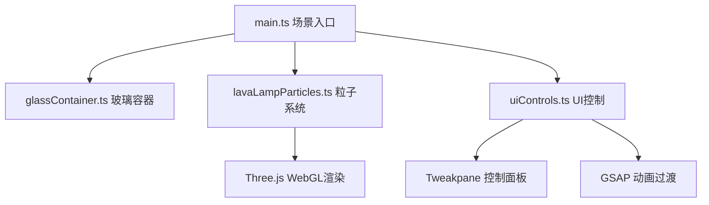

# 虚拟熔岩灯3D交互可视化应用 - 技术架构文档

## 1. 架构设计



## 2. 技术说明

- 前端框架: Three.js 0.160.0 + TypeScript
- 构建工具: Vite
- UI控制: Tweakpane
- 动画库: GSAP
- 无后端，纯前端项目

## 3. 项目结构

```
auto162/
├── package.json
├── vite.config.js
├── tsconfig.json
├── index.html
└── src/
    ├── main.ts                 # Three.js场景初始化，动画循环
    ├── glassContainer.ts       # 玻璃容器几何体与材质
    ├── lavaLampParticles.ts    # 核心粒子系统
    └── uiControls.ts           # Tweakpane控制面板
```

## 4. 核心类/文件说明

### 4.1 glassContainer.ts
- 生成经典熔岩灯造型：上窄下宽带瓶颈的圆柱组合
- MeshPhysicalMaterial：透明度0.3，折射率1.5，环境反射
- 内部液体背景平面
- 底部虚拟热源（脉动红色圆形）

### 4.2 lavaLampParticles.ts
- 150-300个球形粒子
- 浮力运动模拟（上升/下沉）
- 碰撞检测与融合（距离<0.3，2%概率）
- 分裂逻辑（半径>0.35，1%概率）
- 颜色随高度渐变（Three.js Color.lerp）
- 预生成Canvas圆形渐变纹理复用

### 4.3 uiControls.ts
- Tweakpane Pane 实例
- 热量强度滑块 0.5-2.0
- 蜡滴大小缩放 0.5-1.5
- 三档颜色拾色器（底部/中部/顶部）
- 三套主题预设（GSAP 2秒平滑过渡）
- 重置按钮
- FPS和粒子数量实时显示

### 4.4 main.ts
- Scene, PerspectiveCamera, WebGLRenderer
- OrbitControls 轨道控制器
- AmbientLight + PointLight 环境光
- 4个环境光点（随机分布，轻微闪烁）
- requestAnimationFrame 动画循环
- 响应式窗口缩放
