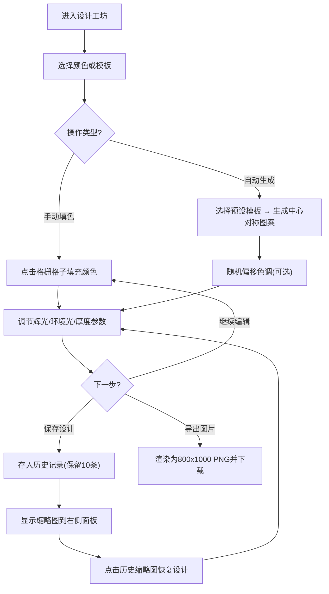

## 1. 产品概述

哥特式彩色玻璃拼花窗设计工坊是一款面向艺术爱好者和教堂玻璃修复师的网页设计工具，用于从零设计、拼接并预览哥特式彩色玻璃窗的透光效果，最终导出高清渲染图。

- 目标用户：艺术创作者、教堂历史建筑修复人员、学生及彩色玻璃艺术爱好者
- 核心价值：降低彩色玻璃窗设计门槛，提供沉浸式的虚拟创作体验与高质量成品输出

## 2. 核心特性

### 2.1 用户角色
| 角色 | 注册方式 | 核心权限 |
|------|---------|---------|
| 普通用户 | 无需注册，直接使用 | 设计、预览、导出、保存历史记录 |

### 2.2 功能模块
1. **哥特式拱形工作台**：深石灰色到暗紫色径向渐变背景，中央尖拱窗口带铁艺边框
2. **8x12格栅编辑器**：逐格点击上色，24色调色盘，实时透光辉光渲染
3. **自动图案生成器**：玫瑰窗、圣经剪影、几何对称等8种预设模板，中心对称算法，随机偏移色调
4. **参数调节面板**：辉光强度、环境光亮度、玻璃厚度模拟三个滑块
5. **导出功能**：800x1000px PNG高清渲染图导出
6. **历史记录管理**：最近10次保存的缩略图侧边栏，一键恢复设计

### 2.3 页面详情
| 页面名称 | 模块名称 | 功能描述 |
|---------|---------|---------|
| 主工作台 | 拱形窗口区 | 600px高尖拱轮廓窗口，8x12可点击格栅，铁艺边框效果 |
| 主工作台 | 左侧工具面板 | 24色调色盘（30px色块）、4x2预设模板选择器，选中高亮金色边框 |
| 主工作台 | 右侧历史面板 | 最近10次保存缩略图，点击恢复 |
| 主工作台 | 底部控制区 | 3个参数滑块 + 自动生成/导出PNG按钮 |
| 主工作台 | 响应式布局 | <900px时三栏变三行，工具面板折叠为顶部抽屉 |

## 3. 核心流程

## 4. 用户界面设计

### 4.1 设计风格
- **主色调**：深石灰#2c2c2c → 暗紫#1a0f2e径向渐变背景，主题金色#d4af37点缀
- **玻璃色系**：24色经典教堂调色盘（教堂蓝#1a4f8f、血红#8b0000、琥珀#c68b2c、翡翠绿#006837等）
- **按钮样式**：细长条形滑块（高4px，圆球10px），金属质感按钮，金色描边选中态
- **字体**：Cinzel Decorative（哥特式装饰字体）用于标题，Lora用于正文
- **布局风格**：三栏式暗色调哥特风，左(220px)中(主区)右(200px)，强烈的空间纵深
- **视觉细节**：铁艺边框inset金属反光、颜色叠加散射辉光、深紫铅框外围边框#4a0080
- **动效**：所有交互0.2s缓动（CSS transition），色块悬停放大1.1倍

### 4.2 页面设计概述
| 页面名称 | 模块名称 | UI元素 |
|---------|---------|--------|
| 主工作台 | 拱形窗口 | CSS clip-path尖拱、铁艺6px边框、8x12 CSS Grid格栅、每格40x40px |
| 主工作台 | 工具面板 | 24色5列网格色块、4x2模板缩略图网格、金色#d4af37选中边框 |
| 主工作台 | 历史面板 | 垂直滚动缩略图列表、悬停放大预览 |
| 主工作台 | 底部控制区 | 金色主题滑块、金属质感操作按钮 |
| 主工作台 | 响应式抽屉 | <900px时工具面板变为顶部可折叠抽屉 |

### 4.3 响应式
- 桌面优先（>900px）：三栏横向布局
- 平板/移动（<900px）：三栏变上下三行，工具面板折叠为可收起抽屉
- 触控优化：色块最小触控面积44x44px，滑块触控区域扩大

## 5. 性能指标

| 操作 | 性能要求 |
|-----|---------|
| 96格重新上色响应 | ≤ 30ms |
| 自动图案生成算法 | ≤ 150ms |
| PNG导出像素操作 | ≤ 500ms |
