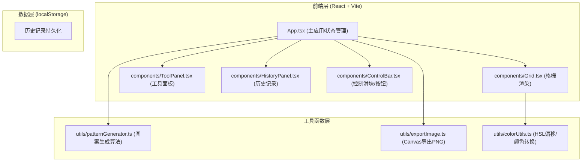

## 1. 架构设计



## 2. 技术说明

- **前端框架**：React 18 + TypeScript 5 + Vite 5
- **初始化方式**：手动配置 Vite + React TS 项目结构
- **样式方案**：原生 CSS Modules + CSS Variables（主题色、动画缓动）
- **导出依赖**：file-saver（下载Blob）、react-colorful（可选HSL色盘）
- **后端**：无，纯前端SPA
- **数据存储**：localStorage 存储最近10条历史记录（Base64缩略图 + 颜色矩阵）
- **渲染技术**：
  - 格栅：CSS Grid Layout（8列×12行）
  - 尖拱轮廓：CSS `clip-path: path()` 精确贝塞尔曲线路径
  - 透光辉光：多层 `box-shadow` + `filter: blur()` 叠加
  - 导出渲染：HTML → Canvas（手动像素绘制保证辉光效果）

## 3. 路由定义

纯单页应用，无需路由。

| 路径 | 用途 |
|-----|------|
| / | 主工作台（唯一页面） |

## 4. 数据模型

### 4.1 核心数据结构

```typescript
// 格栅颜色矩阵：12行 × 8列
type ColorMatrix = string[][];  // string 为 hex 颜色值

// 单个历史记录项
interface HistoryItem {
  id: string;
  timestamp: number;
  colors: ColorMatrix;
  settings: RenderSettings;
  thumbnail: string;  // Base64 缩略图
}

// 渲染参数设置
interface RenderSettings {
  glowIntensity: number;   // 0-100
  ambientLight: number;    // 0-100
  glassThickness: number;  // 0-5 (px)
}

// 预设模板枚举
type PatternTemplate = 
  | 'rose_window'
  | 'biblical_silhouette'
  | 'geometric_symmetry'
  | 'radial_burst'
  | 'diamond_lattice'
  | 'cross_motif'
  | 'floral_tracery'
  | 'gothic_arch';
```

### 4.2 调色盘常量（24色）

```typescript
const CHURCH_PALETTE = [
  '#1a4f8f', // 教堂蓝
  '#2e6bb3', // 天蓝
  '#006837', // 翡翠绿
  '#2d8a4e', // 森林绿
  '#8b0000', // 血红
  '#c41e3a', // 深红
  '#c68b2c', // 琥珀黄
  '#e8b923', // 金黄
  '#4a0080', // 深紫（铅框色）
  '#6a0dad', // 紫罗兰
  '#00ced1', // 青蓝
  '#40e0d0', // 绿松石
  '#8b4513', // 棕褐
  '#cd853f', // 赭石
  '#ff6b6b', // 珊瑚红
  '#ff8c00', // 橙红
  '#9acd32', // 酸橙绿
  '#7cfc00', // 草坪绿
  '#ff69b4', // 粉红
  '#da70d6', // 兰花紫
  '#b8860b', // 暗金
  '#d4af37', // 主题金
  '#f5f5dc', // 奶油白
  '#ffffff', // 纯白
];
```

## 5. 性能优化策略

1. **格栅渲染优化**：
   - 每个格子使用纯CSS渲染，避免重绘时reflow
   - 颜色变化仅更新 `background-color` 属性，配合 `will-change: background-color`
   - 96格使用CSS Grid一次性布局，不动态增删节点

2. **图案生成算法**：
   - 中心对称使用镜像计算（4象限同步赋值），O(n)时间复杂度
   - HSL偏移使用预计算色相偏移表，避免重复Color对象创建

3. **PNG导出**：
   - 使用离屏Canvas（OffscreenCanvas 优先，降级为document.createElement）
   - 800x1000像素分块绘制，单次循环内完成所有像素操作
   - `toBlob` 异步导出避免阻塞主线程 > 50ms

4. **历史记录**：
   - 缩略图使用 Canvas 缩小至 100x125px 后 Base64 存储
   - localStorage 容量限制监控（预估10条 ≈ 1.5MB）

## 6. 文件组织结构

```
auto163/
├── package.json
├── vite.config.js
├── tsconfig.json
├── index.html
└── src/
    ├── App.tsx                    # 主应用：状态管理/布局/协调
    ├── main.tsx                   # React入口挂载
    ├── index.css                  # 全局样式：主题变量/字体/reset
    ├── components/
    │   ├── Grid.tsx               # 8x12格栅：点击上色/高亮/渲染
    │   ├── ToolPanel.tsx          # 左侧：调色盘+模板选择
    │   ├── HistoryPanel.tsx       # 右侧：历史记录侧边栏
    │   ├── ControlBar.tsx         # 底部：3滑块+2按钮
    │   └── GothicWindow.tsx       # 拱形窗口容器：clip-path/边框
    ├── utils/
    │   ├── patternGenerator.ts    # 自动图案生成算法
    │   ├── exportImage.ts         # PNG导出（Canvas绘制）
    │   └── colorUtils.ts          # HSL偏移/颜色转换辅助
    └── constants/
        └── palette.ts             # 24色调色盘常量
```
