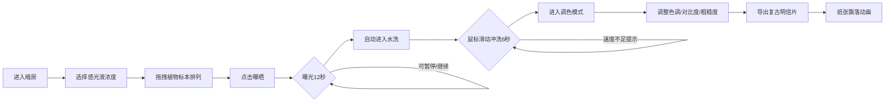

## 1. 产品概述

虚拟蓝晒法（氰版摄影）印相工坊是一款基于浏览器的交互式古典摄影工艺模拟器，专为摄影爱好者和古典工艺学习者设计，让用户在网页上完整体验从涂布感光液、放置植物标本到日光曝光、水洗显影的蓝晒印相全过程，并能对最终生成的普鲁士蓝图像进行数字调色和导出复古明信片。

### 核心价值
- 零成本体验19世纪古典摄影工艺
- 互动式学习蓝晒法的化学原理和操作流程
- 创意拼贴与数字调色结合，产出独特的艺术作品

## 2. 核心功能

### 2.1 用户角色
| 角色 | 注册方式 | 核心权限 |
|------|----------|----------|
| 访客用户 | 无需注册 | 完整体验所有功能，导出PNG图片 |

### 2.2 功能模块
1. **涂布操作区**：选择感光液浓度（低/中/高三档），在玻璃托盘中的水彩纸上排列植物标本
2. **曝光模拟器**：12秒日光曝光动画，进度条可暂停/继续，实时显示颜色渐变
3. **水洗显影区**：鼠标滑动模拟水流冲洗，6秒完成显影，速度反馈提示
4. **调色调整区**：色调偏移、对比度、粗糙度三个滑块实时调整图像效果
5. **导出功能**：一键导出800x600像素复古明信片PNG，带纸张飘落动画

### 2.3 页面详情
| 页面名称 | 模块名称 | 功能描述 |
|----------|----------|----------|
| 主工作台 | 涂布操作区 | 三档浓度按钮、玻璃托盘、水彩纸、标本拖拽排列、重叠检测 |
| 主工作台 | 曝光模拟器 | 日光渐变盘、进度条、暂停/继续按钮、颜色渐变动画 |
| 主工作台 | 水洗显影区 | 鼠标滑动检测、水洗进度、水流量提示、水波纹光标 |
| 主工作台 | 调色调整区 | 色调偏移滑块、对比度滑块、粗糙度滑块、实时预览 |
| 主工作台 | 导出模块 | 保存明信片按钮、纸张飘落动画、PNG导出 |

## 3. 核心流程

### 主操作流程
用户进入暗房工作台 → 选择感光液浓度 → 从右侧标本库拖拽植物到水彩纸排列 → 点击曝晒按钮启动曝光 → 12秒曝光动画（可暂停）→ 自动进入水洗模式 → 鼠标滑动冲洗6秒 → 进入调色模式 → 调整色调/对比度/粗糙度 → 导出复古明信片

## 4. 用户界面设计

### 4.1 设计风格
- **整体风格**：19世纪维多利亚式暗房美学，复古印刷感
- **主色调**：普鲁士蓝 #003153、暗褐色 #3a2518、米白色 #f7f0e0
- **背景**：深棕灰 #2b1d14 到暗褐色 #3a2518 垂直线性渐变，模拟木制工作台
- **字体**：衬线体（serif），模拟复古印刷感
- **按钮风格**：圆角矩形（border-radius: 4px），深棕色背景 #2b1d14，悬停变亮至 #4a2c1a，0.3s ease 过渡
- **滑块风格**：普鲁士蓝渐变轨道，米白色圆形拇指（直径14px），拖拽微弹效果

### 4.2 页面布局
| 区域 | 位置 | 宽度占比 | 主要元素 |
|------|------|----------|----------|
| 操作区 | 左侧 | 25% | 浓度选择按钮、玻璃托盘、标本库 |
| 预览区 | 中央 | 50% | 水彩纸/曝光盘/水洗画面/调色预览 |
| 调色区 | 右侧 | 25% | 三个调色滑块、导出按钮 |

### 4.3 交互动效
- 按钮点击：缩小0.95倍再恢复（弹跳反馈）
- 拖拽标本：轻微阴影跟随
- 水洗光标：圆形水波纹指示器（radial-gradient 动画，半径40px旋转）
- 导出动画：5张纸片随机飞出飘落
- 滑块拖拽：GSAP 微弹效果

### 4.4 响应式适配
- **桌面端**（≥768px）：左-中-右三栏布局
- **移动端**（<768px）：上下布局，预览区居中占满宽度，操作按钮字体缩小至14px

## 5. 性能要求
- 实时渲染帧率 ≥ 50fps（颜色更新、调色滑块响应）
- 曝光进度动画流畅不卡顿
- 拖拽植物标本无延迟感知
- 水洗显影阶段鼠标采样率 ≥ 60次/秒
