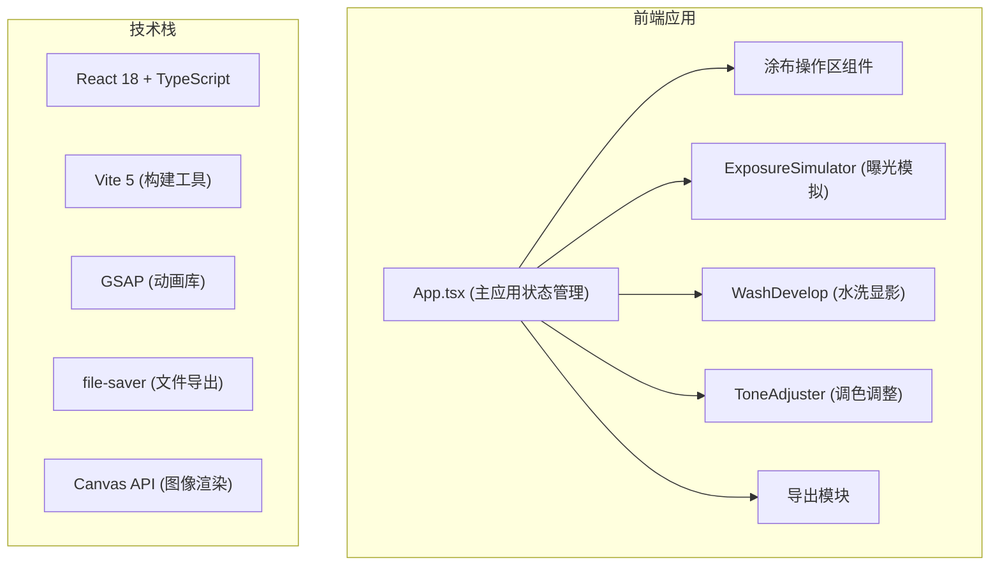

## 1. 架构设计



## 2. 技术描述

### 前端技术栈
- **框架**: React 18 + TypeScript
- **构建工具**: Vite 5
- **动画库**: GSAP
- **文件导出**: file-saver
- **图像渲染**: Canvas API + CSS filter + SVG feTurbulence
- **状态管理**: React useState/useReducer（轻量级，无需全局状态库）

### 项目初始化
- 使用 Vite react-ts 模板初始化
- TypeScript 严格模式，目标 ES2020
- base 路径设置为 './'

## 3. 目录结构

```
src/
├── App.tsx                    # 主应用组件，状态管理
├── components/
│   ├── CoatingStation.tsx     # 涂布操作区（浓度选择+标本拖拽）
│   ├── ExposureSimulator.tsx  # 曝光模拟器
│   ├── WashDevelop.tsx        # 水洗显影组件
│   ├── ToneAdjuster.tsx       # 调色调整组件
│   ├── PlantLibrary.tsx       # 植物标本库
│   └── PostcardExport.tsx     # 明信片导出
├── hooks/
│   ├── useDragAndDrop.ts      # 拖拽逻辑hook
│   └── useAnimationFrame.ts   # requestAnimationFrame hook
├── types/
│   └── index.ts               # TypeScript类型定义
└── utils/
    ├── canvasUtils.ts         # Canvas绘图工具
    └── colorUtils.ts          # 颜色计算工具
```

## 4. 核心模块设计

### 4.1 状态管理（App.tsx）
```typescript
type AppState = 'coating' | 'exposure' | 'washing' | 'toning';

interface PlantSpecimen {
  id: string;
  type: 'fern' | 'leaf' | 'feather';
  x: number;
  y: number;
  rotation: number;
  scale: number;
}

interface ToneSettings {
  hueShift: number;     // -30 to +30, default 0
  contrast: number;     // 0.5 to 1.5, default 1.0
  roughness: number;    // 0 to 100, default 50
}
```

### 4.2 涂布操作区
- 三档浓度按钮（6%/12%/25% 柠檬酸铁铵）
- 玻璃托盘：350px × 280px，半透明磨砂边框，backdrop-filter 玻璃质感
- 水彩纸：190g纹理纸效果，背景色 #f7f0e0
- 植物标本拖拽：支持旋转（R键45度/次）、缩放（鼠标滚轮0.5x-2x）
- 重叠检测：重叠时红色高亮警告

### 4.3 曝光模拟器
- 圆形日光模拟盘：直径280px，放射渐变 #fffde0 → #ffe6a0
- 12秒曝光进度动画，可暂停/继续
- 颜色渐变：植物阴影区从浅黄色 → 深普鲁士蓝 #003153
- 曝光完成显示青色中间底片效果

### 4.4 水洗显影
- 鼠标移动事件捕获，采样率 ≥ 60次/秒
- 水洗进度计算：基于鼠标移动距离和速度
- 6秒完成显影
- 水流量不足提示（速度低于阈值时显示）
- 水波纹光标指示器（CSS radial-gradient 动画）

### 4.5 调色调整
- 色调偏移：-30 到 +30，步长 1
- 对比度：0.5 到 1.5，步长 0.1
- 粗糙度：0 到 100，步长 1
- 使用 CSS filter + SVG feTurbulence 实现实时效果

### 4.6 导出功能
- Canvas 渲染最终图像（800×600px）
- 圆角和复古边框效果
- toBlob 导出 PNG
- 5张纸片随机飞出飘落动画（GSAP）

## 5. 性能优化策略

1. **Canvas 分层渲染**：背景层、植物层、效果层分离，减少重绘
2. **requestAnimationFrame**：所有动画使用 RAF 确保帧率
3. **CSS 硬件加速**：transform 和 opacity 动画优先
4. **节流/防抖**：鼠标移动事件使用 requestAnimationFrame 节流
5. **按需渲染**：调色滑块变化时仅更新 filter，不重绘整个 canvas
6. **will-change**：对频繁变化的元素添加 will-change 提示

## 6. 构建配置

### vite.config.js
- 启用 React 插件
- base: './'
- TypeScript 支持

### tsconfig.json
- 严格模式（strict: true）
- target: ES2020
- module: ESNext
- jsx: react-jsx

### package.json 依赖
- react
- react-dom
- typescript
- vite@5
- @vitejs/plugin-react
- gsap
- file-saver
