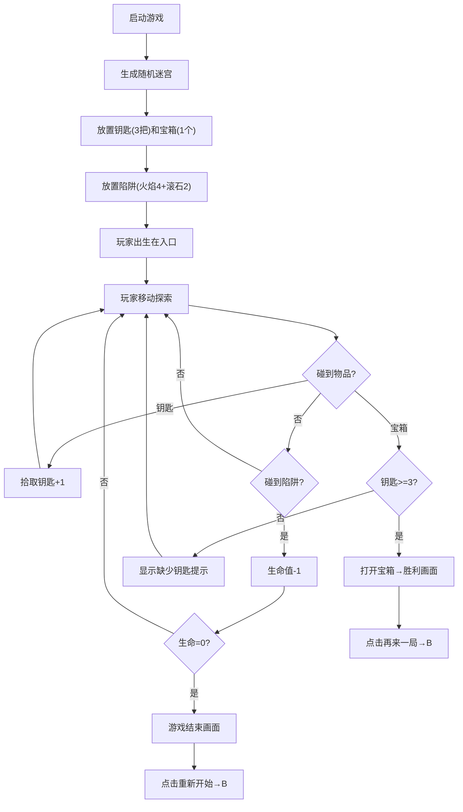

## 1. 产品概述

虚拟迷宫寻宝与陷阱逃脱游戏是一款基于浏览器的2D像素风格休闲益智游戏。玩家在古老石板迷宫中探索，收集钥匙、打开宝箱，同时躲避动态陷阱，最终找到出口逃离迷宫。

- **目标用户**：休闲游戏爱好者、解谜游戏玩家
- **核心价值**：提供紧张刺激的迷宫探索体验，结合策略躲避与收集要素

## 2. 核心功能

### 2.1 功能模块

1. **主游戏界面**：迷宫渲染、玩家控制、UI显示（生命值、钥匙、计时器、迷你地图）
2. **迷宫生成系统**：随机15x15迷宫、墙壁与地板布局、烛光氛围粒子
3. **玩家控制系统**：WASD/方向键移动、碰撞检测、生命值管理、受伤反馈
4. **物品拾取系统**：3把金色钥匙（闪烁发光）、1个大宝箱（钥匙判定、开盖动画）
5. **动态陷阱系统**：火焰陷阱（4个）、滚石陷阱（2个）、随机移动方向、碰撞伤害
6. **胜负判定系统**：胜利画面（通关时间显示）、失败画面（游戏结束）、重新开始

### 2.2 功能详情

| 页面/模块 | 子模块 | 功能描述 |
|-----------|--------|----------|
| 游戏主界面 | 迷宫渲染 | 深灰(#3a3a3a)墙面、浅灰(#bababa)地板、690x690像素居中显示 |
| 游戏主界面 | 玩家角色 | 16x16蓝色像素小人、4格/秒移动速度、撞墙0.1秒停顿动画 |
| 游戏主界面 | UI层 | 左上迷你地图、右上生命/钥匙/计时器、四周红色受伤边框 |
| 迷宫系统 | 迷宫生成 | 递归回溯算法、15x15迷宫、生成时间<50ms |
| 迷宫系统 | 氛围效果 | 随机烛光粒子（黄色半透明、2px半径、1-3秒闪烁） |
| 物品系统 | 钥匙 | 3把金色钥匙、0.8秒闪烁周期、拾取后钥匙计数+1 |
| 物品系统 | 宝箱 | 棕色带金色边框、集齐钥匙可开启、开盖0.5秒动画、胜利粒子 |
| 物品系统 | 提示 | 未集齐钥匙点击宝箱显示红色"缺少钥匙"、1秒后消失 |
| 陷阱系统 | 火焰陷阱 | 4个红色火焰粒子、每秒跳跃1格、2秒随机改变方向 |
| 陷阱系统 | 滚石陷阱 | 2个灰色圆形、每秒滚动2格沿直线、2秒随机改变方向 |
| 陷阱系统 | 伤害判定 | 碰陷阱生命-1、0.3秒红色边框闪烁、生命归零游戏结束 |
| 胜负系统 | 胜利 | 金色光芒扩散1秒、"恭喜通关"大字、显示用时、再来一局按钮 |
| 胜负系统 | 失败 | 黑色半透明蒙版、"游戏结束"白色大字、重新开始按钮 |
| 按钮系统 | 交互按钮 | 8px圆角、悬停#8b4513→#a0522d渐变、点击缩小0.95倍 |

## 3. 核心流程

## 4. 用户界面设计

### 4.1 设计风格

- **主色调**：深褐色(#1a0f0a)到黑色径向渐变背景
- **迷宫配色**：深灰墙面(#3a3a3a)、浅灰地板(#bababa)
- **强调色**：金色钥匙/宝箱(#ffd700)、红色陷阱/生命(#ff0000)、蓝色玩家(#0066ff)
- **按钮风格**：圆角矩形8px、悬停背景#8b4513→#a0522d、点击缩放0.95
- **字体**：像素风格等宽字体、绿色计时器文字、红色提示文字
- **布局**：迷宫居中(690x690)、四周留白放置UI

### 4.2 页面设计

| 区域 | 模块 | UI元素 |
|------|------|--------|
| 背景 | 全屏背景 | 深褐→黑色径向渐变、烛光氛围粒子 |
| 中心 | 迷宫区域 | 690x690像素迷宫、相机跟随玩家 |
| 左侧 | 迷你地图 | 缩小版迷宫全貌、绿色玩家位置标记 |
| 右上 | 状态栏 | 红色心形x3(生命)、金色钥匙图标+计数、绿色计时器 |
| 四周 | 受伤反馈 | 红色边框闪烁0.3秒 |
| 覆盖层 | 胜利画面 | 金色光芒扩散、"恭喜通关"、用时显示、再来一局按钮 |
| 覆盖层 | 失败画面 | 黑色半透明蒙版、"游戏结束"、重新开始按钮 |
| 覆盖层 | 提示文字 | 红色"缺少钥匙"文字、1秒后消失 |

### 4.3 动画反馈

- **撞墙抖动**：0.15秒、偏移3px
- **钥匙闪烁**：0.8秒周期、发光效果
- **开盖动画**：0.5秒、宝箱盖旋转/位移
- **胜利粒子**：金色光芒扩散1秒
- **陷阱移动**：火焰tween跳跃、滚石tween滚动
