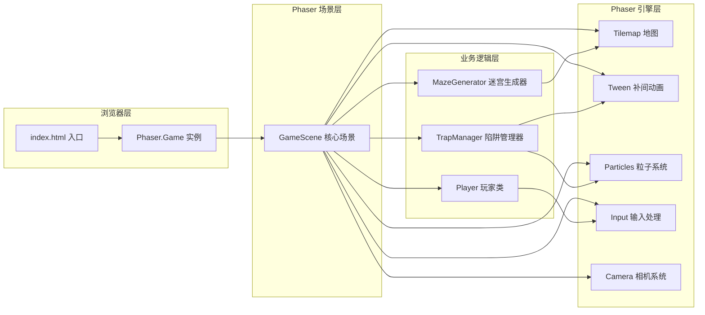

## 1. 架构设计



## 2. 技术选型

| 分类 | 技术 | 版本 | 用途 |
|------|------|------|------|
| 游戏引擎 | Phaser | 3.60.0 | 2D游戏渲染、场景管理、动画、粒子、输入 |
| 语言 | TypeScript | 最新 | 类型安全开发 |
| 构建工具 | Vite | 最新 | 快速开发服务器、TS编译、打包 |
| 类型定义 | @types/phaser | 最新 | Phaser的TypeScript类型支持 |

## 3. 文件结构

```
auto168/
├── package.json              # 项目依赖与脚本配置
├── vite.config.js            # Vite构建配置(base='./')
├── tsconfig.json             # TypeScript配置(严格模式, ES2020)
├── index.html                # HTML入口(全屏黑底, 引入main.ts)
└── src/
    ├── main.ts               # 游戏入口, Phaser.Game初始化
    ├── GameScene.ts          # 核心游戏场景(迷宫/玩家/陷阱/UI)
    ├── Player.ts             # 玩家类(移动/碰撞/生命)
    ├── MazeGenerator.ts      # 迷宫生成器(递归回溯算法)
    └── TrapManager.ts        # 陷阱管理器(火焰/滚石逻辑)
```

## 4. 核心模块设计

### 4.1 MazeGenerator.ts (迷宫生成器)

```typescript
// 核心类型
interface Cell {
  x: number;
  y: number;
  walls: { top: boolean; right: boolean; bottom: boolean; left: boolean };
  visited: boolean;
}

// 迷宫生成算法：递归回溯
// 1. 初始化15x15网格，所有单元格四周有墙
// 2. 从起点(1,1)开始，随机选择未访问邻居
// 3. 打通墙壁，递归深入，无邻居则回溯
// 4. 最终生成完整迷宫

class MazeGenerator {
  generate(size: number): number[][]  // 输出二维数组: 0=地板, 1=墙
  getFloorCells(): {x: number, y: number}[]  // 获取所有可通行格子
  getRandomFloor(): {x: number, y: number}  // 随机获取地板位置
}
```

**性能要求**：生成时间 < 50ms

### 4.2 Player.ts (玩家类)

```typescript
// 玩家属性
interface PlayerState {
  x: number; y: number;       // 像素坐标
  gridX: number; gridY: number; // 网格坐标
  hp: number;                 // 生命值(默认3)
  keys: number;               // 已收集钥匙数
  isMoving: boolean;          // 是否移动中
  isHurt: boolean;            // 是否受伤状态
}

class Player {
  sprite: Phaser.GameObjects.Container;  // 玩家渲染容器
  state: PlayerState;
  
  move(direction: 'up'|'down'|'left'|'right'): void  // 4格/秒移动
  takeDamage(): boolean  // 受伤-1生命, 返回是否死亡
  collectKey(): void     // 拾取钥匙
  playWallHitAnim(): void  // 撞墙0.1秒停顿+抖动
  playHurtAnim(): void     // 受伤抖动+无敌帧
}
```

### 4.3 TrapManager.ts (陷阱管理器)

```typescript
// 陷阱类型
type TrapType = 'fire' | 'rock';
interface Trap {
  id: number;
  type: TrapType;
  gridX: number;
  gridY: number;
  direction: 'up'|'down'|'left'|'right';
  sprite: Phaser.GameObjects.Container;
  particles?: Phaser.GameObjects.Particles.ParticleEmitter;
}

class TrapManager {
  traps: Trap[];
  
  spawnFireTrap(x: number, y: number): Trap  // 红色火焰, 1格/秒
  spawnRockTrap(x: number, y: number): Trap  // 灰色滚石, 2格/秒
  update(delta: number): void  // 每帧更新: 移动+碰撞检测
  randomizeDirection(trap: Trap): void  // 每2秒随机改变方向
  checkCollision(playerGridX, playerGridY): boolean  // 检测玩家碰撞
}
```

### 4.4 GameScene.ts (核心游戏场景)

```typescript
// 场景生命周期
class GameScene extends Phaser.Scene {
  // 常量配置
  static readonly GRID_SIZE = 15;
  static readonly TILE_SIZE = 46;  // 690/15 = 46像素
  static readonly MAZE_PX = 690;
  
  // 子模块引用
  mazeGenerator: MazeGenerator;
  player: Player;
  trapManager: TrapManager;
  
  // Phaser对象
  tilemap: Phaser.Tilemaps.Tilemap;
  keys: Phaser.GameObjects.Container[];  // 3把钥匙
  chest: Phaser.GameObjects.Container;   // 1个宝箱
  minimap: Phaser.GameObjects.Graphics;  // 迷你地图
  hpHearts: Phaser.GameObjects.Image[];  // 生命值心形
  timerText: Phaser.GameObjects.Text;    // 计时器
  keyCountText: Phaser.GameObjects.Text; // 钥匙计数
  
  // 生命周期方法
  preload(): void      // 预加载资源(代码生成纹理)
  create(): void       // 场景创建: 迷宫/玩家/陷阱/UI
  update(time, delta): void  // 每帧更新: 输入/移动/碰撞
  generateMaze(): void       // 生成迷宫并渲染
  spawnItems(): void         // 放置钥匙和宝箱
  spawnTraps(): void         // 放置陷阱
  setupUI(): void            // 迷你地图/生命/计时器
  checkItemPickup(): void    // 检测钥匙拾取
  checkChestInteraction(): void  // 宝箱交互
  showVictory(): void        // 胜利画面
  showGameOver(): void       // 失败画面
  resetGame(): void          // 重置游戏
}
```

## 5. 渲染与动画策略

### 5.1 纹理生成
- **不使用外部图片资源**，全部使用Phaser Graphics API代码生成
- 玩家、钥匙、宝箱、陷阱等均通过Graphics绘制后生成Texture

### 5.2 动画实现
| 动画 | 实现方式 | 参数 |
|------|----------|------|
| 玩家移动 | Phaser.Tweens | duration: 250ms (4格/秒) |
| 撞墙停顿 | Tween + 抖动 | 0.1秒停顿 + 0.15秒偏移3px |
| 钥匙闪烁 | Tween.yoyo | 0.8秒周期, alpha/scale |
| 宝箱开盖 | Tween.rotation/y | 0.5秒动画 |
| 陷阱移动-火焰 | Tween + 跳跃 | 1格/秒, 弹跳效果 |
| 陷阱移动-滚石 | Tween + 旋转 | 2格/秒, 360度旋转 |
| 受伤红框 | Tween + Graphics | 0.3秒边框闪烁 |
| 胜利粒子 | ParticleEmitter | 金色光芒扩散1秒 |
| 烛光氛围 | ParticleEmitter | 黄色半透明, 1-3秒闪烁周期 |

### 5.3 性能优化
- 使用Phaser内置Tilemap渲染迷宫（批量绘制）
- 粒子系统复用Emitter，避免频繁创建销毁
- 碰撞检测使用网格坐标对比（O(1)），不使用物理引擎
- 帧率目标：稳定60FPS

## 6. 输入处理

使用Phaser Input.Keyboard：
- `W / ↑` → 向上移动
- `S / ↓` → 向下移动
- `A / ←` → 向左移动
- `D / →` → 向右移动
- `空格键 / 回车` → 宝箱交互（靠近时）

按钮交互：DOM级CSS按钮，使用Phaser的HTML Element或DOM overlay

## 7. 相机系统

- Camera初始位置：迷宫中心
- 跟随策略：`camera.startFollow(playerSprite, true, 0.1, 0.1)`
- 视口：固定690x690像素显示迷宫区域
- 迷你地图：独立Graphics渲染，不受主相机影响
