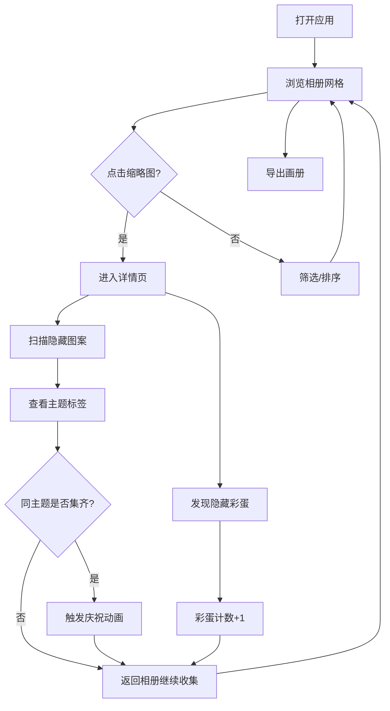

## 1. 产品概述

虚拟明信片收藏簿与互动解谜应用——一位数字收藏家在浏览器中整理和展示虚拟明信片，通过扫描隐藏图案、匹配主题标签和触发互动彩蛋，解锁完整的旅行纪念数字画册。
- 目标用户：数字收藏爱好者、旅行纪念品爱好者
- 核心价值：将静态明信片收藏升级为沉浸式互动解谜体验，增加收藏趣味性和仪式感

## 2. 核心功能

### 2.1 用户角色
| 角色 | 注册方式 | 核心权限 |
|------|----------|----------|
| 收藏家 | 无需注册 | 浏览、筛选、扫描、解谜、导出 |

### 2.2 功能模块
1. **相册视图页**：明信片缩略图网格、标签筛选、日期排序、主题进度高亮
2. **明信片详情页**：高清大图、主题标签、隐藏图案扫描、互动彩蛋
3. **侧边栏**：主题收集进度、彩蛋计数、导出按钮

### 2.3 页面详情
| 页面名称 | 模块名称 | 功能描述 |
|----------|----------|----------|
| 相册视图 | 缩略图网格 | 瀑布流布局展示所有明信片缩略图（150x100px，圆角8px），悬浮抬起效果 |
| 相册视图 | 筛选排序栏 | 按主题标签筛选、按收藏日期排序（升序/降序） |
| 相册视图 | 主题进度面板 | 显示各主题收集进度，已完成主题高亮，触发庆祝动画 |
| 明信片详情 | 高清大图 | 最大800px宽，支持缩放，显示主题标签和收藏日期 |
| 明信片详情 | 隐藏图案扫描 | 鼠标悬停/长按激活扫描模式，Canvas覆盖层淡入显示隐藏图案（0.5秒），3秒无操作自动退出 |
| 明信片详情 | 互动彩蛋 | 随机隐藏点击区域（5%-10%面积），点击后播放动画并提示"彩蛋已解锁！" |
| 侧边栏 | 彩蛋计数 | 累计显示已解锁彩蛋数量，framer-motion数字滚动动画 |
| 侧边栏 | 导出画册 | 一键导出PDF格式数字画册，含封面标题、明信片图片、标签、彩蛋状态 |

## 3. 核心流程

用户打开应用 → 浏览相册网格 → 点击缩略图进入详情 → 悬停扫描隐藏图案 → 返回相册收集同主题明信片 → 主题完成后触发庆祝动画 → 在详情页发现隐藏彩蛋 → 导出完整画册

## 4. 用户界面设计

### 4.1 设计风格
- 主色调：深蓝（#0a192f）到深紫（#1a0f2e）径向渐变，模拟夜空下的收藏簿
- 辅助色：金色点缀（#ffd700）用于高亮和解锁状态
- 按钮样式：磨砂玻璃效果（backdrop-filter: blur(8px)，背景#ffffff透明度0.1，白色细边框1px）
- 字体：Playfair Display（标题）+ Outfit（正文），营造优雅收藏簿氛围
- 布局：侧边栏+主内容区，相册网格瀑布流
- 图标：线性风格，搭配微光效果

### 4.2 页面设计概览
| 页面名称 | 模块名称 | UI元素 |
|----------|----------|--------|
| 相册视图 | 缩略图网格 | 瀑布流布局，三列/两列/单列响应式，悬浮y=-8 scale=1.05阴影加深 |
| 相册视图 | 筛选排序栏 | 磨砂玻璃胶囊按钮，选中状态金色边框 |
| 相册视图 | 主题进度 | 进度条+标签名，完成态金色高亮 |
| 明信片详情 | 大图区域 | 滑入式过渡（右→左，阻尼0.3，刚度300），Canvas扫描覆盖层 |
| 明信片详情 | 标签区域 | 胶囊标签，金色边框 |
| 明信片详情 | 彩蛋区域 | 隐藏热区，触发后光芒/绽放动画+弹窗提示 |
| 侧边栏 | 彩蛋计数 | 数字滚动动画，金色图标 |
| 侧边栏 | 导出按钮 | 磨砂玻璃按钮，点击scale 0.95→1恢复0.15s |

### 4.3 响应式适配
- 桌面端（≥1024px）：三列网格 + 侧边栏
- 平板端（768px-1023px）：两列网格 + 底部工具栏
- 移动端（<768px）：单列网格，详情页全屏显示，底部浮动操作栏

### 4.4 交互反馈
- 按钮点击：scale短暂缩小到0.95再恢复（0.15s）
- 缩略图悬浮：y=-8, scale=1.05，阴影加深
- 详情页切换：从右向左滑入（阻尼0.3，刚度300）
- 扫描激活：Canvas覆盖层淡入（0.5秒）
- 主题完成：五彩纸屑粒子效果（canvas-confetti，持续2秒）
- 彩蛋解锁：光芒/绽放动画+弹窗提示
