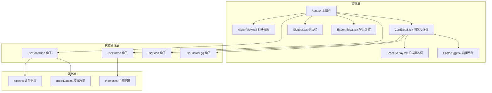
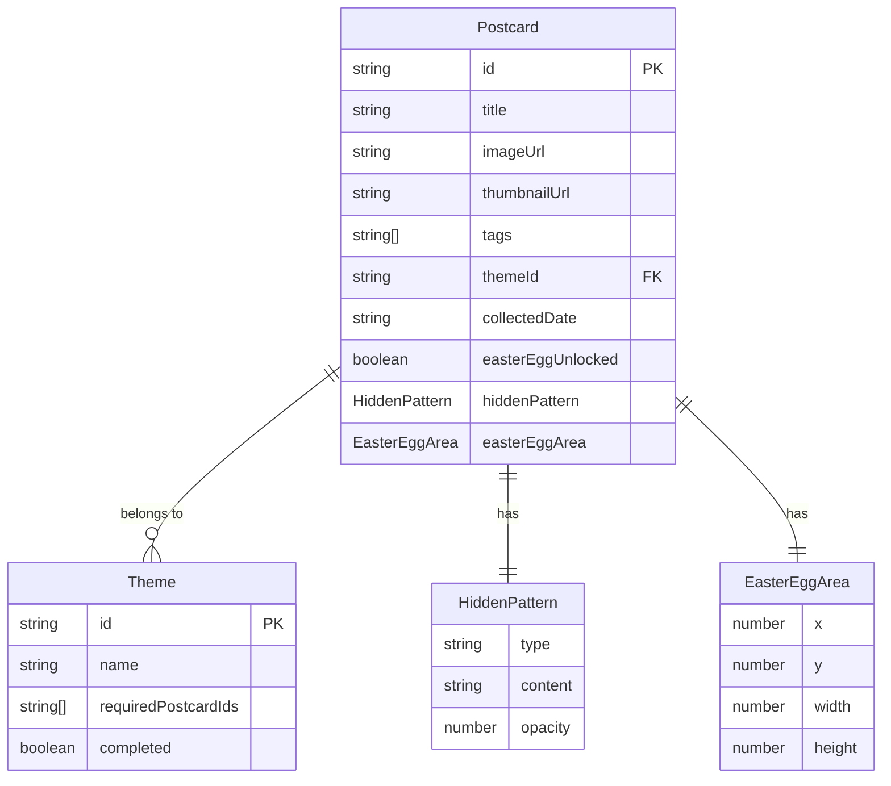

## 1. 架构设计



## 2. 技术说明
- 前端框架：React@18 + TypeScript + Vite@5
- 初始化工具：Vite
- 样式方案：CSS Modules + CSS变量
- 动画库：framer-motion@11
- 五彩纸屑：canvas-confetti
- PDF导出：浏览器打印功能 + blob生成
- UUID生成：uuid
- 文件保存：file-saver
- 无后端服务，使用Mock数据

## 3. 路由定义
| 路由 | 用途 |
|------|------|
| / | 相册视图（默认主页） |
| /card/:id | 明信片详情页 |

## 4. 文件结构

```
├── package.json
├── vite.config.js
├── tsconfig.json
├── index.html
├── src/
│   ├── main.tsx                    # 入口文件，渲染App
│   ├── App.tsx                     # 主组件，管理状态和路由
│   ├── types.ts                    # 类型定义
│   ├── mockData.ts                 # 模拟明信片数据
│   ├── themes.ts                   # 主题配置
│   ├── styles/
│   │   ├── global.css              # 全局样式、CSS变量
│   │   ├── AlbumView.module.css    # 相册视图样式
│   │   ├── CardDetail.module.css   # 详情页样式
│   │   └── Sidebar.module.css      # 侧边栏样式
│   ├── hooks/
│   │   ├── useCollection.ts        # 收藏管理钩子
│   │   ├── usePuzzle.ts            # 解谜逻辑钩子
│   │   ├── useScan.ts              # 扫描模式钩子
│   │   └── useEasterEgg.ts         # 彩蛋逻辑钩子
│   └── components/
│       ├── AlbumView.tsx           # 相册网格视图
│       ├── CardDetail.tsx          # 明信片详情
│       ├── ScanOverlay.tsx         # Canvas扫描覆盖层
│       ├── EasterEgg.tsx           # 彩蛋交互组件
│       ├── Sidebar.tsx             # 侧边栏
│       ├── ExportModal.tsx         # 导出画册弹窗
│       ├── ThemeProgress.tsx       # 主题进度组件
│       └── ConfettiEffect.tsx      # 五彩纸屑效果
```

## 5. 数据模型

### 5.1 数据模型定义



### 5.2 TypeScript 类型定义

```typescript
interface Postcard {
  id: string;
  title: string;
  imageUrl: string;
  thumbnailUrl: string;
  tags: string[];
  themeId: string;
  collectedDate: string;
  easterEggUnlocked: boolean;
  hiddenPattern: HiddenPattern;
  easterEggArea: EasterEggArea;
}

interface HiddenPattern {
  type: 'handwriting' | 'dashed-map' | 'stamp';
  content: string;
  svgPath?: string;
}

interface EasterEggArea {
  x: number;
  y: number;
  width: number;
  height: number;
}

interface Theme {
  id: string;
  name: string;
  requiredPostcardIds: string[];
  completed: boolean;
}

interface CollectionState {
  postcards: Postcard[];
  themes: Theme[];
  totalEasterEggs: number;
  selectedCardId: string | null;
  filterTag: string | null;
  sortOrder: 'asc' | 'desc';
}
```

## 6. 数据流向

```
用户交互事件
    ↓
App.tsx（状态管理中心）
    ├── useCollection → 管理明信片列表、筛选、排序
    ├── usePuzzle → 检测主题完成、触发庆祝
    ├── useScan → 管理扫描模式状态
    └── useEasterEgg → 管理彩蛋解锁状态
    ↓
组件渲染
    ├── AlbumView ← 接收筛选后的明信片数组
    ├── CardDetail ← 接收选中明信片数据
    ├── ScanOverlay ← 接收扫描状态和图案数据
    ├── EasterEgg ← 接收彩蛋区域和解锁状态
    ├── Sidebar ← 接收主题进度和彩蛋计数
    └── ExportModal ← 接收所有已解锁明信片
```
