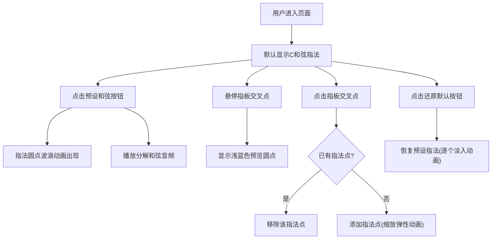

## 1. 产品概述

交互式吉他指板图谱查看与和弦预览应用，为音乐爱好者提供直观的和弦学习、预览和自定义编辑工具。无需专业软件，在线即可完成和弦指位可视化与音频预览。

- 主要用途：吉他和弦指法学习、和弦进行预览、自定义和弦编辑
- 目标用户：音乐爱好者、吉他初学者、歌曲创作者
- 产品价值：降低和弦学习门槛，提供直观的可视化交互体验

## 2. 核心功能

### 2.2 功能模块

1. **吉他指板视图**：6弦5品指板渲染、指法圆点标记、悬停预览、交互编辑
2. **和弦选择面板**：预设和弦按钮组、选中状态高亮、点击切换和弦
3. **音频播放模块**：分解和弦音频播放、与视觉动画同步
4. **自定义编辑**：点击添加/移除指法点、还原默认和弦功能
5. **动画效果**：波浪式出现动画、缩放弹性动画、淡入动画

### 2.3 页面详情

| 页面名称 | 模块名称 | 功能描述 |
|-----------|-------------|---------------------|
| 主页面 | 吉他指板视图 | 渲染6弦5品指板，红色渐变圆点标记指法，支持悬停预览和点击编辑 |
| 主页面 | 和弦选择面板 | 展示C、Dm、Em、F、G、Am、Bdim七个预设和弦按钮，点击切换 |
| 主页面 | 还原默认按钮 | 一键清除自定义指法，恢复预设和弦指法 |
| 主页面 | 音频播放系统 | 切换和弦时同步播放分解和弦音频 |

## 3. 核心流程

用户进入页面后，默认显示C和弦指法。点击预设和弦按钮时，指板上的指法圆点以波浪动画从琴头向琴码逐个出现（间隔100ms），同时播放对应和弦的分解音频。用户可悬停指板查看预览圆点，点击添加/移除指法点进行自定义编辑。点击"还原默认"按钮恢复预设指法，圆点逐个淡入。

## 4. 用户界面设计

### 4.1 设计风格

- 主背景色：#1a1a2e（深色）
- 指板背景：#16213e
- 琴弦颜色：银灰色#c0c0c0
- 品格线：半透明白色
- 指法圆点：渐变红色（#ff4d4d到#cc0000），带发光效果
- 预览圆点：半透明浅蓝色
- 按钮风格：圆角矩形，默认背景#2d2d44，选中时渐变蓝色#3a7bd5，按压弹性动画

### 4.2 页面设计概述

| 页面名称 | 模块名称 | UI元素 |
|-----------|-------------|-------------|
| 主页面 | 吉他指板视图 | 6根银灰色琴弦、5个品格、品格线半透明白色、红色渐变指法圆点（发光效果）、浅蓝色悬停预览圆点、十字准星光标 |
| 主页面 | 和弦选择面板 | 7个圆形/圆角矩形和弦按钮、弹性按压动画（scale 0.95瞬间恢复）、选中高亮状态 |
| 主页面 | 还原默认按钮 | 圆角矩形按钮、与和弦按钮风格统一 |

### 4.3 响应式

- 桌面端（≥768px）：指板全宽显示，和弦按钮单行排列
- 移动端（<768px）：指板按比例缩小，和弦按钮转为两行排列，触控优化

### 4.4 动画效果

| 动画类型 | 触发条件 | 参数配置 |
|-----------|-------------|-------------|
| 波浪式出现 | 切换和弦 | 从琴头到琴码，间隔100ms逐个出现 |
| 缩放弹性动画 | 添加新指法点 | 0到1缩放，200ms，easeOutBack缓动 |
| 淡入动画 | 还原默认和弦 | 逐个淡入，间隔80ms，透明度0到1，300ms |
| 按压动画 | 点击和弦按钮 | scale 0.95瞬间恢复 |
