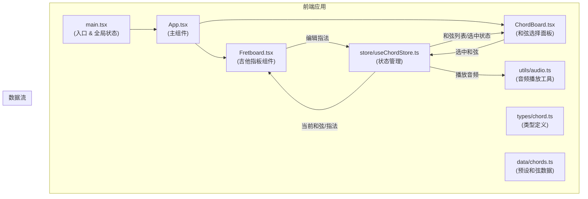

## 1. 架构设计



## 2. 技术描述

- 前端框架：React 18 + TypeScript
- 构建工具：Vite 5
- 状态管理：Zustand
- 音频播放：howler.js
- 样式方案：CSS Modules + 原生CSS变量
- 初始化工具：vite-init

## 3. 目录结构

```
src/
├── main.tsx              # 应用入口，渲染App，全局状态初始化
├── App.tsx               # 主组件，整合Fretboard和ChordBoard
├── types/
│   └── chord.ts          # 类型定义：Chord, FingerPosition等
├── data/
│   └── chords.ts         # 预设和弦数据：C, Dm, Em, F, G, Am, Bdim
├── store/
│   └── useChordStore.ts  # Zustand状态管理
├── utils/
│   └── audio.ts          # howler.js音频播放工具
├── components/
│   ├── Fretboard.tsx     # 吉他指板组件：6弦5品，指法渲染，交互
│   └── ChordBoard.tsx    # 和弦选择面板：预设按钮，还原按钮
└── styles/
    └── variables.css     # CSS变量：颜色，尺寸
```

## 4. 模块调用关系

1. **main.tsx** → 导入App，导入全局样式，初始化状态
2. **App.tsx** → 导入Fretboard、ChordBoard、useChordStore
3. **Fretboard.tsx** → 导入useChordStore、类型定义、audio工具
4. **ChordBoard.tsx** → 导入useChordStore、类型定义、audio工具
5. **useChordStore.ts** → 导入chords数据、类型定义、audio工具
6. **audio.ts** → 导入howler

## 5. 数据模型

### 5.1 核心类型定义

```typescript
// 单个指法位置
interface FingerPosition {
  string: number;      // 琴弦编号 1-6 (1为最细弦)
  fret: number;        // 品位数 0-5 (0为空弦)
  finger?: number;     // 手指编号 1-4 (可选)
}

// 和弦定义
interface Chord {
  name: string;              // 和弦名称：如 "C", "Dm"
  displayName: string;       // 显示名称
  positions: FingerPosition[]; // 指法位置数组
  audioFiles: string[];      // 分解和弦音频文件路径
}

// 和弦状态
interface ChordState {
  currentChord: Chord | null;
  customPositions: FingerPosition[];
  selectedChordName: string;
  isPlaying: boolean;
  animationPhase: 'idle' | 'wave' | 'fadeIn';
}
```

### 5.2 状态管理 Actions

- `selectChord(name: string)`: 选择和弦，触发波浪动画和音频播放
- `togglePosition(string: number, fret: number)`: 切换指法点（添加/移除）
- `resetToDefault()`: 还原为预设指法，触发淡入动画
- `setAnimationPhase(phase: string)`: 设置动画阶段

## 6. 性能优化策略

1. **渲染优化**：
   - 使用React.memo包装Fretboard和ChordBoard组件
   - 指法点使用CSS transform动画而非JS驱动
   - 利用will-change提升动画性能

2. **动画优化**：
   - 使用CSS keyframes实现波浪和淡入动画
   - 动画间隔通过animation-delay控制
   - 避免强制同步布局（Forced Synchronous Layouts）

3. **事件优化**：
   - 使用事件委托处理指板交互
   - 悬停状态使用CSS:hover而非JS状态
