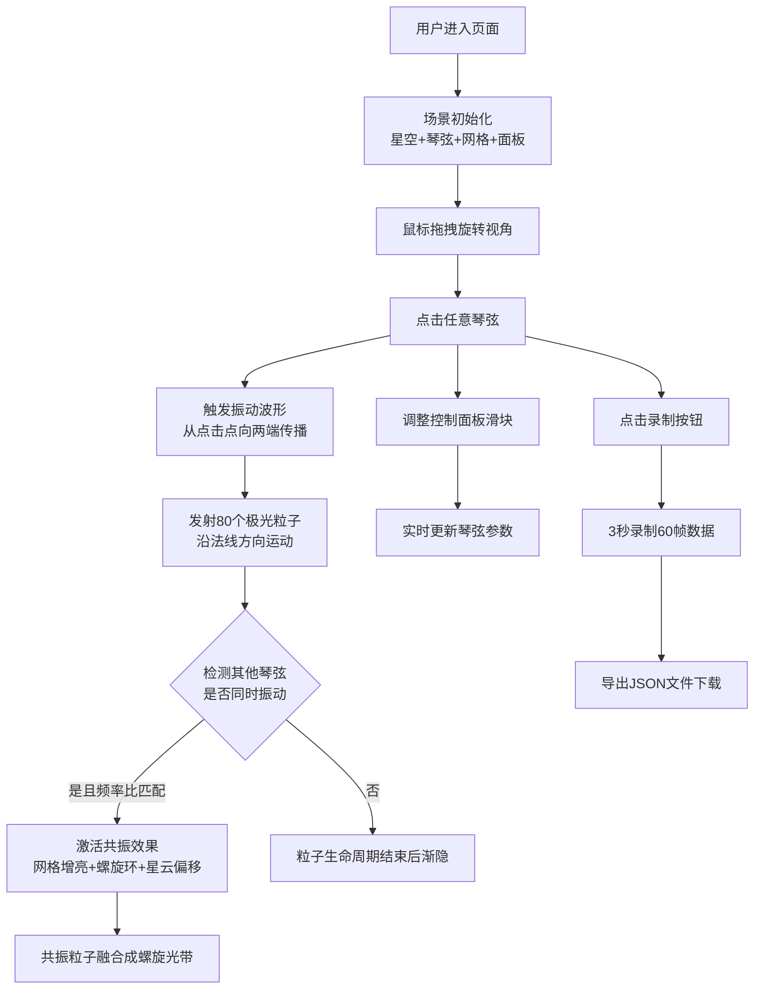

## 1. 产品概述

虚拟极光琴弦与时空共振3D交互可视化项目 - 让用户以宇宙弦乐师的身份，在浏览器中拨动悬浮于星空中的12根半透明发光琴弦，体验粒子流动、共振融合与星云变幻的沉浸式视听盛宴。

- **核心目标**：通过粒子物理与共振数学的可视化呈现，让用户直观感受波动、频率与宇宙共振之美
- **目标用户**：艺术爱好者、物理科普受众、交互体验探索者

## 2. 核心特性

### 2.1 功能模块

1. **3D星际场景**：深邃渐变星空背景、12根琴弦竖琴结构、六边形耦合网格、菲涅尔边缘光效
2. **琴弦交互系统**：点击触发振动、正弦波位移传播、衰减动画、粒子喷射
3. **共振检测系统**：频率比检测(2:1/3:2/4:3)、容差匹配、网格连线增亮、螺旋粒子环生成
4. **视觉特效系统**：星云色调偏移、场景旋转加速、粒子颜色渐变
5. **控制面板**：琴弦张力、阻尼系数、共振灵敏度滑块，重置按钮
6. **录制回放**：60帧运动数据采集、JSON导出、Blob下载
7. **响应式适配**：移动端折叠面板、尺寸自适应、粒子数量优化

### 2.2 页面详情

| 页面名称 | 模块名称 | 功能描述 |
|-----------|-------------|---------------------|
| 主页（单页） | 3D星空场景 | 三层渐变背景(#050a1a→#0f1b3d→#1a2a4a)、雾效、星云粒子 |
| 主页（单页） | 琴弦系统 | 12根MeshPhysicalMaterial琴弦、色环均匀着色、六边形网格连线 |
| 主页（单页） | 交互系统 | OrbitControls拖拽、Raycaster点击检测、振动波形传播 |
| 主页（单页） | 粒子系统 | 拨动粒子、共振螺旋粒子、生命周期管理、BufferGeometry合并 |
| 主页（单页） | 共振效果 | 频率比检测、网格动画、螺旋环、星云偏移、场景加速 |
| 主页（单页） | 控制面板 | Tweakpane滑块、实时数值、重置功能、磨砂玻璃效果 |
| 主页（单页） | 录制系统 | 3秒脉冲按钮、60帧数据采集、JSON导出 |

## 3. 核心流程

## 4. 用户界面设计

### 4.1 设计风格

- **主色调**：深邃蓝紫星空渐变（#050a1a / #0f1b3d / #1a2a4a）
- **琴弦色环**：从#ff6b6b（红）到#6b6bff（蓝）12色均匀分布
- **共振强调色**：金色#ffd700、极光渐变
- **字体**：无衬线现代字体，数值显示#d0d0ff
- **面板风格**：磨砂玻璃（backdrop-filter: blur(12px)），rgba(10,10,30,0.6)背景，12px圆角，半透明边框

### 4.2 页面设计概览

| 页面名称 | 模块名称 | UI元素 |
|-----------|-------------|-------------|
| 主页 | 3D场景 | 全屏Canvas、三层径向渐变背景、雾效FogExp2、星点粒子 |
| 主页 | 琴弦竖琴 | 12根BoxGeometry、MeshPhysicalMaterial(透明0.7/发光0.5)、弧形排列 |
| 主页 | 耦合网格 | LineSegments、透明度0.2淡蓝色、共振时渐变至金色0.9 |
| 主页 | 粒子效果 | PointsMaterial(半径0.08)、颜色渐变、生命周期管理 |
| 主页 | 控制面板 | 左侧固定定位、磨砂玻璃容器、三个滑块带数值显示、重置按钮 |
| 主页 | 录制按钮 | 右下角圆形36px、白色半透明→红色脉冲动画 |

### 4.3 响应式设计

- **桌面端（≥768px）**：左侧完整控制面板，琴弦标准间距，粒子全数量
- **移动端（<768px）**：控制面板折叠为40px圆形悬浮图标，点击弹出全屏覆盖层；琴弦间距缩小至70%；粒子数量减少至60%

### 4.4 3D场景指导

- **环境**：深邃星际空间，指数雾效(FogExp2, density 0.02)，三层渐变背景
- **光照**：AmbientLight(0.4) + 两个PointLight(0.8, 色偏蓝紫)从两侧照射
- **相机**：PerspectiveCamera(fov 60, near 0.1, far 1000)，初始位置(0, 2, 12)
- **控制器**：OrbitControls(target 0,2,0, damping 0.1, enableDamping true)
- **构图**：琴弦竖琴结构居中悬浮，间距约1.2单位，呈弧形排列
- **交互**：Raycaster点击检测琴弦，振动波形使用顶点位移实现
- **后处理**：可考虑后期UnrealBloomPass增强发光效果（可选）
- **性能**：BufferGeometry合并粒子，总数控制≤3000，目标FPS≥45
