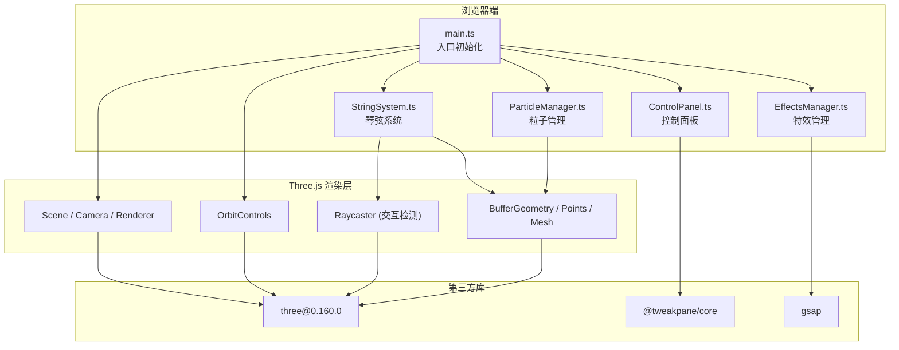

## 1. 架构设计



## 2. 技术选型说明

- **前端框架**：TypeScript + Vite（非React/Vue，直接操作Three.js）
- **3D引擎**：Three.js@0.160.0（WebGL渲染、3D场景管理、粒子系统）
- **控制面板**：@tweakpane/core（轻量参数调节UI库）
- **动画引擎**：gsap（补间动画、颜色插值、缓动效果）
- **构建工具**：Vite（极速HMR、TypeScript支持、打包优化）
- **后端**：无（纯前端项目）

## 3. 文件结构

```
e:\solo\VersionFast\tasks\auto170\
├── package.json
├── vite.config.js
├── tsconfig.json
├── index.html
└── src/
    ├── main.ts              # 场景初始化、渲染循环、全局状态
    ├── StringSystem.ts      # 琴弦创建/振动/共振检测
    ├── ParticleManager.ts   # 粒子系统管理
    ├── ControlPanel.ts      # Tweakpane控制面板
    └── EffectsManager.ts    # 共振视觉效果管理
```

## 4. 核心模块接口定义

### 4.1 StringSystem 接口

```typescript
interface StringData {
  id: number;
  mesh: THREE.Mesh;
  basePosition: THREE.Vector3;
  color: THREE.Color;
  frequency: number;        // 基础频率(Hz)
  isVibrating: boolean;
  vibrationStartTime: number;
  clickPoint: number;       // 0-1 琴弦上的相对位置
  amplitude: number;
  decay: number;
  originalGeometry: THREE.BufferGeometry;
}

interface ResonanceEvent {
  stringA: number;
  stringB: number;
  ratio: number;           // 2:1 / 3:2 / 4:3
  strength: number;
}

class StringSystem {
  strings: StringData[];
  couplingLines: THREE.LineSegments;
  onResonance: (events: ResonanceEvent[]) => void;
  
  createStrings(scene: THREE.Scene): void;
  createCouplingGrid(scene: THREE.Scene): void;
  triggerVibration(stringId: number, clickPoint: THREE.Vector3): void;
  updateVibrations(time: number, delta: number): void;
  checkResonance(tolerance: number): ResonanceEvent[];
  getAllStrings(): StringData[];
  getVibrationData(): Array<{id: number, displacement: Float32Array}>;
  resetAll(): void;
}
```

### 4.2 ParticleManager 接口

```typescript
interface Particle {
  position: THREE.Vector3;
  velocity: THREE.Vector3;
  color: THREE.Color;
  life: number;           // 剩余生命周期(秒)
  maxLife: number;
  type: 'pluck' | 'resonance' | 'nebula';
  parentStringId?: number;
}

class ParticleManager {
  scene: THREE.Scene;
  pluckParticles: THREE.Points;
  resonanceParticles: THREE.Points;
  nebulaParticles: THREE.Points;
  
  createNebulaParticles(count: number): void;
  emitPluckParticles(
    position: THREE.Vector3,
    normal: THREE.Vector3,
    color: THREE.Color,
    count: number,
    speedMultiplier: number
  ): void;
  emitResonanceRing(
    center: THREE.Vector3,
    colorA: THREE.Color,
    colorB: THREE.Color,
    radius: number,
    particleCount: number
  ): void;
  updateParticles(delta: number): void;
  getParticlePositions(): Float32Array;
  clearAll(): void;
}
```

### 4.3 ControlPanel 接口

```typescript
interface ControlParams {
  tension: number;           // 0.1 - 2.0, default 1.0
  damping: number;           // 0.9 - 0.99, default 0.98
  resonanceSensitivity: number; // 0.01 - 0.1, default 0.05
}

class ControlPanel {
  params: ControlParams;
  container: HTMLElement;
  onReset: () => void;
  onRecordStart: () => void;
  onRecordStop: (data: any) => void;
  
  createPanel(): void;
  createMobileToggle(): void;
  getParams(): ControlParams;
  setRecordingState(isRecording: boolean): void;
}
```

### 4.4 EffectsManager 接口

```typescript
class EffectsManager {
  scene: THREE.Scene;
  nebulaBaseColor: THREE.Color;
  nebulaTargetColor: THREE.Color;
  rotationBoost: number;
  
  subscribeResonanceEvents(source: any): void;
  animateCouplingLine(
    lineIndex: number,
    fromColor: THREE.Color,
    toColor: THREE.Color,
    duration: number
  ): void;
  shiftNebulaColor(targetColor: THREE.Color, speed: number): void;
  setSceneRotationBoost(multiplier: number): void;
  update(delta: number): void;
  reset(): void;
}
```

## 5. 性能优化策略

| 优化项 | 方案 |
|-------|------|
| 粒子渲染 | 使用单个BufferGeometry + Points合并所有同类粒子，减少draw call |
| 顶点动画 | 琴弦振动使用shader-based顶点位移或CPU端BufferAttribute更新 |
| 粒子上限 | 桌面端≤3000，移动端≤1800，超过后优先淘汰老粒子 |
| 碰撞检测 | Raycaster仅在mousedown时触发，不每帧检测 |
| 共振检测 | 仅当≥2根琴弦同时振动时才进行频率比计算 |
| 颜色插值 | HSL空间插值代替RGB，避免色彩偏差 |
| 响应式 | 移动端缩小琴弦间距70%，粒子数60%，降低几何复杂度 |
| 雾效裁剪 | 使用FogExp2减少远距离绘制，density=0.02 |

## 6. 录制数据结构

```typescript
interface RecordingFrame {
  frame: number;
  timestamp: number;
  stringVibrations: Array<{
    stringId: number;
    displacement: number[];  // 顶点位移数组
    amplitude: number;
  }>;
  particlePositions: Array<{
    type: 'pluck' | 'resonance';
    x: number; y: number; z: number;
    r: number; g: number; b: number;
  }>;
}

interface RecordingData {
  version: '1.0';
  duration: number;
  fps: 60;
  totalFrames: number;
  paramsAtRecord: ControlParams;
  frames: RecordingFrame[];
}
```
