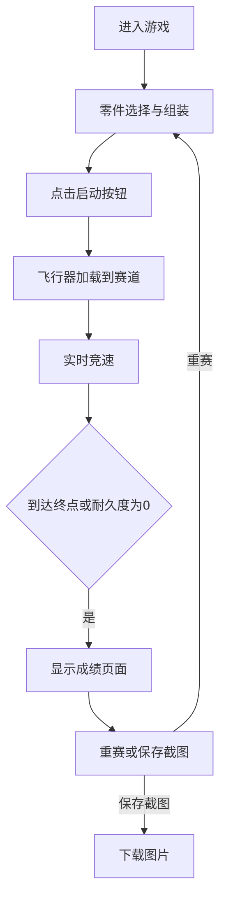

## 1. 产品概述

蒸汽朋克飞行器组装与竞速游戏是一款基于浏览器的互动游戏，让机械爱好者和竞速游戏玩家能够从零选择零件（引擎、机翼、螺旋桨、驾驶舱），组装个性化的蒸汽朋克飞行器，并在齿轮、管道和钟楼构成的赛道上进行实时竞速，最终根据速度、稳定性和耐久度综合评分。

### 目标用户
- 机械爱好者：享受零件选择和组装过程
- 竞速游戏玩家：追求速度和操作技巧
- 蒸汽朋克文化爱好者：欣赏独特的维多利亚时代工业美学

### 产品价值
- 提供沉浸式的蒸汽朋克风格视觉体验
- 结合策略性（零件选择）与操作性（竞速操控）的双重乐趣
- 无需安装，直接在浏览器中即可体验

## 2. 核心功能

### 2.1 功能模块

1. **零件选择与组装模块**：工作台界面，四种零件类型各三种选择，拖拽式组装
2. **赛道竞速模块**：水平卷轴式赛道，键盘控制，障碍物碰撞检测
3. **成绩评分模块**：综合评分系统，重赛与截图保存功能

### 2.2 页面详情

| 页面名称 | 模块名称 | 功能描述 |
|---------|---------|---------|
| 主界面 | 工作台组装区 | 展示虚拟工作台，支持零件拖拽组装，金属咬合音效 |
| 主界面 | 零件槽位区 | 引擎、机翼、螺旋桨、驾驶舱各3种可选零件 |
| 主界面 | 赛道预览区 | 水平卷轴式赛道，800x400px，包含5个障碍物 |
| 主界面 | 启动按钮 | 铆接金属风格按钮，启动竞速 |
| 竞速界面 | 飞行器控制 | 方向键控制上下左右移动 |
| 竞速界面 | 碰撞系统 | AABB碰撞检测，耐久度扣减，震动动画 |
| 竞速界面 | 音效系统 | 引擎声音随耐久度变化 |
| 成绩界面 | 分数展示 | 总时间、碰撞次数、耐久度余量、综合评分 |
| 成绩界面 | 操作按钮 | 重赛按钮、保存截图按钮 |

## 3. 核心流程

### 3.1 游戏主流程

### 3.2 组装流程

1. 用户从零件槽位中拖拽零件到组装区域
2. 零件自动对接，播放金属咬合音效
3. 四种零件（引擎、机翼、螺旋桨、驾驶舱）全部组装完成后，启动按钮激活

### 3.3 竞速流程

1. 点击启动按钮，飞行器从起点出发
2. 用户使用方向键控制飞行器移动
3. 飞行器与障碍物碰撞时扣减耐久度并播放震动动画
4. 耐久度低于30%时引擎声音变低沉
5. 到达终点或耐久度为0时竞速结束
6. 根据时间、碰撞次数、耐久度计算总分

## 4. 用户界面设计

### 4.1 设计风格

**蒸汽朋克风格** - 维多利亚时代工业美学

- **主色调**：
  - 铜色 `#b87333` - 金属质感的主色
  - 铁锈红 `#7a3a2a` - 复古工业感
  - 奶油色 `#f5deb3` - 柔和的点缀色
  - 深棕色 `#3b2b1a` - 深色背景与文字

- **背景**：深赭石色 `#3b2b1a` 到铁锈色 `#5a3a2a` 的径向渐变，模拟旧金属板质感

- **按钮风格**：铆接金属风格，圆角8px，深色内阴影模拟立体感

- **字体**：选用具有复古工业感的字体搭配清晰易读的正文字体

### 4.2 页面设计概览

| 页面区域 | 模块名称 | UI元素 |
|---------|---------|-------|
| 左侧 | 零件槽位区 | 4列零件卡片，铜色边框，悬停发光效果 |
| 中央 | 工作台组装区 | 木色工作台，木板纹理，拖拽放置区域 |
| 右侧 | 赛道预览/竞速区 | Canvas绘制的赛道，飞行器与障碍物 |
| 底部 | 控制区 | 启动按钮、状态信息 |
| 覆盖层 | 成绩面板 | 黄铜色边框，金属质感数字 |

### 4.3 动画与交互

- **零件拖拽**：半透明蓝色拖影 (`drop-shadow(0 0 6px #4a90d9)`)
- **碰撞反馈**：飞行器震动动画 (`rotate(-2deg)` 和 `translateX(5px)` 交替)
- **齿轮旋转**：CSS旋转动画，每1.5秒一圈
- **蒸汽管道**：CSS keyframes沿Y轴浮动
- **金属咬合**：Web Audio API生成短促咔嗒声

### 4.4 响应式设计

- **桌面端 (>768px)**：工作台与赛道水平排列，零件槽位4列纵向排列
- **移动端 (<768px)**：工作台与赛道垂直排列，零件槽位1行4列，尺寸缩小

## 5. 性能要求

- 主渲染循环保持60fps
- 碰撞检测使用AABB矩形算法
- 每帧最多检测20个障碍物
- 障碍物精灵开启GPU加速 (`will-change: transform`)
- 零件拖拽使用 `requestAnimationFrame` 优化
- 总代码包大小不超过200KB
