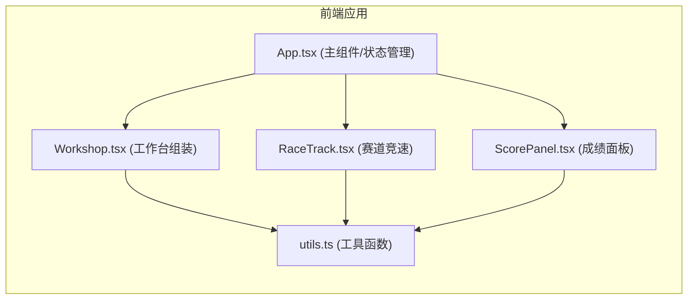

## 1. 架构设计



## 2. 技术栈描述

### 核心技术
- **前端框架**：React 18 + TypeScript
- **构建工具**：Vite 5
- **状态管理**：React useReducer
- **动画库**：GSAP（可选，用于复杂动画）
- **图标库**：无，使用 CSS/SVG 绘制蒸汽朋克风格元素

### 原生 API 使用
- **Canvas API**：绘制赛道背景、障碍物和飞行器
- **Web Audio API**：生成音效（金属咬合声、引擎声）
- **requestAnimationFrame**：游戏主循环、拖拽优化
- **Canvas toDataURL**：截图保存功能

### 依赖包
| 包名 | 版本 | 用途 |
|-----|-----|------|
| react | ^18.2.0 | UI 框架 |
| react-dom | ^18.2.0 | DOM 渲染 |
| typescript | ^5.0.0 | 类型系统 |
| vite | ^5.0.0 | 构建工具 |
| @vitejs/plugin-react | ^4.0.0 | React 插件 |
| uuid | ^9.0.0 | 生成唯一 ID |
| file-saver | ^2.0.5 | 文件保存 |
| gsap | ^3.12.0 | 动画库 |

## 3. 项目结构

```
.
├── index.html                 # 入口 HTML
├── package.json               # 项目配置
├── vite.config.js             # Vite 配置
├── tsconfig.json              # TypeScript 配置
└── src/
    ├── App.tsx                # 主组件，状态管理
    ├── Workshop.tsx           # 零件选择与组装组件
    ├── RaceTrack.tsx          # 赛道渲染与竞速组件
    ├── ScorePanel.tsx         # 成绩显示组件
    └── utils.ts               # 工具函数集合
```

## 4. 状态管理设计

### 游戏状态 (GameState)

```typescript
type GamePhase = 'assembly' | 'racing' | 'finished';

interface SelectedParts {
  engine: Part | null;
  wing: Part | null;
  propeller: Part | null;
  cockpit: Part | null;
}

interface RaceState {
  position: { x: number; y: number };
  speed: number;
  durability: number;     // 0-100
  distance: number;       // 已行驶距离
  collisions: number;     // 碰撞次数
  startTime: number | null;
  endTime: number | null;
  isFinished: boolean;
}

interface ScoreData {
  totalTime: number;
  collisions: number;
  durability: number;
  totalScore: number;
}

interface GameState {
  phase: GamePhase;
  selectedParts: SelectedParts;
  raceState: RaceState;
  scoreData: ScoreData | null;
}
```

## 5. 零件数据模型

### 零件类型定义

```typescript
type PartType = 'engine' | 'wing' | 'propeller' | 'cockpit';

interface Part {
  id: string;
  type: PartType;
  name: string;
  description: string;
  stats: {
    speed?: number;       // 速度加成 (用于引擎)
    stability?: number;   // 稳定性 (用于机翼)
    durability?: number;  // 耐久度加成
    acceleration?: number; // 加速度
  };
  color: string;
  width: number;
  height: number;
}
```

### 零件配置

- **引擎 (3种)**：
  - 蒸汽涡轮引擎：速度 180px/s，耐久度加成 0
  - 双活塞引擎：速度 140px/s，耐久度加成 20
  - 单缸引擎：速度 100px/s，耐久度加成 30

- **机翼 (3种)**：
  - 双翼式：稳定性高，速度慢
  - 单翼式：平衡型
  - 后掠翼：速度快，稳定性低

- **螺旋桨 (3种)**：
  - 涡轮式：高速推进
  - 三叶式：平衡型
  - 双叶式：低速高扭矩

- **驾驶舱 (3种)**：
  - 黄铜座舱：耐久度高
  - 玻璃座舱：视野好，耐久度低
  - 装甲座舱：最重，最耐用

## 6. 碰撞检测算法

### AABB 矩形碰撞检测

```typescript
interface AABB {
  x: number;
  y: number;
  width: number;
  height: number;
}

function checkAABBCollision(a: AABB, b: AABB): boolean {
  return (
    a.x < b.x + b.width &&
    a.x + a.width > b.x &&
    a.y < b.y + b.height &&
    a.y + a.height > b.y
  );
}
```

## 7. 分数计算

```typescript
function calculateScore(
  time: number,       // 毫秒
  collisions: number, // 碰撞次数
  durability: number  // 剩余耐久度 0-100
): number {
  const timeScore = Math.max(0, 100 - (time / 1000 - 15) * 2);  // 时间占50%
  const collisionScore = Math.max(0, 100 - collisions * 15);    // 碰撞占30%
  const durabilityScore = durability;                           // 耐久占20%
  
  return Math.round(
    timeScore * 0.5 + 
    collisionScore * 0.3 + 
    durabilityScore * 0.2
  );
}
```

## 8. 性能优化策略

1. **渲染循环**：使用 `requestAnimationFrame` 实现 60fps 游戏循环
2. **碰撞优化**：每帧最多检测 20 个障碍物，使用空间分区
3. **GPU 加速**：障碍物元素使用 `will-change: transform` 开启硬件加速
4. **拖拽优化**：使用 `requestAnimationFrame` 而非 `mousemove` 事件处理拖拽
5. **Canvas 绘制**：使用 Canvas 绘制赛道和障碍物，减少 DOM 操作
6. **状态管理**：使用 `useReducer` 集中管理状态，避免不必要的重渲染

## 9. 音效系统设计

### Web Audio API 生成

1. **金属咬合声**：短促的咔嗒声，使用方波振荡器 + 快速衰减包络
2. **引擎声音**：持续的低频嗡嗡声，使用锯齿波振荡器
   - 正常状态：基础频率 80Hz
   - 低耐久度 (<30%)：频率降至 50Hz，声音变低沉

## 10. 响应式设计断点

| 断点 | 布局变化 |
|-----|---------|
| > 768px | 桌面端：工作台与赛道水平排列，零件槽位4列纵向 |
| ≤ 768px | 移动端：工作台与赛道垂直排列，零件槽位1行4列 |
