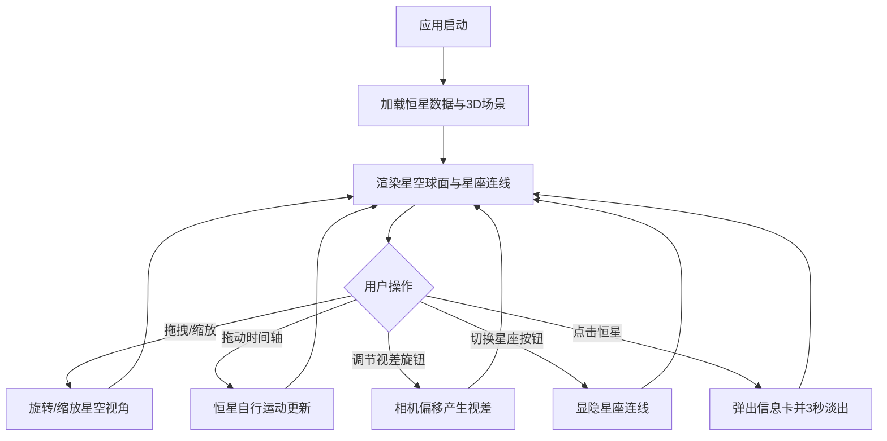

## 1. 产品概述

虚拟黄道星图与恒星运动模拟器——一款基于真实恒星数据的3D交互式天文可视化应用，让数字星象学家在浏览器中操控时间轴与视差角度，观察黄道十二宫星座中恒星的位置变化、星等闪烁和相对运动。

- 面向天文爱好者与数字星象学家，提供沉浸式恒星运动观测体验
- 核心价值：将专业天文数据转化为直观的3D交互可视化，模拟千年尺度的天球变化

## 2. 核心功能

### 2.1 功能模块

1. **星空球面**：围绕观测者（原点）的3D星空球面，包含至少50颗较亮恒星，根据真实星等和光谱类型渲染不同大小（0.2-1.5单位）和颜色（蓝白#aaccff到红橙#ff6633渐变），恒星表面有呼吸闪烁效果（自定义着色器Sine波）
2. **时间轴控制**：水平时间轴滑块（范围-1000年到+1000年，步长10年），拖动时恒星根据自行运动数据在球面上移动，星等和颜色根据距离变化做微小调整
3. **视差角度控制**：垂直视差角度旋钮（范围-30到+30度），旋转时相机围绕Y轴偏移，产生前景/背景恒星视差位移
4. **黄道十二宫连线**：12条半透明星座连线（3-8顶点/线，线宽2px，颜色取星座主星平均色），12个圆钮独立切换显隐
5. **恒星信息卡**：点击恒星弹出半透明磨砂玻璃信息卡（星名、星等、距离、光谱类型、所属星座），3秒后自动淡出

### 2.2 页面详情

| 页面名称 | 模块名称 | 功能描述 |
|---------|---------|---------|
| 星图主页面 | 3D星空球面 | 粒子系统渲染50+颗恒星，自定义着色器实现呼吸闪烁，鼠标拖拽旋转和滚轮缩放 |
| 星图主页面 | 时间轴滑块 | 水平滑块-1000~+1000年，步长10年，拖动驱动恒星位置/亮度/颜色变化 |
| 星图主页面 | 视差角度旋钮 | 垂直旋钮-30~+30度，弧形刻度盘，驱动相机Y轴偏移产生视差 |
| 星图主页面 | 星座连线与切换 | 12条黄道十二宫半透明连线，左上角12个圆形按钮独立切换显隐 |
| 星图主页面 | 恒星信息卡 | 点击恒星弹出磨砂玻璃卡片，3秒自动淡出 |

## 3. 核心流程

用户打开应用 → 加载3D星空球面 → 拖拽旋转/滚轮缩放观察星空 → 拖动时间轴观察恒星运动 → 调节视差角度观察远近星位移差异 → 切换星座连线显隐 → 点击恒星查看信息卡

## 4. 界面设计

### 4.1 设计风格

- 主色调：深空黑(#0a0a1a)，动态背景色在深蓝(#0a0a2a)与暗紫(#1a0a2a)之间缓动
- 辅助色：恒星色谱（蓝白#aaccff → 黄白#ffffaa → 橙红#ff6633），星座主色
- 按钮/控件风格：圆角边框、10px内阴影、半透明背景(rgba(255,255,255,0.08))、悬停外发光1px白色
- 字体：等宽数字字体用于年份显示，无衬线字体用于信息卡
- 布局：全屏沉浸式3D场景，UI控件浮动叠加

### 4.2 页面设计概览

| 页面名称 | 模块名称 | UI元素 |
|---------|---------|--------|
| 星图主页面 | 3D星空球面 | 全屏Three.js Canvas，黑色深空背景，粒子系统 |
| 星图主页面 | 时间轴滑块 | 屏幕底部水平滑块，数字显示+年份标记，GSAP驱动背景色渐变 |
| 星图主页面 | 视差角度旋钮 | 屏幕右侧垂直旋钮，弧形刻度盘，-30°~+30° |
| 星图主页面 | 星座切换按钮 | 左上角两行圆形按钮（直径28px，深灰#222，激活时填充星座主色） |
| 星图主页面 | 恒星信息卡 | 点击弹出半透明磨砂玻璃卡片，显示星名/星等/距离/光谱/星座 |

### 4.3 响应式适配

- 桌面端优先设计
- 屏幕宽度<768px时：UI折叠到屏幕边缘可滑动抽屉，时间轴缩至高度40px
- 触控优化：点击/拖动操作有微弱触感反馈（CSS transform:scale(0.98)临时缩放）

### 4.4 3D场景指导

- 环境/氛围：深空黑色背景，恒星粒子发光，星座连线半透明叠加
- 相机设置：透视相机，初始位于原点附近，支持拖拽旋转和滚轮缩放
- 交互：鼠标拖拽旋转星空，滚轮缩放，时间轴驱动恒星位置更新，视差旋钮驱动相机偏移
- 后处理：恒星呼吸闪烁（自定义着色器Sine波），GSAP驱动背景色渐变
- 性能预算：45+FPS，星座连线顶点≤200个，时间轴更新延迟<100ms
