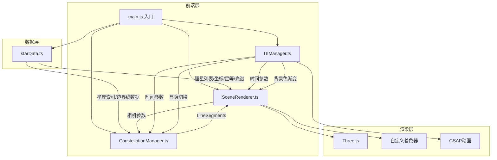

## 1. 架构设计



## 2. 技术说明

- 前端框架：TypeScript + Three.js@0.160.0（非React/Vue，纯Three.js渲染）
- 构建工具：Vite
- 动画库：GSAP
- 初始化工具：手动创建项目结构（非vite-init模板，因为非React/Vue项目）
- 后端：无
- 数据库：无，使用内嵌恒星数据

## 3. 文件结构与调用关系

| 文件 | 职责 | 调用关系 |
|-----|------|---------|
| `package.json` | 项目依赖与脚本 | 入口 |
| `vite.config.js` | Vite构建配置 | 被vite CLI引用 |
| `tsconfig.json` | TypeScript严格模式配置 | 被tsc引用 |
| `index.html` | HTML入口，全屏黑色背景 | 引用src/main.ts |
| `src/main.ts` | 应用入口，初始化所有模块 | 引用starData, SceneRenderer, ConstellationManager, UIManager |
| `src/starData.ts` | 定义IStarData接口和StarSystem类，恒星坐标/星等/光谱/自行运动数据 | 被SceneRenderer和ConstellationManager引用 |
| `src/SceneRenderer.ts` | Three.js场景初始化，相机/光线/粒子系统，每帧更新粒子位置和材质，鼠标拖拽旋转/滚轮缩放 | 接收starData恒星列表，被UIManager调用方法 |
| `src/ConstellationManager.ts` | 根据时间参数从starData查询星座边界线，生成LineSegments，切换显隐 | 接收starData星座索引和SceneRenderer相机参数，输出连线到场景 |
| `src/UIManager.ts` | 创建时间轴/视差旋钮/星座按钮，绑定事件，GSAP驱动动画 | 调用SceneRenderer和ConstellationManager的方法 |

## 4. 数据流向

```
starData.ts ──→ SceneRenderer.ts（恒星坐标、星等、光谱 → 粒子位置/大小/颜色）
starData.ts ──→ ConstellationManager.ts（星座索引、连线顶点 → LineSegments）
UIManager.ts ──→ SceneRenderer.ts（时间参数 → 更新粒子位置；视差参数 → 更新相机位置）
UIManager.ts ──→ ConstellationManager.ts（时间参数 → 更新连线；显隐切换 → 设置visible）
SceneRenderer.ts ──→ ConstellationManager.ts（相机参数 → 连线渲染参考）
```

## 5. 自定义着色器设计

### 5.1 恒星粒子着色器

- 顶点着色器：根据星等计算粒子大小(0.2-1.5)，根据光谱类型计算颜色（蓝白→黄白→红橙渐变），加入时间驱动的Sine波呼吸闪烁效果
- 片元着色器：径向渐变发光效果，中心亮边缘暗，模拟恒星视觉外观

### 5.2 性能优化策略

- 使用BufferGeometry + Points批量渲染恒星粒子
- 星座连线使用LineSegments合并渲染，总顶点数≤200
- 时间轴更新使用requestAnimationFrame节流，确保延迟<100ms
- 视差计算在顶点着色器中完成，减少CPU开销

## 6. 恒星数据结构

```typescript
interface IStarData {
  name: string;
  ra: number;
  dec: number;
  magnitude: number;
  distance: number;
  spectralType: string;
  properMotionRA: number;
  properMotionDec: number;
  constellation: string;
}

class StarSystem {
  stars: IStarData[];
  getStarColor(spectralType: string): number;
  getStarSize(magnitude: number): number;
  getAdjustedPosition(star: IStarData, yearOffset: number): { x: number; y: number; z: number };
}
```
