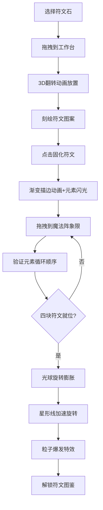

## 1. 产品概述

虚拟符文石篆刻与魔法阵激活交互游戏，为奇幻爱好者和符文研究爱好者提供沉浸式的网页体验。玩家可选择不同材质的符文石，在石面上手工刻绘符文，按元素循环顺序排列符文石激活魔法阵，触发绚丽特效并解锁隐藏符文图鉴。

- **核心价值**：通过精细的视觉效果和流畅的交互，让玩家体验古老符文魔法的魅力
- **目标用户**：奇幻文化爱好者、符文研究者、游戏玩家
- **市场定位**：高品质网页交互体验，兼具艺术性和娱乐性

## 2. 核心特征

### 2.1 功能模块

1. **工坊主界面**：石质工作台、符文石选择面板、3x3网格槽位、悬浮提示信息
2. **符文刻符系统**：Canvas笔触绘制、凿刻碎屑粒子、固化动画、元素闪光特效
3. **魔法阵激活系统**：四象限元素魔法阵、元素循环验证、共振波纹、光球旋转膨胀、粒子爆发
4. **符文图鉴系统**：已解锁符文卡牌展示、卡牌翻转动画、元素色光晕

### 2.2 页面详情

| 页面名称 | 模块名称 | 功能描述 |
|-----------|-------------|---------------------|
| 主工坊界面 | 符文石选择面板 | 6种材质符文石展示（月光石、黑曜石、血石、翡翠、琥珀、紫水晶），点击显示名称、元素属性和传说简介，拖拽放置 |
| 主工坊界面 | 石质工作台 | 300px*400px尺寸，3x3网格槽位，支持拖拽放置，放置动画和光晕脉冲 |
| 符文刻符界面 | 刻符画布 | Canvas绘制符文，凿刻粒子效果，3px笔划，石面高光色 |
| 符文刻符界面 | 固化功能 | 渐变描边动画显现符文，元素色闪光特效 |
| 魔法阵界面 | 魔法阵区域 | 直径400px圆形阵，四象限元素分区，旋转星形线，元素色轮盘渐变 |
| 魔法阵界面 | 激活系统 | 元素循环顺序验证（火→水→风→地→火），共振波纹，旋转光球，粒子爆发 |
| 图鉴界面 | 符文图鉴 | 右侧滑入面板，半透明模糊背景，符文卡牌翻转动画 |

## 3. 核心流程

玩家从符文石选择面板拖拽符文石到工作台槽位 → 在石面上用鼠标刻绘符文图案 → 点击"固化符文"按钮完成刻绘 → 将固化后的符文石拖拽到魔法阵对应元素象限 → 按火→水→风→地顺序放置四块符文石 → 魔法阵激活，光球旋转膨胀，粒子爆发 → 解锁隐藏符文图鉴。

## 4. 用户界面设计

### 4.1 设计风格

- **整体风格**：黑暗奇幻中世纪手稿质感，古老石质工坊氛围
- **主色调**：深灰岩色（#2e2b28）、暗苔绿色（#2a382a）、古铜色（#b87333）
- **背景**：径向渐变从深灰岩到暗苔绿，模拟潮湿石室质感，激活时变为星光闪烁
- **按钮与面板**：CSS伪元素纹理和阴影，模拟羊皮纸和金属铆钉效果
- **字体**：选择具有古老质感的衬线字体作为标题，清晰易读的无衬线字体作为正文

### 4.2 视觉特效

| 特效名称 | 实现方式 | 效果描述 |
|-----------|-------------|---------------------|
| 3D翻转放置 | CSS 3D transform | Y轴旋转180度，0.5s动画 |
| 光晕脉冲 | CSS box-shadow animation | 元素色到#ffffff50循环，周期2s |
| 凿刻粒子 | Canvas | 每帧5个白色小点，随机飞散，0.5s消失 |
| 渐变描边 | Canvas stroke animation | 从起点到终点0.8s逐笔显现 |
| 共振波纹 | Canvas | 从放置点扩散到200px直径，1s持续，透明度1→0 |
| 旋转光球 | Canvas | 多层径向渐变，0.5s一圈，从20px膨胀到80px |
| 粒子爆发 | canvas-confetti | 500个彩色粒子，速度200-500px/s，持续3s |
| 卡牌翻转 | CSS 3D transform | 0.6s翻转动画 |
| 星光闪烁 | CSS animation | 随机透明度0.3-1，周期2-5秒 |

### 4.3 页面设计概览

| 页面名称 | 模块名称 | UI元素 |
|-----------|-------------|-------------|
| 主工坊界面 | 工作台区域 | 石质纹理背景、3x3虚线网格、3D翻转动画、光晕脉冲 |
| 主工坊界面 | 符文石面板 | 6种颜色方块、悬浮提示框（淡入0.3s）、拖拽效果 |
| 刻符界面 | Canvas画布 | 3px笔划、石面高光色、碎屑粒子、固化按钮 |
| 魔法阵界面 | 圆形阵 | 元素色轮盘渐变（#ff4500-#00bfff-#32cd32-#ffd700）、旋转星形线（10s/圈）、四象限分区 |
| 魔法阵界面 | 激活特效 | 共振波纹、旋转光球、星形线加速（2s/圈）、粒子爆发 |
| 图鉴界面 | 侧滑面板 | 半透明背景#2a2a2a90、blur(8px)、卡牌翻转动画、元素色光晕 |

### 4.4 响应式设计

- **大屏（>1200px）**：工作台和魔法阵区域并排排列
- **中屏（768-1200px）**：工作台和魔法阵区域上下堆叠
- **小屏（<768px）**：魔法阵缩小至300px直径，文字说明隐藏

### 4.5 性能要求

- **动画驱动**：所有动画使用requestAnimationFrame，保证60fps
- **粒子系统**：激活瞬间最多500个粒子，15秒后自动消亡，帧率不低于55fps
- **Canvas优化**：笔触绘制使用offscreen缓存，避免重复绘制
