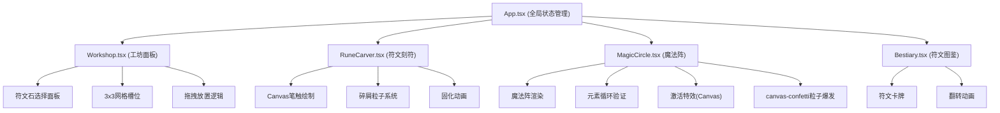

## 1. 架构设计



## 2. 技术描述

- **前端框架**：React 18 + TypeScript
- **构建工具**：Vite 5
- **React插件**：@vitejs/plugin-react
- **粒子系统**：canvas-confetti
- **状态管理**：React useState/useReducer (组件内状态) + props传递
- **样式方案**：CSS Modules / 内联CSS变量 + 全局样式
- **动画方案**：CSS 3D Transform + CSS Animation + Canvas requestAnimationFrame

## 3. 目录结构

```
├── package.json
├── vite.config.js
├── tsconfig.json
├── index.html
└── src/
    ├── App.tsx
    ├── types/
    │   └── index.ts
    ├── utils/
    │   ├── canvasUtils.ts
    │   └── particleUtils.ts
    ├── components/
    │   ├── Workshop.tsx
    │   ├── RuneCarver.tsx
    │   ├── MagicCircle.tsx
    │   └── Bestiary.tsx
    └── styles/
        ├── global.css
        ├── animations.css
        └── textures.css
```

## 4. 核心数据模型

### 4.1 类型定义

```typescript
// 元素类型
type ElementType = 'fire' | 'water' | 'wind' | 'earth';

// 符文石材质
interface RuneStone {
  id: string;
  name: string;
  color: string;
  element: ElementType;
  legend: string;
  highlightColor: string;
}

// 放置的符文石
interface PlacedStone {
  id: string;
  stone: RuneStone;
  gridPosition: { row: number; col: number } | null;
  circlePosition: ElementType | null;
  runePaths: Point[][];
  isCarved: boolean;
  isSolidified: boolean;
}

// 绘制点
interface Point {
  x: number;
  y: number;
}

// 粒子
interface Particle {
  x: number;
  y: number;
  vx: number;
  vy: number;
  life: number;
  maxLife: number;
  color: string;
  size: number;
}

// 魔法阵状态
type MagicCircleState = 'idle' | 'waiting' | 'activating' | 'active';

// 图鉴卡牌
interface RuneCard {
  id: string;
  name: string;
  element: ElementType;
  description: string;
  isUnlocked: boolean;
  pattern: string;
}
```

### 4.2 元素循环顺序

```
fire → water → wind → earth → fire
```

元素颜色映射：
- fire: #ff4500 (橙红色)
- water: #00bfff (深天蓝)
- wind: #32cd32 (酸橙绿)
- earth: #ffd700 (金色)

### 4.3 符文石数据

```typescript
const RUNE_STONES: RuneStone[] = [
  { id: 'moonstone', name: '月光石', color: '#e6e0d0', element: 'water', legend: '北欧神话中，月光石是月神的眼泪凝结而成，蕴含水元素的治愈之力。', highlightColor: '#ffffff' },
  { id: 'obsidian', name: '黑曜石', color: '#1a1a1a', element: 'fire', legend: '火山熔岩迅速冷却形成的宝石，封印着远古火焰精灵的力量。', highlightColor: '#4a4a4a' },
  { id: 'bloodstone', name: '血石', color: '#5a2020', element: 'fire', legend: '古代战士献祭之石，血红色的斑点象征着勇气与牺牲。', highlightColor: '#8a4040' },
  { id: 'jade', name: '翡翠', color: '#2a5a2a', element: 'earth', legend: '东方文明中的大地之石，象征着永恒的生命力与繁荣。', highlightColor: '#4a8a4a' },
  { id: 'amber', name: '琥珀', color: '#c8a020', element: 'wind', legend: '远古树脂的化石，封存着风的记忆与时间的秘密。', highlightColor: '#f0c840' },
  { id: 'amethyst', name: '紫水晶', color: '#6a2a8a', element: 'wind', legend: '酒神的馈赠，紫色的晶体能够净化心灵，唤醒风元素的智慧。', highlightColor: '#9a4aba' },
];
```

## 5. 组件接口定义

### 5.1 Workshop 组件 Props

```typescript
interface WorkshopProps {
  selectedStone: RuneStone | null;
  placedStones: PlacedStone[];
  onStoneSelect: (stone: RuneStone) => void;
  onStonePlace: (stone: RuneStone, gridPosition: { row: number; col: number }) => void;
  onStoneSelectForCarving: (placedStone: PlacedStone) => void;
  onStoneDragToCircle: (placedStone: PlacedStone) => void;
}
```

### 5.2 RuneCarver 组件 Props

```typescript
interface RuneCarverProps {
  placedStone: PlacedStone | null;
  onCarvingComplete: (stoneId: string, paths: Point[][]) => void;
  onSolidify: (stoneId: string) => void;
}
```

### 5.3 MagicCircle 组件 Props

```typescript
interface MagicCircleProps {
  placedStones: PlacedStone[];
  onStoneDrop: (stoneId: string, element: ElementType) => void;
  onActivationComplete: () => void;
}
```

### 5.4 Bestiary 组件 Props

```typescript
interface BestiaryProps {
  isOpen: boolean;
  unlockedCards: RuneCard[];
  onClose: () => void;
  newlyUnlocked: RuneCard | null;
}
```

## 6. 性能优化策略

### 6.1 Canvas 优化

1. **Offscreen Canvas**：使用 OffscreenCanvas 进行离屏渲染缓存
2. **分层绘制**：将静态背景和动态元素分层绘制
3. **脏矩形更新**：只重绘变化的区域

### 6.2 粒子系统优化

1. **对象池**：复用粒子对象，避免频繁GC
2. **数量限制**：最大500个粒子同时存在
3. **自动消亡**：15秒后自动清理所有粒子

### 6.3 动画优化

1. **requestAnimationFrame**：所有动画使用 RAF 驱动
2. **CSS Transform**：优先使用 transform 和 opacity 动画
3. **will-change**：对动画元素添加 will-change 提示

## 7. 构建配置

### 7.1 vite.config.js

```javascript
import { defineConfig } from 'vite';
import react from '@vitejs/plugin-react';

export default defineConfig({
  plugins: [react()],
  base: './',
  server: {
    port: 3000,
    open: true
  },
  build: {
    outDir: 'dist',
    sourcemap: true
  }
});
```

### 7.2 tsconfig.json

```json
{
  "compilerOptions": {
    "target": "ES2020",
    "useDefineForClassFields": true,
    "lib": ["ES2020", "DOM", "DOM.Iterable"],
    "module": "ESNext",
    "skipLibCheck": true,
    "moduleResolution": "bundler",
    "allowImportingTsExtensions": true,
    "resolveJsonModule": true,
    "isolatedModules": true,
    "noEmit": true,
    "jsx": "react-jsx",
    "strict": true,
    "noUnusedLocals": true,
    "noUnusedParameters": true,
    "noFallthroughCasesInSwitch": true
  },
  "include": ["src"],
  "references": [{ "path": "./tsconfig.node.json" }]
}
```
