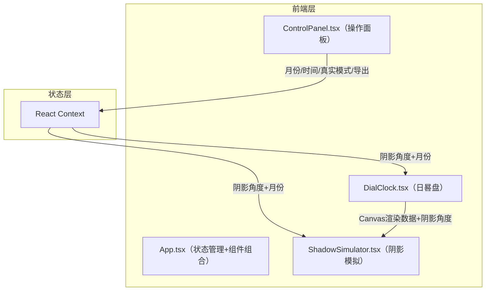

## 1. 架构设计



## 2. 技术说明

- **前端框架**：React 18 + TypeScript
- **构建工具**：Vite 5（@vitejs/plugin-react）
- **动画库**：framer-motion
- **截图库**：html2canvas
- **文件保存**：file-saver
- **状态管理**：React Context（轻量级，无需zustand，仅3个状态值）
- **后端**：无（纯前端应用）

## 3. 文件结构与调用关系

```
项目根目录/
├── package.json          # 依赖与脚本
├── vite.config.js        # 构建配置（React插件，base:'./'）
├── tsconfig.json         # TypeScript严格模式，目标ES2020
├── index.html            # 入口页面（深灰背景）
└── src/
    ├── App.tsx           # 主入口：组合子组件，Context Provider
    ├── DialClock.tsx     # 日晷盘：Canvas渲染晷面/晷针/刻度，计算阴影角度
    ├── ShadowSimulator.tsx # 阴影模拟：接收角度渲染地台阴影
    ├── ControlPanel.tsx  # 操作面板：滑块/开关/按钮
    └── main.tsx          # React挂载入口
```

### 数据流向

```
ControlPanel（用户操作）
    ↓ month, hour, minute, realMode
App.tsx（React Context Provider）
    ↓ shadowAngle, month, hour, minute
    ├→ DialClock（接收参数，计算并渲染晷面+阴影旋转）
    └→ ShadowSimulator（接收shadowAngle+month，渲染地台阴影）
```

## 4. 关键算法

### 4.1 太阳方位角计算

时间范围6:00-18:00映射到0°-180°半圆弧：
- `shadowAngle = ((hour - 6) * 60 + minute) / (12 * 60) * 180`
- 阴影方向与太阳方位相反：`shadowRotation = 180 + shadowAngle`

### 4.2 阴影长度计算

月份1-12映射到阴影占地台高度比例（30%-70%）：
- 冬至（1月）最长70%，夏至（6月）最短30%
- `lengthRatio = 0.7 - 0.4 * Math.abs(month - 6) / 5`
- 线性插值中间月份

### 4.3 真实模式

开启后每秒通过`new Date()`获取当前时间：
- 仅在6:00-18:00范围内更新
- 禁用月份和时间滑块交互
- 使用`setInterval`每秒刷新

## 5. 性能策略

- 晷面使用Canvas渲染，避免DOM重绘开销
- 阴影旋转通过`requestAnimationFrame`驱动，确保60fps
- 地台阴影通过CSS transform更新，利用GPU加速
- 滑块拖动使用`onInput`事件（非`onChange`），确保每帧响应
- React Context值使用`useMemo`包裹，避免不必要的子组件重渲染

## 6. 路由定义

| 路由 | 用途 |
|------|------|
| / | 单页面应用，日晷交互页 |

## 7. 依赖清单

| 依赖 | 版本 | 用途 |
|------|------|------|
| react | ^18 | UI框架 |
| react-dom | ^18 | DOM渲染 |
| typescript | ^5 | 类型安全 |
| vite | 5 | 构建工具 |
| @vitejs/plugin-react | ^4 | Vite React插件 |
| framer-motion | ^11 | 交互动画 |
| file-saver | ^2 | 文件下载 |
| html2canvas | ^1 | 截图导出 |
