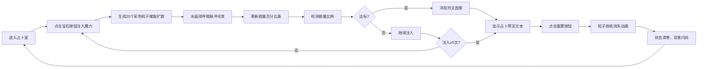

## 1. 产品概述

虚拟魔法水晶球占卜与能量漩涡培养游戏，用户扮演隐居深林的水晶占卜师，通过点击和拖拽给水晶球注入不同颜色的魔力，体验神秘的占卜仪式。

- **核心目标**：提供沉浸式的魔法占卜体验，通过粒子动画和视觉效果营造神秘氛围
- **目标用户**：喜欢神秘学、占卜游戏和视觉特效的休闲玩家
- **产品价值**：通过精美的粒子动画和交互反馈，创造独特的视觉享受和占卜乐趣

## 2. 核心功能

### 2.1 功能模块

1. **占卜室主界面**：神秘氛围背景、中央水晶球、宝石按钮控制面板、占卜文本展示区
2. **魔力注入系统**：五色宝石按钮、能量百分比条、粒子螺旋扩散动画
3. **符文激活系统**：能量比例检测、符文图案浮现、旋转发光动画
4. **占卜预言系统**：卷轴式文本展示、逐字出现动画、随机预言库
5. **重置系统**：粒子倒收动画、状态清零、呼吸闪烁反馈

### 2.2 页面详情

| 页面名称 | 模块名称 | 功能描述 |
|-----------|-------------|---------------------|
| 占卜室主界面 | 背景氛围 | 三色渐变背景（暗紫灰→深森林绿→微光蓝），模拟石室烛光氛围 |
| 占卜室主界面 | 水晶球展示 | 直径400px水晶球，CSS径向渐变+box-shadow模拟玻璃质感，底部荧光环 |
| 占卜室主界面 | 宝石按钮组 | 五色宝石按钮（红、蓝、绿、紫、金），点击脉冲放大动画 |
| 占卜室主界面 | 能量百分比条 | 五条渐变色条，实时显示各颜色能量占比 |
| 占卜室主界面 | 粒子系统 | Canvas实现粒子螺旋扩散、旋转、消失动画，峰值≤150个 |
| 占卜室主界面 | 符文系统 | 能量比例达标时浮现对应符文，旋转闪烁8秒后淡出 |
| 占卜室主界面 | 占卜文本 | 连续注入5次后显示卷轴预言，哥特字体逐字动画 |
| 占卜室主界面 | 重置按钮 | 圆形重置按钮，粒子倒收动画，状态清零 |

## 3. 核心流程

## 4. 用户界面设计

### 4.1 设计风格

- **主色调**：暗紫灰色 `#1a0f2e`、深森林绿 `#0d1a0d`、微光蓝色 `#0a1a2e`
- **强调色**：古金色 `#d4af37`、荧光紫 `#8a4aff`、五色魔力（红`#ff3344`、蓝`#3399ff`、绿`#33dd66`、紫`#aa44ff`、金`#ffaa33`）
- **按钮风格**：圆形宝石按钮，带脉冲放大动画（GSAP实现，缩放1.2倍回弹，0.3秒）
- **字体**：UnifrakturMaguntia（哥特风）用于占卜文本，系统字体用于界面元素
- **布局风格**：居中对称布局，水晶球占中央60%区域，营造仪式感
- **动效风格**：柔和呼吸光效、粒子螺旋扩散、符文旋转闪烁、卷轴展开

### 4.2 页面设计概述

| 页面名称 | 模块名称 | UI元素 |
|-----------|-------------|-------------|
| 占卜室主界面 | 背景层 | 三色垂直渐变，暗色调为主，营造神秘氛围 |
| 占卜室主界面 | 水晶球 | 400px直径，径向渐变玻璃质感，内阴影`#4a2a6a` 30px，高光`#cce8ff`，底部荧光环`#8a4aff` 发光8px |
| 占卜室主界面 | 宝石按钮组 | 五个圆形按钮水平排列（间距20px），响应式折为两行，位于球体正上方 |
| 占卜室主界面 | 能量条 | 五条渐变色条，位于按钮下方，宽度随注入动态变化 |
| 占卜室主界面 | 粒子层 | Canvas覆盖水晶球，粒子从中心螺旋扩散，持续5秒旋转后消失 |
| 占卜室主界面 | 符文层 | SVG符文图案（火焰、波浪、树叶、星辰、太阳），金色线条，球心旋转闪烁 |
| 占卜室主界面 | 占卜文本 | 最大宽度500px，居中显示于球体下方，古金色`#d4af37`，逐字出现（每字80ms），多层text-shadow墨迹效果 |
| 占卜室主界面 | 重置按钮 | 圆形，背景`#2a2a3a`，hover`#3a3a5a`，位于界面上方 |

### 4.3 响应式设计

- **桌面优先**：1200px+ 全屏展示，水晶球400px直径
- **平板适配**：768px-1199px，水晶球320px直径，宝石按钮保持一行
- **移动适配**：<768px，水晶球280px直径，宝石按钮折为两行（3+2布局）
- **触摸优化**：按钮最小触控区域48x48px，支持触摸点击反馈

### 4.4 性能要求

- 粒子数量峰值 ≤ 150个
- 动画使用 requestAnimationFrame 驱动
- 全程帧率 ≥ 50fps
- 内存泄漏检测：粒子及时回收，定时器及时清理
