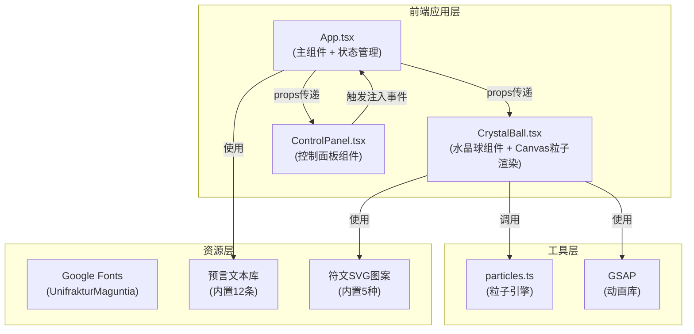

## 1. 架构设计



## 2. 技术描述

- **前端框架**：React 18 + TypeScript
- **构建工具**：Vite 5.x
- **状态管理**：React useState/useEffect（轻量级，无需额外状态库）
- **动画库**：GSAP 3.x（用于按钮脉冲、符文动画、粒子倒收等复杂动画）
- **粒子渲染**：HTML5 Canvas 2D API + requestAnimationFrame
- **样式方案**：CSS Modules 内联样式（单文件组件内定义）
- **字体资源**：Google Fonts (UnifrakturMaguntia)
- **依赖**：react、react-dom、typescript、vite、@vitejs/plugin-react、gsap、file-saver

## 3. 目录结构

```
auto180/
├── index.html                 # 入口HTML，引入哥特字体
├── package.json               # 项目依赖和脚本
├── vite.config.js             # Vite构建配置
├── tsconfig.json              # TypeScript配置
└── src/
    ├── App.tsx                # 主应用组件（状态管理、布局）
    ├── main.tsx               # React入口文件
    ├── index.css              # 全局样式
    ├── components/
    │   ├── CrystalBall.tsx    # 水晶球组件（Canvas粒子、符文、光效）
    │   └── ControlPanel.tsx   # 控制面板（宝石按钮、重置按钮、能量条）
    └── utils/
        └── particles.ts       # 粒子引擎（生成、更新、比例检测）
```

## 4. 数据模型

### 4.1 类型定义

```typescript
// 魔力颜色类型
type MagicColor = 'red' | 'blue' | 'green' | 'purple' | 'gold';

// 能量百分比状态
interface EnergyPercentages {
  red: number;
  blue: number;
  green: number;
  purple: number;
  gold: number;
}

// 粒子接口
interface Particle {
  id: number;
  x: number;
  y: number;
  vx: number;
  vy: number;
  color: MagicColor;
  alpha: number;
  size: number;
  angle: number;
  radius: number;
  speed: number;
  life: number;
  maxLife: number;
}

// 符文类型
type RuneType = 'fire' | 'wave' | 'leaf' | 'star' | 'sun' | null;

// 符文状态
interface RuneState {
  type: RuneType;
  visible: boolean;
  opacity: number;
  rotation: number;
}

// 符文激活条件
interface RuneCondition {
  type: RuneType;
  requirements: Partial<EnergyPercentages>;
}

// 占卜预言
const PROPHECIES: string[] = [
  "星辰低语，远方的旅程将带来新的盟友",
  "月光如水，隐秘的真相即将浮出水面",
  // ... 共12条
];
```

### 4.2 核心常量

```typescript
// 颜色映射
const COLOR_MAP: Record<MagicColor, string> = {
  red: '#ff3344',
  blue: '#3399ff',
  green: '#33dd66',
  purple: '#aa44ff',
  gold: '#ffaa33',
};

// 符文激活条件
const RUNE_CONDITIONS: RuneCondition[] = [
  { type: 'fire', requirements: { red: 25, blue: 25, green: 25, purple: 15, gold: 10 } },
  // ... 其他符文条件
];

// 水晶球尺寸
const CRYSTAL_BALL_SIZE = 400;
const PARTICLE_COUNT_PER_INJECT = 20;
const MAX_PARTICLES = 150;
const PROPHECY_TRIGGER_COUNT = 5;
```

## 5. 核心算法

### 5.1 粒子螺旋运动算法

```
粒子初始位置：水晶球中心 (cx, cy)
粒子初始角度：随机 0-2π
粒子初始半径：0
粒子速度：角度增量 = 0.02-0.05，半径增量 = 0.5-1.5
每一帧更新：
  angle += speed
  radius += radiusIncrement
  x = cx + cos(angle) * radius
  y = cy + sin(angle) * radius
  alpha *= 0.995 (逐渐消失)
  life -= 1
```

### 5.2 能量比例计算

```
每次注入对应颜色计数+1
总注入次数 = red + blue + green + purple + gold
各颜色百分比 = (颜色计数 / 总注入次数) * 100
```

### 5.3 符文条件检测

```
遍历 RUNE_CONDITIONS:
  对每个条件，检查所有要求的颜色百分比是否匹配（±5%容差）
  如果匹配，激活对应符文
```

## 6. 性能优化策略

1. **粒子池化**：复用 Particle 对象，避免频繁 GC
2. **Canvas 离屏渲染**：静态背景预渲染，只更新粒子层
3. **requestAnimationFrame 节流**：确保与显示器刷新率同步
4. **粒子上限控制**：超过 150 个时移除最旧的粒子
5. **组件 memo 优化**：使用 React.memo 避免不必要重渲染
6. **事件委托**：宝石按钮使用事件委托减少监听器
