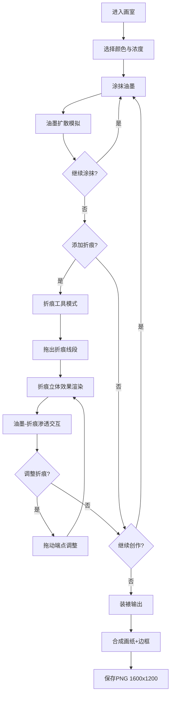

## 1. 产品概述

虚拟油墨扩散与纸艺折痕生成艺术工具——一款面向插画师和纸艺爱好者的网页端数字艺术创作工具。用户可以在仿古画纸上涂抹水彩油墨、模拟油墨在纸张纤维中的自然扩散、添加立体折痕并观察墨水在折痕处聚集渗透，最终生成带有复古水彩渐变与立体折痕纹理的高清数字艺术品。

- 核心价值：将传统水彩与纸艺的物理特性（毛细扩散、纤维渗透、折痕聚集）以实时交互方式在浏览器中呈现
- 目标用户：插画师、纸艺爱好者、数字艺术创作者

## 2. 核心功能

### 2.1 用户角色

| 角色 | 使用方式 | 核心权限 |
|------|----------|----------|
| 创作者 | 直接访问 | 全部功能（涂抹、扩散、折痕、装裱导出） |

### 2.2 功能模块

1. **创作画室页面**：仿木制画案界面，中央画纸区域，油墨涂抹与扩散模拟，折痕生成与调整，工具栏与参数控制，装裱输出

### 2.3 页面详情

| 页面名称 | 模块名称 | 功能描述 |
|----------|----------|----------|
| 创作画室 | 画纸区域 | 800x600px 虚拟画纸，径向渐变纸色，CSS噪声纹理模拟纤维质感，接收鼠标涂抹输入 |
| 创作画室 | 油墨涂抹 | 鼠标点击拖拽涂抹油墨，笔触圆形大小随速度变化（慢30-60px/快8-20px），5种水彩原色+3级浓度 |
| 创作画室 | 油墨扩散 | 笔触外围以每帧3-8px扩散，边缘随机毛刺模拟纤维毛细作用，湿度参数影响扩散速度与透明度，multiply模式混色 |
| 创作画室 | 折痕工具 | 点击折痕工具图标后拖动画线，线段两侧20px范围CSS立体效果，深度滑块控制，最多10条，可拖动端点调整 |
| 创作画室 | 油墨-折痕交互 | 折痕穿透油墨层，油墨向折痕两侧15px聚集渗透，浓度提升30%，边缘水渍扩散 |
| 创作画室 | 装裱输出 | 合成画纸图像，添加仿古装裱边框（深檀木30px+金色细线3px+回形纹角装饰），PNG 1600x1200导出 |
| 创作画室 | 工具栏 | 5色选择、浓度滑块、湿度滑块、折痕深度滑块、折痕工具按钮、装裱输出按钮、保存按钮 |

## 3. 核心流程

用户进入画室页面 → 选择油墨颜色与浓度 → 在画纸上涂抹油墨 → 油墨自动扩散并与其他油墨融合 → 切换折痕工具 → 在画纸上拖出折痕 → 折痕与油墨产生渗透交互 → 调整折痕位置/角度 → 点击装裱输出 → 预览成品 → 保存PNG

## 4. 界面设计

### 4.1 设计风格

- **主色调**：暖棕 #3b2b1a → 亚麻色 #c4a882 渐变（背景），画纸 #faf4e8 → #e8dcc8 径向渐变
- **控件风格**：深褐色底 #5a3a2a + 金色描边 #c9a96e，按压凹陷动画 scale(0.95)，悬停金色光晕
- **字体**：Ma Shan Zheng（毛笔字体）用于所有按钮和滑块标签
- **布局**：仿木制画案，画纸居中，工具栏在画纸下方或侧面
- **装饰**：回形纹角装饰，CSS噪声纹理，仿古纸质感

### 4.2 页面设计概览

| 页面名称 | 模块名称 | UI要素 |
|----------|----------|--------|
| 创作画室 | 背景画案 | 暖棕→亚麻渐变背景，仿木纹质感 |
| 创作画室 | 画纸区域 | 800x600px径向渐变纸色，CSS噪声纤维纹理，居中显示 |
| 创作画室 | 油墨工具 | 5个色块（朱红/藤黄/花青/赭石/墨黑），3级浓度滑块，湿度滑块0-100 |
| 创作画室 | 折痕工具 | 折痕图标按钮，折痕深度滑块0-100，折痕数量指示器 |
| 创作画室 | 装裱区域 | 装裱输出按钮，保存按钮，预览窗口 |

### 4.3 响应式

- 桌面端：画纸固定 800x600px
- 平板及以下：画纸宽度100%，高度自适应保持比例
- 工具栏在窄屏下垂直排列

### 4.4 性能要求

- 油墨扩散模拟稳定 30fps 以上
- 折痕添加和调整响应时间 ≤ 50ms
- Canvas 渲染采用 requestAnimationFrame 驱动
