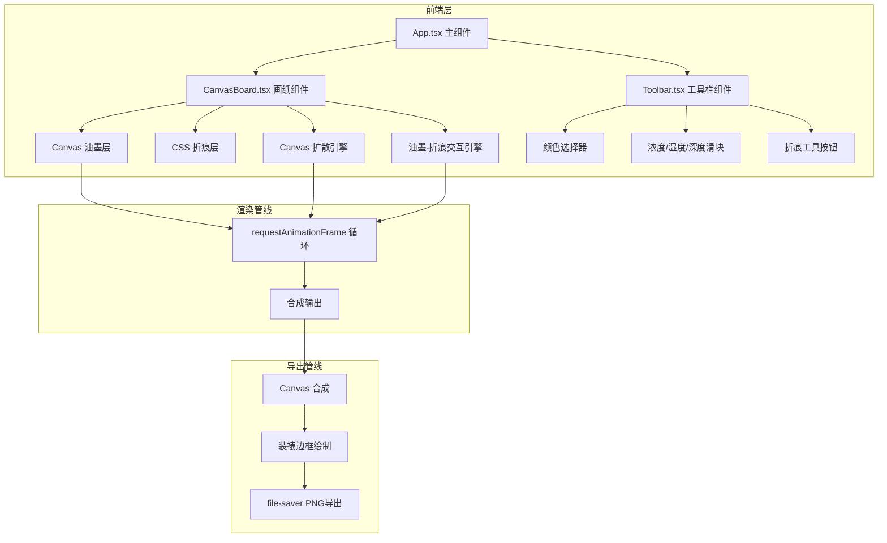

## 1. 架构设计



## 2. 技术说明

- **前端框架**：React 18 + TypeScript + Vite 5
- **构建工具**：Vite 5 + @vitejs/plugin-react
- **状态管理**：React useState/useCallback（通过 props 传递，无需全局状态库）
- **画布渲染**：Canvas 2D API（油墨层 + 扩散引擎）+ CSS（折痕立体效果层）
- **字体**：@fontsource/ma-shan-zheng（离线加载毛笔字体）
- **导出**：file-saver（PNG 文件保存）
- **无后端**：纯前端应用，所有计算在浏览器本地完成

## 3. 路由定义

| 路由 | 用途 |
|------|------|
| / | 创作画室（单页应用，唯一页面） |

## 4. 数据模型

### 4.1 油墨笔触数据结构

```typescript
interface InkStroke {
  id: string;
  points: Array<{
    x: number;
    y: number;
    pressure: number;
    speed: number;
    timestamp: number;
  }>;
  color: InkColor;
  density: DensityLevel;
  humidity: number;
}

type InkColor = 'vermilion' | 'gamboge' | 'indigo' | 'ochre' | 'inkBlack';
type DensityLevel = 'light' | 'medium' | 'heavy';
```

### 4.2 折痕数据结构

```typescript
interface Crease {
  id: string;
  start: { x: number; y: number };
  end: { x: number; y: number };
  depth: number;
}
```

### 4.3 扩散粒子数据结构

```typescript
interface DiffusionParticle {
  x: number;
  y: number;
  radius: number;
  opacity: number;
  color: string;
  velocity: number;
  age: number;
  maxAge: number;
}
```

## 5. 核心算法设计

### 5.1 油墨扩散模拟

- 每个笔触点生成多个扩散粒子
- 粒子以每帧3-8px速度向外扩散，速度受湿度参数影响
- 扩散边缘生成随机毛刺（角度偏移±15°，长度±3px）
- 粒子透明度随年龄递减，颜色随湿度变浅
- 使用 Canvas globalCompositeOperation = 'multiply' 实现混色

### 5.2 折痕立体效果

- 折痕线段两侧20px范围叠加CSS效果层
- 高光渐变（#fff0d0）在折痕一侧，阴影渐变（#5a4a3a）在另一侧
- 折痕中心颜色加深20%
- clip-path 生成随机锯齿模拟撕裂纹理
- 深度参数控制高光与阴影对比度

### 5.3 油墨-折痕交互

- 折痕区域内的油墨在两侧15px范围内浓度提升30%
- 卷积核模拟边缘扩散（3x3高斯模糊+方向偏移）
- 沿折痕边缘产生水渍状扩散（随机抖动+衰减）

## 6. 文件组织

```
├── package.json
├── vite.config.js
├── tsconfig.json
├── index.html
└── src/
    ├── App.tsx              # 主组件：布局+状态管理
    ├── main.tsx             # 入口
    ├── index.css            # 全局样式
    └── components/
        ├── CanvasBoard.tsx   # 画纸组件：Canvas渲染+扩散引擎+折痕CSS层
        └── Toolbar.tsx       # 工具栏组件：颜色/滑块/按钮
```
