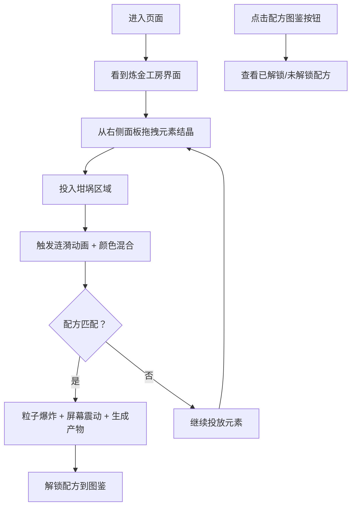

## 1. 产品概述

虚拟炼金术士坩埚混合与元素反应模拟器，让用户在浏览器中体验中世纪炼金术士的工作，通过拖拽元素结晶投入坩埚观察化学反应，探索配方合成神秘炼金产物。

- 核心目的：提供沉浸式、趣味性的元素混合与反应模拟体验
- 目标用户：对炼金术、化学模拟、互动小游戏感兴趣的用户
- 产品价值：将抽象的化学概念转化为可视化的互动体验，兼具教育性与娱乐性

## 2. 核心功能

### 2.1 用户角色

| 角色 | 注册方式 | 核心权限 |
|------|----------|----------|
| 访客用户 | 无需注册 | 体验完整游戏功能，查看配方图鉴 |

### 2.2 功能模块

1. **主界面**：炼金工房场景、坩埚与三脚架、元素结晶面板
2. **坩埚系统**：液体颜色混合、气泡动画、涟漪特效
3. **元素交互**：拖拽投放元素结晶、数量统计、颜色混合算法
4. **配方系统**：配方检测、合成触发、产物展示
5. **特效系统**：Canvas粒子爆炸、屏幕震动、产物浮现动画
6. **图鉴系统**：配方展示、解锁状态追踪

### 2.3 页面详情

| 页面名称 | 模块名称 | 功能描述 |
|----------|----------|----------|
| 主界面 | 炼金工房背景 | 暗色渐变背景、石柱装饰、纹理质感 |
| 主界面 | 坩埚组件 | 半球形铜绿色坩埚、8个铆钉装饰、沸腾液体渐变 |
| 主界面 | 元素结晶面板 | 5个彩色圆形按钮、拖拽交互、hover发光效果 |
| 主界面 | 状态显示区 | 元素计数进度条、投放次数统计、打字机状态文本 |
| 主界面 | 配方图鉴按钮 | 右下角入口、点击弹出半透明面板 |
| 图鉴面板 | 配方卡片 | 已解锁/未解锁状态展示、元素比例说明 |
| 特效层 | 粒子特效 | Canvas绘制彩色粒子爆炸动画 |
| 特效层 | 屏幕震动 | CSS关键帧震动效果 |

## 3. 核心流程

用户进入页面后看到古老炼金工房场景，从右侧元素面板拖拽彩色结晶投入中央坩埚，观察液体颜色变化和气泡涟漪效果。当元素组合匹配预定义配方时，触发粒子爆炸特效和屏幕震动，生成炼金产物并自动解锁到图鉴中。用户可随时点击右下角按钮查看配方收集进度。

## 4. 用户界面设计

### 4.1 设计风格

- **主色调**：暗灰石色 #2a2520 渐变到深琥珀色 #3a2818
- **元素色**：红 #ff3333、蓝 #3366ff、绿 #44cc44、黄 #ffcc33、紫 #9933ff
- **坩埚色**：铜绿色、液体底部 #1a3a1a、顶部 #2a6a2a
- **按钮风格**：圆形、50px直径、hover缩放1.2倍、发光滤镜
- **字体**：使用中世纪风格的装饰字体搭配清晰易读的正文字体
- **布局风格**：中央焦点构图、左右石柱装饰、右侧元素面板、底部信息栏

### 4.2 页面设计概述

| 页面名称 | 模块名称 | UI元素 |
|----------|----------|--------|
| 主界面 | 炼金工房背景 | 渐变背景、CSS伪元素绘制石柱、噪声纹理叠加 |
| 主界面 | 坩埚组件 | 径向渐变半球形、border-radius、8个铆钉装饰、气泡动画 |
| 主界面 | 元素结晶面板 | 5个彩色圆形按钮、framer-motion拖拽、发光阴影 |
| 主界面 | 顶部状态栏 | 5个圆形进度条、打字机动画状态文本、闪烁光标 |
| 主界面 | 配方图鉴按钮 | 右下角固定、复古风格图标 |
| 图鉴面板 | 配方卡片 | 半透明背景 #1a1a1a 不透明度0.85、彩色/灰色剪影 |
| 特效层 | 粒子特效 | Canvas全屏覆盖、80-120个彩色粒子、1.5秒动画 |
| 特效层 | 产物展示 | 坩埚上方浮现、图标+名称、渐入渐出动画 |

### 4.3 响应性

- 桌面端优先设计，最小支持宽度1024px
- 元素面板固定在右侧，坩埚居中显示
- 触摸设备优化拖拽交互，支持点击投放作为备选

### 4.4 动效设计

- 气泡上升：10个半透明气泡，大小6-14px，速度0.8-1.5秒
- 涟漪扩散：落点波纹向外扩散0.5秒
- 颜色混合：CSS过渡动画，平滑渐变
- 打字机效果：逐字显示状态文本，光标闪烁
- 粒子爆炸：从中心向外飞散，透明度衰减
- 屏幕震动：水平偏移2px，持续0.3秒
