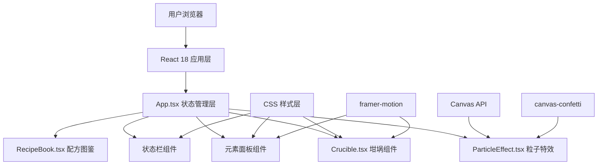

## 1. 架构设计



## 2. 技术描述

- **前端框架**: React 18 + TypeScript
- **构建工具**: Vite 5
- **动画库**: framer-motion
- **粒子特效**: canvas-confetti + 原生 Canvas API
- **样式方案**: CSS Modules + 内联样式 + CSS 变量
- **状态管理**: React useState + useReducer (组件内)
- **初始化方式**: 手动配置 Vite + React + TypeScript

## 3. 组件与类型定义

### 3.1 核心组件

| 组件 | 职责 | 传入 Props |
|------|------|------------|
| App.tsx | 主组件，状态管理，配方检测 | 无 |
| Crucible.tsx | 坩埚渲染，气泡，涟漪，液体颜色 | liquidColor, onDrop, ripples |
| ParticleEffect.tsx | Canvas粒子爆炸特效 | trigger, particleType, position |
| RecipeBook.tsx | 配方图鉴面板 | recipes, unlockedRecipes, onClose |
| ElementPanel.tsx | 元素结晶拖拽面板 | onElementDragStart |
| StatusBar.tsx | 顶部状态栏 | elementCounts, totalDrops, statusText |

### 3.2 核心类型定义

```typescript
type ElementType = 'red' | 'blue' | 'green' | 'yellow' | 'purple';

interface ElementCounts {
  red: number;
  blue: number;
  green: number;
  yellow: number;
  purple: number;
}

interface Recipe {
  id: string;
  name: string;
  icon: string;
  requirements: Partial<ElementCounts>;
  description: string;
}

interface Ripple {
  id: number;
  x: number;
  y: number;
}

interface Particle {
  x: number;
  y: number;
  vx: number;
  vy: number;
  size: number;
  color: string;
  alpha: number;
}
```

### 3.3 预设配方

| 配方名称 | 元素组合 | 产物图标 |
|----------|----------|----------|
| 贤者之石 | 红3 + 蓝2 + 黄1 | 🔮 |
| 长生不老药 | 绿2 + 紫3 | 🧪 |
| 黄金转化剂 | 红4 + 黄2 + 蓝1 | ✨ |
| 智慧之水 | 蓝3 + 紫2 + 绿1 | 💧 |
| 火焰精华 | 红2 + 黄3 + 紫1 | 🔥 |

## 4. 颜色混合算法

### 4.1 RGB颜色值

| 元素 | RGB值 |
|------|-------|
| 红 | [255, 51, 51] |
| 蓝 | [51, 102, 255] |
| 绿 | [68, 204, 68] |
| 黄 | [255, 204, 51] |
| 紫 | [153, 51, 255] |

### 4.2 混合公式

```
混合颜色 = (基础液体色 * 权重 + Σ(元素色 * 元素数量)) / (权重 + 总元素数)
```

- 基础液体色: [26, 74, 26] (深绿色)
- 权重: 2 (保持基础色调的影响力)
- 使用CSS transition实现平滑过渡

## 5. 性能优化

- **帧率目标**: 主线程 ≥ 30fps
- **粒子上限**: 单次特效 ≤ 120个，总粒子 ≤ 200个
- **Canvas优化**: requestAnimationFrame循环，粒子数量控制，离屏渲染
- **重绘优化**: 使用CSS transform而非top/left，避免频繁重排
- **动画优化**: CSS动画优先于JS动画，使用will-change提示浏览器

## 6. 数据持久化

- 使用 localStorage 存储已解锁配方列表
- 页面刷新后保留解锁状态
- 坩埚状态不持久化，每次刷新重置
