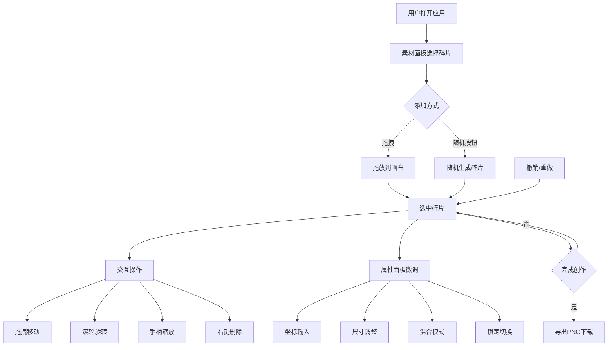

## 1. 产品概述

虚拟拼贴画与碎片重组创意工具是一款在浏览器中运行的创意艺术应用，让用户像拼贴艺术家一样，通过拖拽、旋转、缩放和层叠素材碎片来创作独特的拼贴作品。
- **主要目的**：为用户提供一个直观、有趣的数字拼贴创作环境，无需专业设计技能即可创作艺术作品
- **目标用户**：创意爱好者、设计师、教育工作者、手工艺术爱好者
- **产品价值**：降低拼贴艺术创作门槛，提供环保的数字化创作体验，支持作品导出分享

## 2. 核心功能

### 2.1 功能模块
1. **拼贴画画布区域**：800x600px 工作区，支持视图缩放与平移
2. **素材面板**：5种可拖拽碎片类型（纸纹理、墨迹、图像条、剪报、金属箔）
3. **碎片交互系统**：选中、拖拽移动、滚轮旋转、角点缩放、右键删除
4. **属性面板**：位置/尺寸/旋转/混合模式/锁定控制
5. **工具栏**：撤销/重做、清空画布、导出PNG
6. **随机生成器**：一键随机添加碎片
7. **音效系统**：拖拽和删除时的环境音效

### 2.2 页面详情
| 页面名称 | 模块名称 | 功能描述 |
|-----------|-------------|---------------------|
| 主创作页面 | 顶部工具栏 | 撤销/重做按钮（显示步数）、清空画布、导出PNG |
| 主创作页面 | 左侧素材面板 | 5类碎片预览展示、随机添加按钮 |
| 主创作页面 | 中央画布区 | 碎片放置与交互区域、缩放滑块、视图平移 |
| 主创作页面 | 右侧属性面板 | 选中碎片的精确属性编辑 |

## 3. 核心流程

### 主创作流程
1. 用户从素材面板拖拽碎片到画布，或点击"随机添加"按钮
2. 点击碎片选中，出现选中边框和缩放手柄
3. 拖拽移动、滚轮旋转、手柄缩放调整碎片位置和形态
4. 在右侧属性面板微调精确参数（坐标、尺寸、混合模式等）
5. 可随时撤销/重做操作，或清空画布重新开始
6. 完成创作后点击"导出PNG"保存作品

## 4. 用户界面设计

### 4.1 设计风格
- **主色调**：暖灰 (#2a2722) → 旧橡木色 (#4a3b2b) 渐变背景
- **面板风格**：半透明磨砂玻璃（backdrop-filter: blur(8px)，背景色 rgba(245,240,232,0.85)）
- **画布背景**：哑光白 (#f5f0e8)
- **按钮样式**：圆角8px，哑光铜色 (#b8956a) → 悬停深铜色 (#a0754a)，点击内缩动画
- **交互反馈**：悬停上浮阴影、点击缩放、选中蓝色虚线边框
- **字体**：衬线字体营造工坊艺术感，标题加粗、正文常规

### 4.2 页面设计概述
| 页面名称 | 模块名称 | UI 元素 |
|-----------|-------------|-------------|
| 主创作页面 | 工具栏 | 深色背景 #2c2c2c，高50px，按钮横向排列 |
| 主创作页面 | 素材面板 | 宽260px，碎片网格展示，顶部随机按钮 |
| 主创作页面 | 画布区域 | 居中显示，右下角缩放滑块，支持滚轮平移 |
| 主创作页面 | 属性面板 | 宽220px，表单控件分组排列 |

### 4.3 响应性
- 桌面优先设计，固定面板宽度布局
- 画布区域自适应弹性伸缩
- 支持触控设备的基础手势操作

### 4.4 微交互动效
- 碎片选中：蓝色虚线边框淡入（0.2s）
- 碎片删除：淡出动画（0.3s）
- 按钮悬停：上浮 + 阴影加深（0.2s）
- 按钮点击：scale(0.95) 内缩（0.1s）
- 拖拽时：纸张摩擦音效（0.1s）
