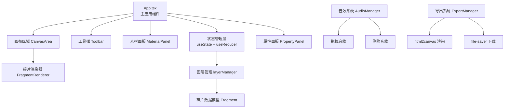

## 1. 架构设计



## 2. 技术描述
- **前端框架**：React@18 + TypeScript
- **构建工具**：Vite@5 + @vitejs/plugin-react
- **动画库**：framer-motion
- **导出渲染**：html2canvas
- **文件下载**：file-saver
- **状态管理**：React useState + useReducer（历史栈）
- **样式方案**：内联样式 + CSS-in-JS

## 3. 项目目录结构
```
auto187/
├── package.json
├── vite.config.js
├── tsconfig.json
├── index.html
└── src/
    ├── App.tsx                      # 主应用组件
    ├── components/
    │   ├── CanvasArea.tsx          # 画布区域组件
    │   └── MaterialPanel.tsx       # 素材面板组件
    └── utils/
        └── layerManager.ts         # 图层管理工具
```

## 4. 数据模型

### 4.1 Fragment 碎片数据模型
```typescript
type FragmentType = 'paper' | 'ink' | 'strip' | 'clipping' | 'foil';
type BlendMode = 'normal' | 'multiply' | 'screen' | 'overlay' | 'darken' | 'lighten';

interface Fragment {
  id: string;              // 唯一标识 UUID
  type: FragmentType;      // 碎片类型
  x: number;               // X 坐标（相对画布左上角）
  y: number;               // Y 坐标
  width: number;           // 宽度 px
  height: number;          // 高度 px
  rotation: number;        // 旋转角度 0-360
  zIndex: number;          // 层级 z-index
  color: string;           // 主色
  blendMode: BlendMode;    // 混合模式
  locked: boolean;         // 是否锁定移动
  opacity?: number;        // 透明度
  clipPath?: string;       // 自定义裁剪路径
}
```

### 4.2 AppState 应用状态
```typescript
interface AppState {
  fragments: Fragment[];           // 当前所有碎片
  selectedId: string | null;       // 当前选中碎片ID
  zoom: number;                    // 画布缩放比例 0.5-2.0
  panX: number;                    // 水平平移偏移
  panY: number;                    // 垂直平移偏移
  history: Fragment[][];           // 历史栈（最多20步）
  historyIndex: number;            // 当前历史位置
  maxHistory: number;              // 最大历史步数（20）
}
```

## 5. 图层管理 API (layerManager.ts)

| 方法名 | 输入 | 输出 | 功能描述 |
|--------|------|------|----------|
| createFragment | type, options | Fragment | 创建新碎片实例 |
| addFragment | fragments, fragment | Fragment[] | 添加碎片并更新zIndex |
| removeFragment | fragments, id | Fragment[] | 删除指定碎片 |
| updateFragment | fragments, id, updates | Fragment[] | 更新碎片属性 |
| bringToFront | fragments, id | Fragment[] | 将碎片提升到最上层 |
| moveFragment | fragments, id, x, y | Fragment[] | 移动碎片位置 |
| rotateFragment | fragments, id, angle | Fragment[] | 旋转碎片 |
| resizeFragment | fragments, id, w, h, corner | Fragment[] | 缩放碎片（保持比例可选） |
| findFragmentById | fragments, id | Fragment \| null | 查找指定碎片 |
| getMaxZIndex | fragments | number | 获取当前最大zIndex值 |
| clampPosition | x, y, canvasW, canvasH, fragW, fragH | {x, y} | 将位置限制在画布范围内 |

## 6. 关键交互实现方案

### 6.1 拖拽系统
- HTML5 Drag and Drop API（素材面板 → 画布）
- 画布内部拖拽使用 mousedown/mousemove/mouseup 事件
- 使用 requestAnimationFrame 保证拖拽流畅度（≥50fps）

### 6.2 缩放手柄
- 四角各一个圆形手柄（8px）
- 使用 transform-origin 配合 CSS transform 缩放
- 限制最小/最大尺寸（20px - 400px）

### 6.3 撤销/重做系统
- useReducer 管理历史栈
- 每次状态变更 push 到 history 数组
- 最多保留20步，超出时丢弃最早记录
- Ctrl+Z / Ctrl+Shift+Z 键盘快捷键

### 6.4 导出系统
```
导出流程：
1. 临时隐藏选中边框和缩放手柄
2. 调用 html2canvas 渲染画布 DOM → Canvas
3. Canvas → Blob (image/png)
4. file-saver 触发下载 "collage.png"
5. 恢复选中状态显示
```

### 6.5 音效系统
- AudioContext 合成音效，无需外部音频文件
- 拖拽音效：500-800Hz 噪声，0.1s 快速衰减
- 删除音效：1s 噪声扫频，模拟撕裂声

## 7. 性能优化策略
1. **碎片渲染优化**：仅选中的碎片渲染缩放手柄
2. **防抖节流**：滚轮旋转使用 requestAnimationFrame 节流
3. **硬件加速**：transform/opacity 操作触发 GPU 合成层
4. **批量更新**：避免每次交互触发全量重渲染（useMemo/useCallback）
5. **canvas 导出**：html2canvas 使用 useCORS: false，scale: 2 确保清晰度
