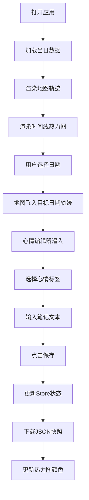

## 1. 产品概述

时光轨迹与心情热力图日记是一款为数字游民设计的极简优雅视觉日记应用，帮助用户记录每日行程路径与心情波动，以地图轨迹和色彩热力图的形式保存美好回忆。

- **核心价值**：将空间轨迹与情感状态结合，创造沉浸式回忆体验
- **目标用户**：数字游民、旅行爱好者、注重生活记录的创意人士
- **差异化特点**：地图轨迹+心情热力图的双重可视化，优雅的动效与主题切换

## 2. 核心功能

### 2.1 用户角色
| 角色 | 注册方式 | 核心权限 |
|------|----------|----------|
| 普通用户 | 无需注册，本地存储 | 记录行程、标记心情、查看历史、导出快照 |

### 2.2 功能模块
1. **地图轨迹面板**：Leaflet地图展示，贝塞尔曲线连接行程点，路径渐变色彩
2. **时间线侧栏**：一周日期缩略图，心情色彩热力色块，全月热力条
3. **心情编辑器**：8种心情标签选择，文本笔记输入，JSON导出功能
4. **主题系统**：日/夜间模式切换，平滑过渡动画

### 2.3 页面详情
| 页面名称 | 模块名称 | 功能描述 |
|---------|----------|----------|
| 主页面 | 地图轨迹面板 | 展示当日行程路径，点击轨迹点显示心情气泡，支持缩放拖拽 |
| 主页面 | 时间线侧栏 | 周视图日期选择，心情色彩热力图，月份热力条，水平滚动 |
| 主页面 | 心情编辑器 | 心情标签选择（8种），笔记文本输入，保存并导出JSON快照 |
| 主页面 | 主题切换 | 右上角日/夜间模式切换，背景渐变过渡1秒 |

## 3. 核心流程

用户打开应用 → 默认展示当日地图与时间线 → 点击时间线某日查看历史轨迹 → 在心情编辑器选择心情标签 → 输入当日笔记 → 点击保存按钮 → 自动下载JSON快照 → 切换主题浏览不同视觉效果

## 4. 用户界面设计

### 4.1 设计风格
- **整体调性**：极简优雅，温暖治愈，注重细节与动效
- **日间主题**：主背景从#FFF8E7到#FFF0D5垂直渐变，磨砂玻璃面板，#FFC107暖黄强调色
- **夜间主题**：主背景从#1A1A2E到#16213E垂直渐变，深色玻璃面板，#00D2FF冰蓝强调色
- **字体**：标题使用Playfair Display优雅衬线字体，正文使用Lato无衬线字体
- **动效**：framer-motion实现流畅过渡，悬停微交互，路径回放光点动画

### 4.2 页面设计概述
| 页面名称 | 模块名称 | UI元素 |
|---------|----------|--------|
| 主页面 | 地图轨迹面板 | Leaflet地图容器，贝塞尔曲线路径（渐变色彩），起点绿/终点红/中间灰圆点，点击气泡，缩放控件 |
| 主页面 | 时间线侧栏 | 左侧垂直布局（移动端顶部横向），32x32px色块，右上角日记条数，7x4全月热力条，支持拖拽滚动 |
| 主页面 | 心情编辑器 | 底部浮动面板（移动端全屏），8个圆形心情标签（激动/平静/疲惫等），悬停放大动画，文本输入框，保存按钮 |
| 主页面 | 主题切换 | 右上角太阳/月亮图标按钮，1秒背景渐变过渡 |

### 4.3 响应式设计
- **桌面端（≥640px）**：左侧Timeline垂直侧栏，底部MoodEditor浮动面板
- **移动端（<640px）**：顶部Timeline横向滚动条，底部MoodEditor全屏弹出面板
- **触控优化**：增大点击热区，支持触摸滑动，禁用不必要的悬停效果

### 4.4 视觉细节
- **磨砂玻璃效果**：backdrop-filter: blur(10px)，半透明白/深色背景
- **卡片悬停**：box-shadow过渡0.3s，微小上浮效果
- **按钮反馈**：点击时scale(0.95)持续0.1s
- **心情标签**：圆形设计，悬停放大1.1倍，选中时脉冲动画
- **路径动画**：光点沿贝塞尔曲线移动1.5秒，模拟轨迹回放
