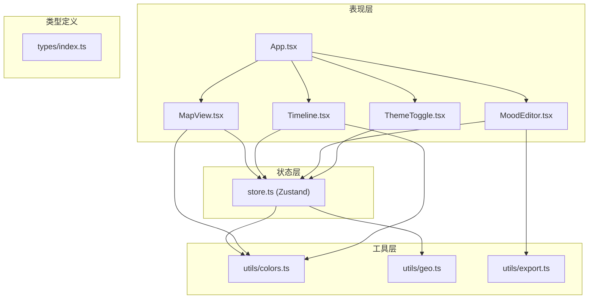
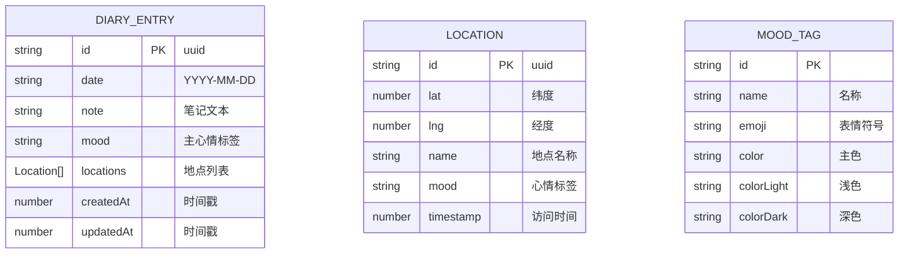

## 1. 架构设计



## 2. 技术栈描述

- **前端框架**: React@18 + TypeScript@5 + Vite@5
- **状态管理**: Zustand（轻量级，避免Redux的冗余）
- **地图组件**: Leaflet@1.9 + react-leaflet@4
- **动画库**: framer-motion@11
- **工具库**: date-fns@3（日期处理）、uuid@9（ID生成）、file-saver@2（文件导出）
- **样式方案**: CSS Modules + CSS Variables（主题切换）
- **构建工具**: Vite@5 + @vitejs/plugin-react@4

## 3. 路由定义
| 路由 | 用途 |
|------|------|
| / | 主应用页面（单页应用，无多路由） |

## 4. 数据模型

### 4.1 数据模型定义



### 4.2 TypeScript 类型定义

```typescript
export interface Location {
  id: string;
  lat: number;
  lng: number;
  name: string;
  mood: MoodType;
  timestamp: number;
}

export interface DiaryEntry {
  id: string;
  date: string;
  note: string;
  mood: MoodType;
  locations: Location[];
  createdAt: number;
  updatedAt: number;
}

export type MoodType = 
  | 'excited' 
  | 'happy' 
  | 'calm' 
  | 'tired' 
  | 'sad' 
  | 'anxious' 
  | 'inspired' 
  | 'peaceful';

export interface MoodTag {
  id: MoodType;
  name: string;
  emoji: string;
  color: string;
  colorLight: string;
  colorDark: string;
}

export interface Theme {
  mode: 'light' | 'dark';
  background: {
    start: string;
    end: string;
  };
  panel: {
    background: string;
    backdropFilter: string;
  };
  accent: string;
  text: {
    primary: string;
    secondary: string;
  };
  map: {
    controlBackground: string;
    controlText: string;
  };
}
```

## 5. 文件结构与调用关系

```
e:\solo\VersionFast\tasks\auto188\
├── package.json              # 项目依赖与脚本
├── vite.config.js            # Vite构建配置
├── tsconfig.json             # TypeScript配置
├── index.html                # 入口HTML
└── src/
    ├── main.tsx              # 应用入口（渲染App）
    ├── App.tsx               # 根组件（布局+主题）
    ├── store.ts              # Zustand状态管理
    │   ├── 数据流: store → 组件（useStore）
    │   └── 操作流: 组件 → store actions
    ├── types/
    │   └── index.ts          # 全局类型定义
    ├── utils/
    │   ├── colors.ts         # 心情颜色计算、渐变生成
    │   ├── geo.ts            # 地理计算、贝塞尔曲线
    │   └── export.ts         # JSON导出工具
    ├── constants/
    │   └── moods.ts          # 心情标签常量配置
    ├── components/
    │   ├── MapView.tsx       # 地图组件
    │   │   ├── 依赖: store（日记数据）、geo（曲线计算）、colors（渐变色）
    │   │   └── 输出: 触发store更新选中点
    │   ├── Timeline.tsx      # 时间线组件
    │   │   ├── 依赖: store（日记列表、选中日期）、colors（热力色）
    │   │   └── 输出: 触发store切换日期
    │   ├── MoodEditor.tsx    # 心情编辑器
    │   │   ├── 依赖: store（当日日记、选中心情）、export（导出）
    │   │   └── 输出: 触发store保存日记、触发动画
    │   └── ThemeToggle.tsx   # 主题切换按钮
    │       └── 依赖: store（主题状态）
    └── styles/
        ├── global.css        # 全局样式与CSS变量
        └── variables.css     # 主题变量定义
```

## 6. 核心算法

### 6.1 贝塞尔曲线路径生成
```
输入: 地点坐标点数组 [P0, P1, P2, ..., Pn]
输出: 平滑贝塞尔曲线路径
算法:
  1. 对每两个相邻点 Pi 和 Pi+1
  2. 计算控制点 Ci1 = Pi + (Pi+1 - Pi-1) * 0.25
  3. 计算控制点 Ci2 = Pi+1 - (Pi+2 - Pi) * 0.25
  4. 生成三次贝塞尔曲线: Pi → Ci1 → Ci2 → Pi+1
  5. 边界处理: 首尾点使用相邻点方向
```

### 6.2 心情加权平均色计算
```
输入: 当日所有地点的心情标签数组
输出: 加权平均RGB颜色
算法:
  1. 统计每种心情出现的次数
  2. 将每种心情的颜色转换为RGB分量
  3. 按次数加权平均R、G、B分量
  4. 返回合成后的颜色值
```

### 6.3 路径动画实现
```
技术: SVG stroke-dasharray + framer-motion
实现:
  1. 计算路径总长度 L
  2. 设置 stroke-dasharray = "L L"
  3. 动画 stroke-dashoffset 从 L 到 0，持续1.5秒
  4. 同步移动光点标记沿路径前进
```

## 7. 性能优化策略

1. **地图性能**: 
   - 使用Leaflet的canvas渲染模式
   - 轨迹点数量限制在每日5个以内
   - 曲线分段渲染，避免重绘整个路径

2. **动画性能**:
   - 使用transform和opacity属性动画（GPU加速）
   - 限制同时运行的动画数量
   - 移动端降低动画复杂度

3. **状态优化**:
   - Zustand selector按需订阅，避免不必要重渲染
   - 列表数据使用useMemo缓存
   - 事件处理函数使用useCallback包裹

4. **构建优化**:
   - Vite自动代码分割
   - Leaflet按需引入
   - 生产环境启用压缩和tree-shaking

## 8. 开发规范

1. **命名规范**: PascalCase组件，camelCase变量/函数，UPPER_CASE常量
2. **类型规范**: 优先使用TypeScript类型，避免any
3. **样式规范**: CSS Modules隔离组件样式，全局变量定义主题
4. **提交规范**: 原子化提交，清晰描述变更内容
5. **性能检查**: 使用React DevTools Profiler监控渲染性能
