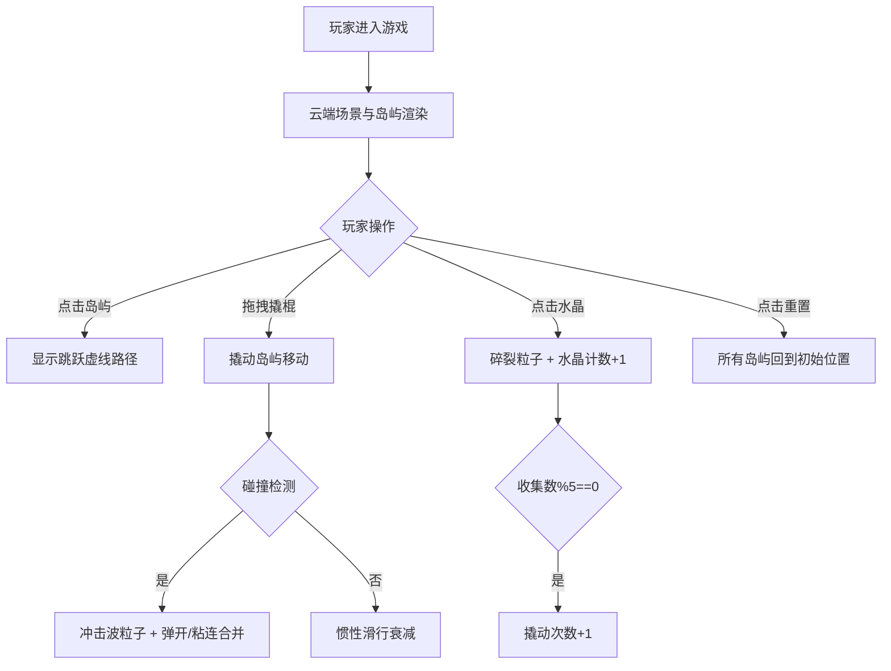

## 1. 产品概述

浮空岛屿撬棍冒险是一款基于浏览器的物理沙盒探险解谜游戏，玩家通过调整浮空岛屿的重力方向、使用虚拟撬棍撬动岛屿板块、在岛屿间跳跃并收集能量水晶，最终抵达浮空王座。目标用户为物理沙盒爱好者和探险解谜爱好者。

- 核心玩法：物理撬动 + 岛屿跳跃 + 水晶收集
- 市场价值：填补网页端轻量级物理沙盒冒险游戏的空白，提供即开即玩的沉浸式体验

## 2. 核心功能

### 2.1 功能模块

1. **游戏主场景**：云端浮空岛屿环境，渐变天空背景，6-8个随机分布的岛屿
2. **岛屿物理系统**：撬棍撬动、惯性滑行、碰撞检测、岛屿粘连合并
3. **水晶收集系统**：水晶生成、点击收集、碎裂粒子特效、计数器
4. **交互工具系统**：虚拟撬棍拖拽、弯曲动画、撬动次数管理
5. **状态栏与重置**：水晶计数、撬动次数、重置按钮

### 2.2 页面详情

| 页面名称 | 模块名称 | 功能描述 |
|----------|----------|----------|
| 游戏主页面 | 云端场景 | 浅蔚蓝到苍白渐变背景，6-8个带草地岩石纹理的浮空岛屿 |
| 游戏主页面 | 跳跃路径指示 | 点击岛屿后显示白色虚线路径，末端带脉动光晕 |
| 游戏主页面 | 能量水晶 | 六边形半透明水晶，自转+呼吸光晕，点击碎裂成光点粒子 |
| 游戏主页面 | 撬棍工具 | SVG绘制撬棍，拖拽撬动岛屿，带弯曲旋转动画 |
| 游戏主页面 | 物理碰撞 | 圆形碰撞检测，冲击波粒子，弹力反弹，距离<40px粘连合并 |
| 游戏主页面 | 状态栏 | 水晶收集数（金色发光）、撬动次数（蓝色）、重置按钮 |

## 3. 核心流程

玩家进入游戏 → 看到漂浮在云端的岛屿群 → 点击岛屿查看跳跃路径 → 拖拽撬棍撬动选中岛屿 → 岛屿滑行并可能与其他岛屿碰撞/合并 → 点击岛屿上的水晶收集（碎裂特效+计数器+1） → 每收集5颗水晶补充1次撬动次数 → 到达最终浮空王座或点击重置重新开始

## 4. 用户界面设计

### 4.1 设计风格

- 主色调：浅蔚蓝(#87CEEB) → 苍白色(#f0f8ff) 渐变天空
- 岛屿色：草地绿(#4a7c3f) + 岩石棕(#8b5e3c)
- 水晶色：金色(#ffd700) → 橙色(#ff8c00) 渐变
- 文字色：收集数金色发光，撬动次数蓝色
- 布局：居中画布，占视口80%宽×85%高，左右留白
- 字体：优雅的无衬线字体，数字带发光效果

### 4.2 页面设计概述

| 页面名称 | 模块名称 | UI 元素 |
|----------|----------|---------|
| 游戏主页面 | 天空背景 | 线性渐变(#87CEEB→#f0f8ff)，轻柔云朵氛围 |
| 游戏主页面 | 浮空岛屿 | 粗糙边缘圆形，草地纹理+岩石边缘，随机大小(150-300px) |
| 游戏主页面 | 跳跃路径 | 白色虚线，末端脉动光晕(透明度0.3-0.8循环) |
| 游戏主页面 | 能量水晶 | 六边形半透明，自转+呼吸缩放(2秒周期)，金色渐变 |
| 游戏主页面 | 撬棍工具 | SVG褐色木质手柄+银色金属尖端(80px)，拖拽时0-15度弯曲旋转 |
| 游戏主页面 | 碰撞特效 | 白色圆形冲击波(5px→20px扩散，透明度0.8→0，持续0.6秒) |
| 游戏主页面 | 水晶碎裂 | 10-15个光点向四周飞散，持续0.8秒 |
| 游戏主页面 | 状态栏 | 底部栏，金色发光数字(水晶数)、蓝色数字(撬动次数)、重置按钮 |

### 4.3 响应式

- 桌面端(≥768px)：画布占80%宽×85%高，左右留白，状态栏在底部
- 移动端(<768px)：画布占满全宽，撬动次数移至左上角排列，状态栏自适应

### 4.4 视觉特效与动画

- 水晶呼吸光晕：2秒周期放大1.1倍后回缩
- 撬棍弯曲：拖拽时CSS transform旋转0-15度
- 碰撞冲击波：5-8个圆形粒子从碰撞点向外扩散
- 水晶碎裂：10-15个光点随机方向飞散，0.8秒消失
- 路径光晕：透明度0.3-0.8循环脉动
- 岛屿惯性：阻尼系数0.95，弹力系数0.3
