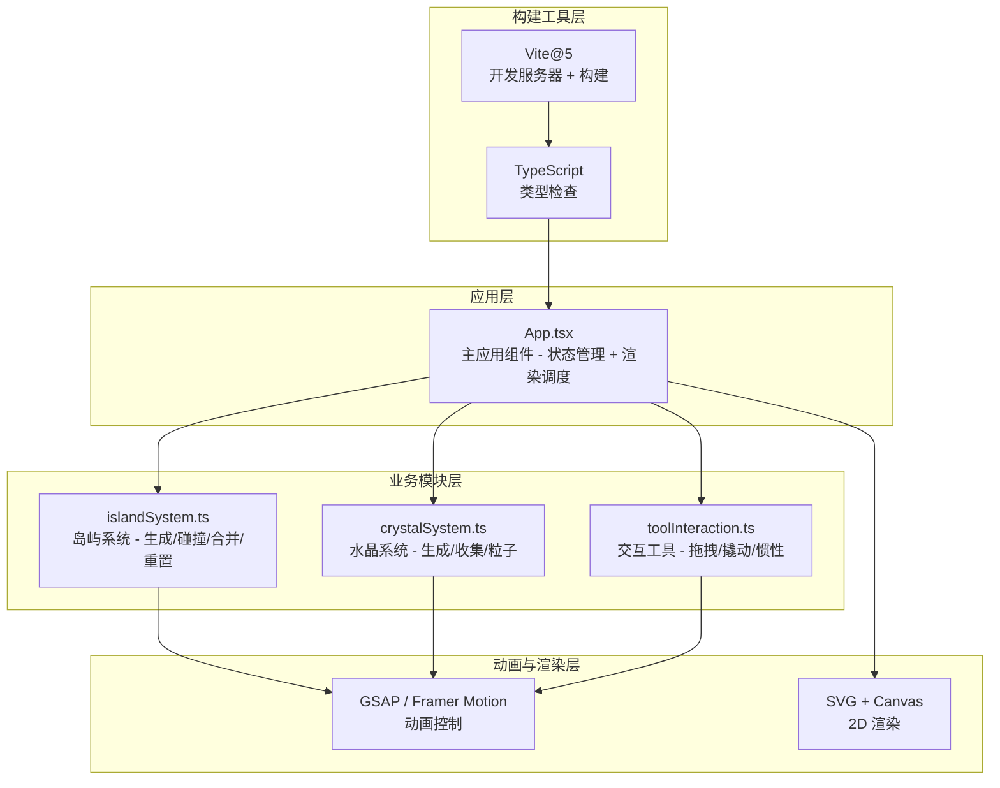

## 1. 架构设计



## 2. 技术描述

- 前端框架：React 18 + TypeScript（严格模式，目标 ES2020，JSX: react-jsx）
- 构建工具：Vite 5 + @vitejs/plugin-react
- 动画库：GSAP + Framer Motion
- 唯一ID：uuid
- 渲染方式：SVG（岛屿、水晶、撬棍、路径） + CSS 动画（粒子、光晕）
- 性能优化：requestAnimationFrame 调度、圆形碰撞检测（O(n²) 但 n≤8）、粒子数量上限控制

## 3. 目录结构

```
auto190/
├── .trae/documents/
│   ├── PRD_浮空岛屿撬棍冒险.md
│   └── 技术架构_浮空岛屿撬棍冒险.md
├── src/
│   ├── App.tsx          # 主应用组件
│   ├── islandSystem.ts  # 岛屿系统模块
│   ├── crystalSystem.ts # 水晶系统模块
│   └── toolInteraction.ts # 交互工具模块
├── index.html
├── package.json
├── tsconfig.json
└── vite.config.js
```

## 4. 数据模型

### 4.1 岛屿 (Island)
```typescript
interface Island {
  id: string;
  x: number;           // 中心X坐标
  y: number;           // 中心Y坐标
  radius: number;      // 半径(75-150px，对应直径150-300px)
  vx: number;          // X方向速度
  vy: number;          // Y方向速度
  mergedWith: string[]; // 合并的岛屿ID列表
  initialX: number;    // 初始X（用于重置）
  initialY: number;    // 初始Y（用于重置）
}
```

### 4.2 水晶 (Crystal)
```typescript
interface Crystal {
  id: string;
  islandId: string;    // 所属岛屿ID
  offsetX: number;     // 相对于岛屿中心的X偏移
  offsetY: number;     // 相对于岛屿中心的Y偏移
  collected: boolean;
}
```

### 4.3 粒子 (Particle)
```typescript
interface Particle {
  id: string;
  x: number;
  y: number;
  vx: number;
  vy: number;
  life: number;        // 剩余生命周期(ms)
  maxLife: number;
  size: number;
  color: string;
  type: 'shockwave' | 'crystal-shard';
}
```

### 4.4 拖拽状态 (DragState)
```typescript
interface DragState {
  isDragging: boolean;
  islandId: string | null;
  startX: number;
  startY: number;
  currentX: number;
  currentY: number;
  crowbarAngle: number; // 撬棍弯曲角度
}
```

## 5. 核心模块函数定义

### 5.1 islandSystem.ts
```typescript
export function generateIslands(canvasWidth: number, canvasHeight: number): Island[]
// 生成6-8个随机位置和半径的岛屿，确保不重叠

export function checkCollision(
  island1: Island, 
  island2: Island
): { collided: boolean; contactX: number; contactY: number; pushDirX: number; pushDirY: number }
// 圆形碰撞检测，返回碰撞点和弹开方向

export function mergeIslands(islands: Island[], id1: string, id2: string): Island[]
// 当距离<40px时粘连两岛，合并水晶归属

export function resetIslands(islands: Island[]): Island[]
// 恢复所有岛屿到初始位置，清空合并状态和速度
```

### 5.2 crystalSystem.ts
```typescript
export function spawnCrystals(islands: Island[]): Crystal[]
// 在每个岛屿上随机生成1-3颗水晶

export function collectCrystal(
  crystals: Crystal[], 
  crystalId: string
): { updatedCrystals: Crystal[]; collectedCrystal: Crystal | null }
// 移除指定水晶并返回被收集的水晶信息

export function explodeParticles(
  x: number, 
  y: number, 
  type: 'shockwave' | 'crystal-shard'
): Particle[]
// 在指定位置生成爆炸/冲击波粒子
```

### 5.3 toolInteraction.ts
```typescript
export function startDrag(
  state: DragState, 
  islandId: string, 
  mouseX: number, 
  mouseY: number
): DragState
// 初始化撬棍拖拽状态

export function updateDrag(
  state: DragState, 
  mouseX: number, 
  mouseY: number, 
  islands: Island[],
  maxSpeed: number
): { state: DragState; updatedIslands: Island[] }
// 根据鼠标偏移更新撬棍弯曲角度和岛屿位置

export function endDrag(
  state: DragState, 
  islands: Island[],
  damping: number
): { state: DragState; updatedIslands: Island[] }
// 松开鼠标，应用惯性阻尼
```
