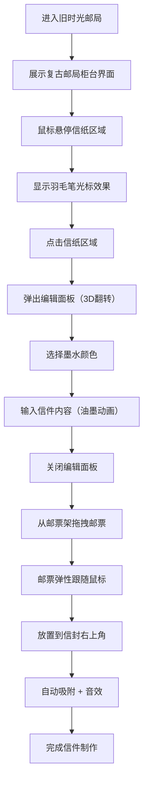

## 1. 产品概述
旧时光邮局是一个沉浸式的虚拟信件制作应用，用户可以在浏览器中体验复古邮局的氛围，通过蜡封、邮票和手写墨迹的组合，制作一封从过去邮寄到现在的信件。

- **主要目的**：为用户提供一个充满怀旧氛围的信件创作体验，通过精美的视觉设计和流畅的交互动画，让用户感受手写书信的温度。
- **目标用户**：喜欢复古风格、热爱手写信件、追求仪式感的用户群体。
- **市场价值**：在数字化时代，为用户提供一个富有情感价值的创意工具，可用于制作电子贺卡、情书、纪念信等。

## 2. 核心功能

### 2.1 功能模块
1. **邮局柜台主界面**：复古胡桃木渐变背景，木质柜台，半成品信纸展示
2. **信纸编辑面板**：旧式信封样式编辑界面，支持多色墨水手写输入
3. **邮票拖拽系统**：虚拟邮票架，支持拖拽邮票到信封指定位置
4. **动画与交互**：羽毛笔光标、油墨扩散动画、3D信纸翻转、弹性拖拽跟随

### 2.2 页面详情

| 页面名称 | 模块名称 | 功能描述 |
|-----------|-------------|---------------------|
| 主界面 | 复古邮局柜台 | 展示渐变背景、木质柜台、半成品信纸、邮票架 |
| 主界面 | 信纸展示区 | 米白色信纸带裁切线，支持点击进入编辑，羽毛笔光标悬停效果 |
| 编辑面板 | 信纸选择区 | 枫木色背景，展示不同信纸样式选项 |
| 编辑面板 | 墨水选择区 | 墨水瓶图标列表（黑、深蓝、暗红、金棕），点击切换笔迹颜色 |
| 编辑面板 | 文本输入区 | 支持手写风格文本输入，实时切换墨水颜色 |
| 主界面 | 邮票拖拽区 | 邮票架展示4种邮票（复古火车、灯塔、帆船、玫瑰），支持拖拽到信封右上角 |
| 主界面 | 吸附与音效 | 邮票对齐到指定区域时自动吸附并发出清脆单击音效 |

## 3. 核心流程

用户打开应用 → 看到复古邮局柜台界面 → 鼠标悬停信纸显示羽毛笔光标 → 点击信纸弹出编辑面板（3D翻转动画） → 选择墨水颜色 → 输入信件内容（油墨扩散动画） → 完成编辑关闭面板 → 从邮票架拖拽邮票 → 邮票弹性跟随鼠标 → 放置到信封右上角自动吸附 → 听到单击音效 → 完成信件制作

## 4. 用户界面设计

### 4.1 设计风格
- **主色调**：暖棕（#6b4c3b）+ 米白（#faf3e0 / #e8dcc8）+ 淡金（#cba37a）
- **按钮风格**：圆角 12px，微弱投影 `box-shadow: 0 2px 8px rgba(0,0,0,0.2)`
- **字体**：复古手写风格字体配合衬线字体
- **布局风格**：桌面端横向柜台布局，移动端竖排自适应
- **视觉元素**：木质纹理、纸张质感、羽毛笔光标、油墨扩散、齿孔邮票

### 4.2 页面设计概述

| 页面名称 | 模块名称 | UI元素 |
|-----------|-------------|-------------|
| 主界面 | 背景区域 | 从胡桃木色#6b4c3b渐变到旧报纸色#e8dcc8，纸张纹理叠加 |
| 主界面 | 木质柜台 | 中央立体柜台，木纹质感，投影效果 |
| 主界面 | 信纸展示 | 米白色#faf3e0信纸，边缘微卷，0.5px虚线裁切线，16:9比例 |
| 主界面 | 羽毛笔光标 | 15px SVG羽毛图标，悬停时轻微晃动动画 |
| 编辑面板 | 信封样式 | 旧式信封外观，3D翻转动画（Y轴90度，0.6s） |
| 编辑面板 | 信纸选择区 | 枫木色#cba37a背景，圆角卡片 |
| 编辑面板 | 墨水瓶列表 | 4色墨水瓶图标，点击高亮反馈 |
| 编辑面板 | 油墨动画 | 圆形渐变从点击点向外扩散，透明度0.6→0 |
| 主界面 | 邮票架 | 右侧展示4枚邮票，60x80px尺寸，细边和齿孔花纹 |
| 主界面 | 拖拽效果 | transform延迟50ms弹性跟随，吸附时单击音效 |

### 4.3 响应式设计
- **桌面端（>768px）**：横向柜台布局，邮票架位于右侧
- **移动端（≤768px）**：竖排布局，柜台缩小，信纸区域自适应宽度并保持16:9比例，邮票架位于下方
- **触控优化**：移动端支持触摸拖拽，增大交互热区

### 4.4 性能要求
- 邮票拖拽操作响应延迟 ≤ 50ms
- 所有动画帧率稳定 60fps
- 使用 CSS transform 和 opacity 实现高性能动画
