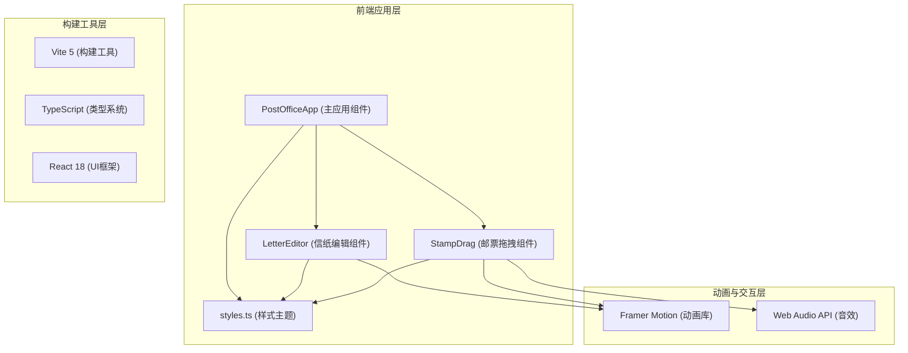

## 1. 架构设计



## 2. 技术描述

- **前端框架**：React 18 + TypeScript
- **构建工具**：Vite 5
- **动画库**：Framer Motion
- **状态管理**：React useState/useRef（轻量级，无需额外状态管理库）
- **音效**：Web Audio API（生成单击音效）
- **工具库**：uuid（生成唯一标识）、file-saver（可选：导出信件图片）

## 3. 项目文件结构

```
e:\solo\VersionFast\tasks\auto192\
├── .trae/
│   └── documents/
│       ├── PRD-旧时光邮局.md
│       └── 技术架构-旧时光邮局.md
├── package.json
├── vite.config.js
├── tsconfig.json
├── index.html
└── src/
    ├── PostOfficeApp.tsx    # 主应用组件
    ├── LetterEditor.tsx     # 信纸编辑组件
    ├── StampDrag.tsx        # 邮票拖拽组件
    └── styles.ts            # 样式主题与动画变体
```

## 4. 组件职责定义

### 4.1 PostOfficeApp.tsx (主应用组件)
- 管理整体应用状态（信件内容、墨水颜色、已放置的邮票）
- 渲染复古邮局柜台背景和木质柜台
- 协调子组件（LetterEditor、StampDrag）
- 处理响应式布局

### 4.2 LetterEditor.tsx (信纸编辑组件)
- 渲染信纸区域（米白色背景、裁切线）
- 实现羽毛笔光标悬停效果
- 管理编辑面板的显示/隐藏（3D翻转动画）
- 渲染墨水颜色选择器
- 实现文本输入区域，实时切换墨水颜色
- 渲染油墨扩散动画效果

### 4.3 StampDrag.tsx (邮票拖拽组件)
- 渲染邮票架和邮票列表
- 实现邮票拖拽逻辑（Framer Motion drag）
- 实现弹性跟随动画（transform 延迟 50ms）
- 检测邮票与目标区域的碰撞
- 实现自动吸附逻辑
- 使用 Web Audio API 播放吸附音效

### 4.4 styles.ts (样式主题)
- 集中管理所有主题颜色变量
- 定义 Framer Motion 动画变体（variants）
- 导出响应式断点配置
- 导出通用样式工具函数

## 5. 核心类型定义

```typescript
// 墨水颜色类型
interface InkColor {
  id: string;
  name: string;
  color: string;
}

// 邮票类型
interface Stamp {
  id: string;
  name: string;
  pattern: 'train' | 'lighthouse' | 'sailboat' | 'rose';
  isPlaced: boolean;
  position?: { x: number; y: number };
}

// 油墨斑点类型
interface InkBlot {
  id: string;
  x: number;
  y: number;
  color: string;
}

// 应用状态类型
interface AppState {
  letterContent: string;
  currentInkColor: string;
  stamps: Stamp[];
  isEditorOpen: boolean;
}
```

## 6. 性能优化策略

1. **使用 CSS Transform 动画**：所有位移、缩放、旋转动画使用 `transform` 属性，触发 GPU 加速
2. **Framer Motion 优化**：使用 `layout` 属性最小化重排，`willChange` 提示浏览器优化
3. **拖拽性能**：使用 Framer Motion 的 drag 事件，避免频繁的 state 更新，使用 ref 存储拖拽位置
4. **内存管理**：及时清理动画监听器和音频上下文
5. **响应式图片**：邮票 SVG 图案内联，避免额外网络请求
