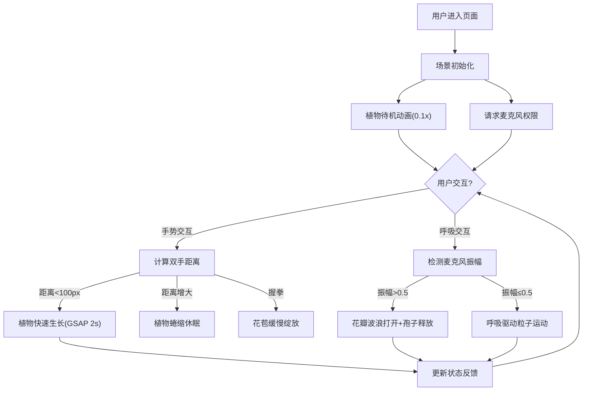

## 1. 产品概述

呼吸与手势驱动数字花园——一个沉浸式交互艺术应用，让观展者通过双手手势（靠近/远离/挥动）和麦克风捕捉的呼吸频率，实时影响虚拟花园中植物的生长、花瓣开合与漂浮孢子的运动轨迹，营造人与数字自然的共生体验。

- 目标用户：交互艺术展览观展者、数字艺术爱好者
- 核心价值：将人体本能动作（呼吸、手势）转化为可视化的自然反馈，创造"身体即花园"的沉浸式体验

## 2. 核心功能

### 2.1 功能模块

1. **主场景页面**：3D花园场景、手势交互、呼吸驱动、状态反馈界面、控制面板

### 2.2 页面详情

| 页面名称 | 模块名称 | 功能描述 |
|----------|----------|----------|
| 主场景 | 手势控制 | 双手距离<100px触发植物快速生长（GSAP 2s 0→1缩放）；距离增大时蜷缩；单手握拳附近花苞缓慢绽放 |
| 主场景 | 呼吸驱动 | 麦克风振幅>0.5时花瓣波浪式打开（延迟0.1s），释放彩色孢子粒子（半径3-6px，径向扩散，2s消失） |
| 主场景 | 动态植物系统 | 30株风格化植物，独立生长状态0-1，颜色嫩绿→深绿，花瓣淡粉→深紫 |
| 主场景 | 背景粒子系统 | 500个半透明光点（2-4px，透明度0.2-0.6），强呼吸螺旋上升，弱呼吸缓慢下落，淡蓝↔金色渐变 |
| 主场景 | 状态反馈界面 | 左上角实时显示手势距离(px)、呼吸强度(0-1)、花园生命力(0-100%)，毛玻璃风格 |
| 主场景 | 控制面板 | 左侧毛玻璃面板(240px)，生长速度/呼吸灵敏度/粒子密度三个滑块，移动端折叠为底部抽屉 |

## 3. 核心流程

用户进入页面 → 场景初始化（植物待机动画0.1倍速开合） → 请求麦克风权限 → 用户通过手势和呼吸与花园交互 → 植物实时响应 → 状态反馈界面更新

## 4. 用户界面设计

### 4.1 设计风格

- 主色调：深午夜蓝(#0a0a2e) → 靛蓝(#1a1a4a) 渐变背景
- 辅助色：嫩绿(#7ec850)、深绿(#2d5a1e)、淡粉(#ffb6c1)、深紫(#8b008b)、淡蓝(#add8e6)、金色(#ffd700)
- 面板风格：毛玻璃(glassmorphism)，背景rgba(0,0,0,0.3)，模糊10px
- 字体：monospace，白色
- 布局：全屏3D场景 + 左侧控制面板叠加 + 左上角状态HUD

### 4.2 页面设计概览

| 页面名称 | 模块名称 | UI元素 |
|----------|----------|--------|
| 主场景 | 3D花园 | 全屏Three.js画布，圆形草地(ShaderMaterial波浪动画)，30株植物，500灵气粒子 |
| 主场景 | 状态HUD | 左上角毛玻璃面板，monospace白色文字，实时数据 |
| 主场景 | 控制面板 | 左侧240px毛玻璃面板，3个滑块(生长速度/呼吸灵敏度/粒子密度)，悬停放大1.05x+shadow，点击scale(0.95) |
| 主场景 | 全屏按钮 | 右下角，screenfull实现 |
| 主场景 | 麦克风按钮 | 请求麦克风权限入口 |

### 4.3 响应式设计

- 桌面端(≥768px)：左侧控制面板固定240px宽度
- 移动端(<768px)：控制面板折叠为底部可拖拽抽屉

### 4.4 3D场景指导

- 环境：深午夜蓝夜空氛围，无HDRI，使用程序化渐变背景
- 光照：环境光 + 柔和方向光，营造神秘花园感
- 相机：透视相机，俯视角度约45度，可鼠标旋转
- 焦点元素：中央植物群、漂浮粒子、草地波浪
- 交互：手势控制植物生长、呼吸驱动花瓣开合和孢子释放
- 性能预算：粒子总数≤800，帧率≥45fps
