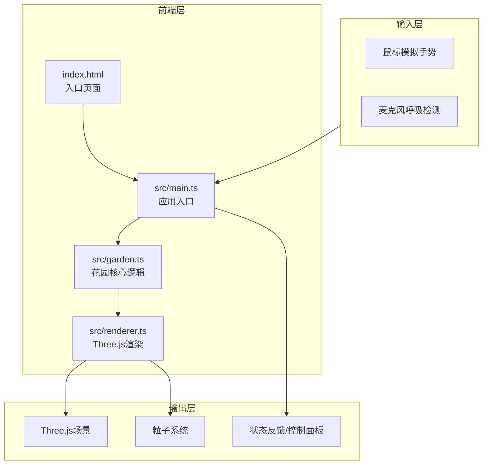

## 1. 架构设计



**数据流向**：
- main.ts 接收手势坐标和呼吸强度 → 传递给 garden.ts
- garden.ts 根据输入更新植物状态（生长值、花瓣开合度、孢子生命周期） → 返回状态参数给 renderer.ts
- renderer.ts 每帧根据 garden.ts 的状态更新 Three.js 场景中的网格、材质、粒子和光照

## 2. 技术说明

- 前端框架：TypeScript + Three.js@0.160.0 + Vite@5
- 动画库：GSAP（植物生长、花瓣开合动画）
- 全屏：screenfull
- 初始化工具：Vite
- 无后端、无数据库

## 3. 路由定义

| 路由 | 用途 |
|------|------|
| / | 主场景页面，包含3D花园、手势交互、呼吸驱动、控制面板 |

## 4. 文件结构

```
├── package.json          # 依赖：three@0.160.0, gsap, typescript, vite@5, @types/three, screenfull
├── vite.config.js        # 构建配置，base: './'，启用TypeScript
├── tsconfig.json         # 严格模式，target: ES2020，paths映射src
├── index.html            # 入口页面，全屏按钮和麦克风权限请求
└── src/
    ├── main.ts           # 应用入口：初始化场景/相机/渲染器，接收手势/麦克风数据，驱动花园状态
    ├── garden.ts         # 花园核心：生长算法、粒子系统、手势/呼吸响应接口
    └── renderer.ts       # 渲染层：Three.js渲染循环，网格/材质/光照/粒子动画管理
```

## 5. 模块间调用关系

### main.ts → garden.ts
- 传入手势坐标（双手位置、距离、是否握拳）
- 传入呼吸强度（0-1振幅值）
- 传入控制面板参数（生长速度、呼吸灵敏度、粒子密度）

### garden.ts → renderer.ts
- 输出每株植物的生长状态（0-1）
- 输出花瓣开合度
- 输出孢子粒子生命周期数据
- 输出背景粒子运动参数
- 输出花园整体生命力

### renderer.ts → Three.js Scene
- 更新植物网格缩放/颜色
- 更新花瓣旋转/颜色
- 更新粒子位置/大小/透明度/颜色
- 更新草地ShaderMaterial uniforms
- 更新光照参数

## 6. 关键算法

### 6.1 植物生长算法
- 每株植物维护 `growth: number` (0-1)
- 双手距离 < 100px 时：GSAP tween growth 0→1 (duration: 2s / growthSpeed)
- 双手距离增大时：GSAP tween growth → 0
- 植物根据最近手势距离连续变化

### 6.2 呼吸检测算法
- 使用 Web Audio API 的 AnalyserNode 获取时域数据
- 计算 RMS 振幅归一化到 0-1
- 振幅 > breathSensitivity 阈值时触发花瓣波浪

### 6.3 粒子系统
- 背景灵气粒子：500个，受呼吸力度影响Y轴运动
- 孢子粒子：呼吸触发时生成，径向扩散，2s生命周期
- 总粒子数上限800

### 6.4 手势模拟
- 桌面端：鼠标位置模拟单手，按住Shift模拟双手
- 移动端：触摸位置模拟手势
