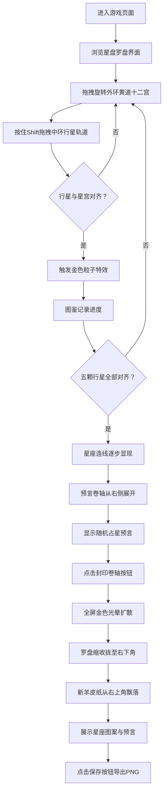

## 1. 产品概述

虚拟古代占星术士星盘罗盘互动解谜游戏，为天文爱好者提供沉浸式的古典占星体验。用户通过旋转多层星盘罗盘，对准星辰连线路径，解锁星座图案与神秘占星预言。

- 核心价值：将古代天文知识转化为可交互的沉浸式解谜体验
- 目标用户：天文爱好者、历史文化爱好者、解谜游戏玩家

## 2. 核心功能

### 2.1 用户角色
| 角色 | 注册方式 | 核心权限 |
|------|----------|----------|
| 访客用户 | 无需注册 | 完整游戏体验、预言导出 |

### 2.2 功能模块
1. **星盘罗盘主界面**：多层可旋转罗盘、拖拽交互、粒子特效、星座连线
2. **图鉴面板**：记录已解锁的星辰标记、显示游戏进度
3. **预言卷轴系统**：羊皮卷动画、随机占星预言文本、封印交互
4. **成果保存功能**：羊皮纸展示、PNG图片导出

### 2.3 页面详情
| 页面名称 | 模块名称 | 功能描述 |
|----------|----------|----------|
| 主游戏页 | 星盘罗盘 | 三层SVG可旋转环（黄道十二宫、行星轨道、中心十字），鼠标拖拽外环旋转，Shift+拖拽中环独立旋转，惯性滚动效果 |
| 主游戏页 | 粒子特效 | 对准时8个金色粒子从对准点扩散，透明度0.8→0，持续0.6秒 |
| 主游戏页 | 星座连线 | 5行星全部对齐后，SVG金色虚线连接行星，15-20个六角星节点闪烁，屏幕震动反馈 |
| 主游戏页 | 图鉴面板 | 右下角星形标记记录已对齐行星，响应式768px以下折叠至底部 |
| 主游戏页 | 预言卷轴 | 90×180px羊皮卷从右侧展开动画（0.8s ease-out），8句随机预言，Cinzel Decorative衬线字体 |
| 主游戏页 | 封印按钮 | 青金石色按钮，点击触发全屏金色光晕扩散（1.2s），罗盘缩放收拢（0.5s ease-in） |
| 主游戏页 | 羊皮纸成果 | 右上角飘下新羊皮纸，带虚线边框与红色火漆印章，显示星座与预言，保存按钮导出PNG |

## 3. 核心流程

用户进入页面 → 浏览古典天文台风格界面 → 拖拽旋转外环黄道十二宫 → 按住Shift拖拽中环行星轨道 → 行星标记与星宫对齐触发粒子特效 → 图鉴记录进度 → 五颗行星全部对齐 → 星座连线显现（逐步连接+节点闪烁+震动）→ 预言卷轴展开 → 阅读随机占星预言 → 点击封印卷轴按钮 → 全屏光晕动画 → 罗盘收拢 → 新羊皮纸飘落 → 查看星座与预言 → 点击保存导出PNG

## 4. 用户界面设计

### 4.1 设计风格
- **主色调**：深赭石色(#3b2a1a)→深靛蓝色(#1a1a2e)径向渐变（中央区域），暗棕色(#2a1a0a)→深靛蓝(#0a0a1a)（整体背景）
- **强调色**：金色(#d4af37)、淡金色(#c9a96e)、青金石蓝(#2a459d)
- **辅助色**：羊皮纸米(#e8dcc8→#faf3e0)、深棕(#4a3b2a)、火漆红
- **字体**：Cinzel Decorative（Google Fonts衬线字体）
- **按钮风格**：1px圆角边框，悬停0.15s ease-out色调切换，点击缩放0.95倍
- **纹理效果**：3%深度噪点纹理覆盖罗盘盘面，营造古老羊皮纸质感

### 4.2 页面设计概述
| 页面名称 | 模块名称 | UI元素 |
|----------|----------|----------|
| 主游戏页 | 星盘罗盘 | 直径400px（响应式300px），三层SVG环，0.5px淡金边框，噪点纹理，惯性旋转 |
| 主游戏页 | 图鉴面板 | 右侧/底部，星形标记阵列，金色描边，已解锁填充 |
| 主游戏页 | 预言卷轴 | 90×180px，卷曲展开动画，羊皮纸质感，衬线字体#c9a96e |
| 主游戏页 | 封印按钮 | 青金石底色，悬停#3a5bbd，点击光晕扩散 |
| 主游戏页 | 羊皮纸成果 | 飘落动画，1px棕色虚线边框，右下角火漆印章，保存按钮深棕圆角8px |

### 4.3 响应式设计
- **桌面端（≥1280px）**：星盘居中（400px），图鉴面板居右，日志面板居左
- **平板端（768px-1279px）**：星盘缩小（350px），面板自适应
- **移动端（<768px）**：星盘缩小（300px），图鉴面板折叠至底部栏，垂直布局

### 4.4 动效设计
- 粒子动画帧率≥55fps
- 旋转响应延迟<50ms
- 星座节点闪烁周期1.5s
- 罗盘惯性滑动0.3-0.5秒
- 所有动画使用framer-motion或CSS原生实现
