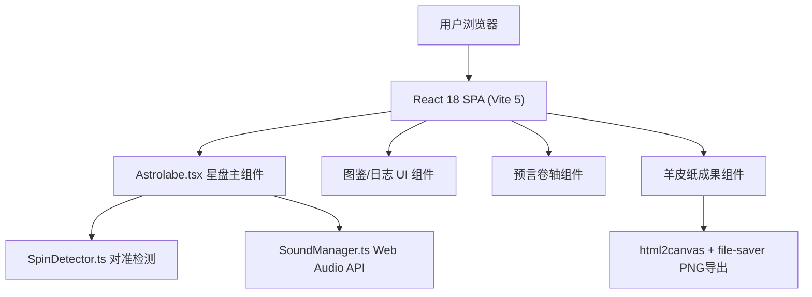

## 1. 架构设计



## 2. 技术描述

- **前端框架**：React 18 + TypeScript 5 + Vite 5
- **初始化工具**：Vite脚手架（react-ts模板）
- **动画库**：framer-motion（卷轴展开、罗盘缩放、光晕扩散、羊皮纸飘落等复杂动画）
- **图形渲染**：原生SVG（星盘罗盘、星座连线、粒子特效）
- **音频处理**：Web Audio API（OscillatorNode + AnalyserNode + GainNode，程序化合成音效）
- **图片导出**：html2canvas（DOM转Canvas）+ file-saver（触发下载）
- **唯一标识**：uuid（粒子、节点等动态元素ID）
- **样式方案**：原生CSS + CSS变量（响应式媒体查询，无Tailwind依赖，满足用户特定颜色需求）
- **后端**：无（纯前端应用）
- **数据库**：无（状态完全在前端内存中）

## 3. 路由定义

| 路由 | 用途 |
|------|------|
| / | 主游戏页面（单页应用，唯一页面） |

## 4. 核心数据结构与类型定义

### 4.1 行星与星宫数据

```typescript
// 黄道十二宫
interface ZodiacSign {
  name: string;        // 宫名（白羊座、金牛座...）
  symbol: string;      // 符号（♈ ♉ ♊...）
  angle: number;       // 起始角度（0°, 30°, 60°...）
}

// 行星标记
interface PlanetMarker {
  id: string;
  name: string;        // 水星、金星、火星、木星、土星
  symbol: string;      // 行星符号
  baseAngle: number;   // 基准角度（未旋转时的位置）
  color: string;       // 标记颜色
  targetZodiacIndex: number; // 目标星宫索引
  aligned: boolean;    // 是否已对齐
}

// 粒子特效
interface Particle {
  id: string;
  x: number;
  y: number;
  vx: number;
  vy: number;
  size: number;        // 2-4px
  opacity: number;     // 0.8 → 0
  life: number;        // 0.6秒
}

// 星座节点
interface ConstellationNode {
  id: string;
  x: number;           // 相对于罗盘中心的坐标
  y: number;
  size: number;        // 5px
  connected: boolean;
}

// 星座连线
interface ConstellationLine {
  fromId: string;
  toId: string;
  visible: boolean;
}
```

### 4.2 游戏状态

```typescript
interface GameState {
  outerRingAngle: number;      // 外环旋转角度（黄道十二宫）
  middleRingAngle: number;     // 中环旋转角度（行星轨道）
  planets: PlanetMarker[];     // 5颗行星状态
  particles: Particle[];       // 当前活动粒子
  constellationNodes: ConstellationNode[];
  constellationLines: ConstellationLine[];
  constellationProgress: number; // 0-1 连线进度
  phase: 'aligning' | 'connecting' | 'prophecy' | 'sealed';
  currentProphecy: string | null;
  parchmentVisible: boolean;
}
```

## 5. 文件结构

```
auto194/
├── .trae/documents/
│   ├── PRD.md
│   └── TECH_ARCHITECTURE.md
├── index.html                     # 入口HTML，引入Cinzel Decorative字体
├── package.json
├── vite.config.js                 # base: './'，启用React插件
├── tsconfig.json                  # strict, target ES2020
├── src/
│   ├── main.tsx                   # React入口
│   ├── App.tsx                    # 根组件，布局与状态
│   ├── index.css                  # 全局样式、CSS变量、响应式
│   ├── components/
│   │   ├── Astrolabe.tsx          # 星盘罗盘主组件（SVG绘制、拖拽、粒子、连线）
│   │   ├── ZodiacPanel.tsx        # 图鉴面板（已解锁星辰展示）
│   │   ├── ProphecyScroll.tsx     # 预言卷轴组件
│   │   └── ParchmentResult.tsx    # 羊皮纸成果展示与保存
│   └── utils/
│       ├── SpinDetector.ts        # 对准检测工具函数
│       ├── SoundManager.ts        # Web Audio API音效管理
│       └── constants.ts           # 星宫、行星、预言文本等常量
```

## 6. 核心算法说明

### 6.1 SpinDetector 对准检测

```
输入：外环角度outerAngle、中环角度middleAngle、行星基准角度planetBaseAngle、目标星宫索引targetZodiacIndex
步骤：
1. 计算行星当前绝对角度 = (planetBaseAngle + middleAngle) % 360
2. 计算目标星宫中心角度 = (targetZodiacIndex * 30 + 15 + outerAngle) % 360
3. 计算角度差 diff = |planetAngle - targetAngle|
4. 归一化到 [0, 180) 范围
5. 阈值判断：|diff| < 3° 视为对齐
输出：{ aligned: boolean, particleX: number, particleY: number }
```

### 6.2 惯性滚动实现

```
拖拽结束时记录角速度ω = Δθ / Δt
使用 requestAnimationFrame 逐帧衰减：
θ(t+1) = θ(t) + ω
ω(t+1) = ω(t) * 0.95  (指数衰减)
当 |ω| < 0.05°/帧 时停止
总持续时间约 0.3-0.5 秒
```

### 6.3 SoundManager 音效合成

- **对准时叮当声**：正弦波 880Hz，持续 0.15s，快速指数衰减包络，通过 AnalyserNode 监测音量防止爆音
- **星座完成和弦**：C-E-G 三和弦（261.6Hz, 329.6Hz, 392Hz），0.6s Attack + 1.2s Release
- 所有音效通过 GainNode 统一控制主音量（≤ 0.3）

### 6.4 图片导出流程

1. html2canvas 截取 ParchmentResult 组件 DOM → Canvas
2. canvas.toDataURL('image/png') 生成 Base64
3. file-saver 的 saveAs(dataURL, 'constellation.png') 触发下载

## 7. 性能优化策略

- SVG 渲染星盘而非 Canvas，利用浏览器硬件加速
- 粒子使用 CSS transform + opacity 而非 top/left 触发 GPU 合成层
- framer-motion 使用 will-change 提示浏览器优化
- requestAnimationFrame 统一驱动所有动画循环
- 粒子对象池复用，避免频繁 GC
- 旋转角度使用 CSS transform: rotate()，避免重排重绘
