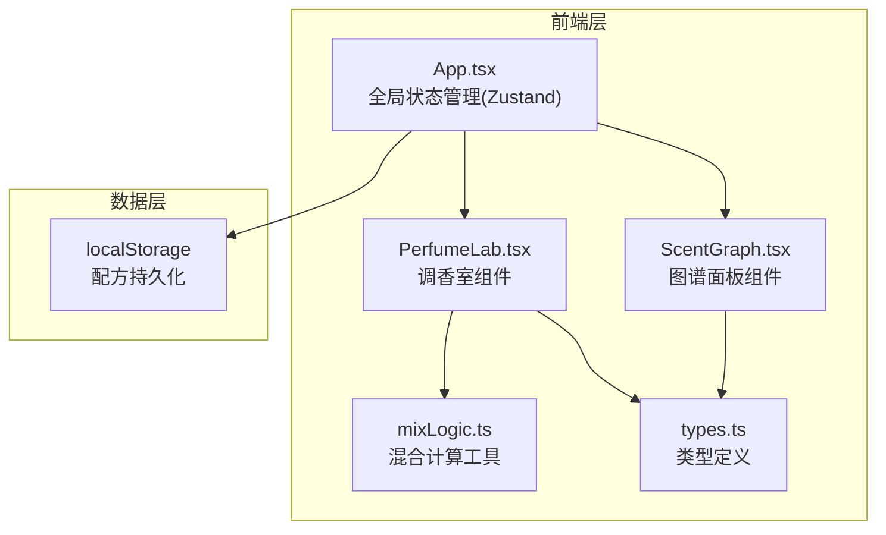
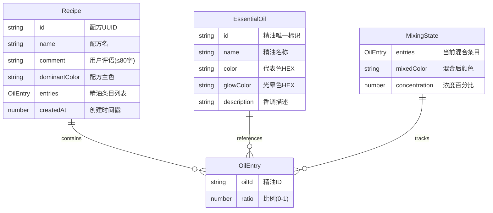

## 1. 架构设计



纯前端应用，无后端服务。配方数据通过 localStorage 持久化存储。

## 2. 技术说明

- **前端框架**：React 18 + TypeScript
- **构建工具**：Vite 5（@vitejs/plugin-react）
- **动画库**：framer-motion（精油拖拽、粒子飘散、花瓣展开动画）
- **状态管理**：Zustand
- **唯一ID生成**：uuid
- **文件导出**：file-saver
- **数据持久化**：localStorage

## 3. 路由定义

单页应用，无路由切换。所有功能在同一页面内通过左右/上下布局呈现。

| 区域 | 用途 |
|------|------|
| 主调香区（60%/100%） | 蒸馏器、精油架、调香碗、配方保存 |
| 图谱面板（35%/100%） | 花瓣图、配方详情浮窗 |

## 4. 数据模型

### 4.1 数据模型定义



### 4.2 核心接口定义

```typescript
interface EssentialOil {
  id: string;
  name: string;
  color: string;
  glowColor: string;
  description: string;
}

interface OilEntry {
  oilId: string;
  ratio: number;
}

interface Recipe {
  id: string;
  name: string;
  comment: string;
  dominantColor: string;
  entries: OilEntry[];
  createdAt: number;
}

interface MixingState {
  entries: OilEntry[];
  mixedColor: string;
  concentration: number;
}
```

## 5. 文件结构

```
├── package.json
├── vite.config.js
├── tsconfig.json
├── index.html
└── src/
    ├── main.tsx
    ├── App.tsx
    ├── types.ts
    ├── store.ts
    ├── components/
    │   ├── PerfumeLab.tsx
    │   └── ScentGraph.tsx
    └── utils/
        └── mixLogic.ts
```
