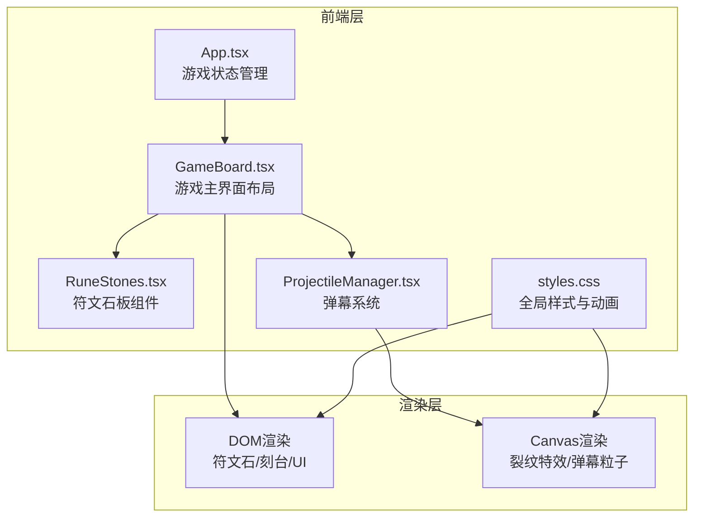

## 1. 架构设计



## 2. 技术说明
- 前端框架：React@18 + TypeScript
- 构建工具：Vite@5 + @vitejs/plugin-react
- 动画库：framer-motion（符文拖拽、弹幕飞行动画）
- 特效库：canvas-confetti（屏障碎裂粒子效果）
- 工具库：uuid（弹幕粒子唯一ID生成）
- 样式方案：CSS（暗色奇幻主题，CSS变量+关键帧动画）
- 初始化工具：vite-init (react-ts模板)

## 3. 路由定义
| 路由 | 用途 |
|------|------|
| / | 游戏主界面（单页应用） |

## 4. 数据模型

### 4.1 游戏状态模型

```typescript
type ElementType = 'fire' | 'ice' | 'lightning' | 'earth' | 'storm';

interface RuneConfig {
  type: ElementType;
  name: string;
  colorFrom: string;
  colorTo: string;
  flightDuration: number;
}

interface Projectile {
  id: string;
  type: ElementType;
  fromPlayer: boolean;
  startTime: number;
}

interface Crack {
  id: string;
  x: number;
  y: number;
  branches: CrackBranch[];
  createdAt: number;
  elementColor: string;
}

interface CrackBranch {
  points: { x: number; y: number }[];
  width: number;
}

interface BarrierState {
  health: number;
  maxHealth: number;
  cracks: Crack[];
  elementShifts: { color: string; intensity: number }[];
}

interface GameState {
  phase: 'playing' | 'ended';
  winner: 'player' | 'opponent' | null;
  playerBarrier: BarrierState;
  opponentBarrier: BarrierState;
  projectiles: Projectile[];
  inscribedRune: ElementType | null;
  lastAIAction: number;
}
```

### 4.2 元素配置

```typescript
const RUNE_CONFIGS: Record<ElementType, RuneConfig> = {
  fire: { type: 'fire', name: '火焰', colorFrom: '#ff4500', colorTo: '#ff8c00', flightDuration: 800 },
  ice: { type: 'ice', name: '寒冰', colorFrom: '#00bfff', colorTo: '#e0ffff', flightDuration: 800 },
  lightning: { type: 'lightning', name: '雷电', colorFrom: '#ffff00', colorTo: '#ffff00', flightDuration: 500 },
  earth: { type: 'earth', name: '大地', colorFrom: '#8b4513', colorTo: '#6b8e23', flightDuration: 800 },
  storm: { type: 'storm', name: '风暴', colorFrom: '#9370db', colorTo: '#c0c0c0', flightDuration: 1200 },
};
```

## 5. 渲染策略

### 5.1 DOM渲染层
- 符文石（5个圆形SVG元素）
- 铭刻台（渐变背景+漂浮粒子）
- 屏障能量盾（半透明+波动滤镜）
- 生命条（绿到红渐变）
- 胜负文字与重新开始按钮

### 5.2 Canvas渲染层
- 屏障裂纹特效（随机分支白色线条）
- 弹幕粒子（火球/冰晶/闪电/石块/漩涡）
- 屏障碎裂碎片动画

### 5.3 性能优化
- 弹幕粒子总数上限50个
- 裂纹使用Canvas绘制而非DOM元素
- requestAnimationFrame驱动Canvas动画循环
- 裂纹2秒自动修复，减少Canvas绘制负担
