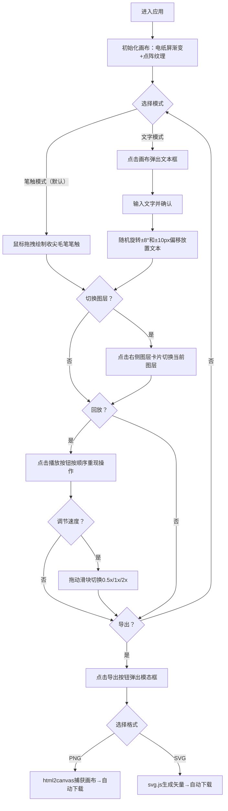

## 1. 产品概述

一款面向极简主义爱好者的虚拟墨水屏电子纸涂鸦与笔记应用，模拟电子墨水屏的低干扰、环保视觉风格，提供自然笔触书写、文字便签、图层管理、操作回放和水墨质感导出功能。

- 核心价值：提供接近纸质书写的数字体验，低饱和度配色缓解视觉疲劳，支持创意笔记的留存与分享
- 目标用户：极简主义爱好者、数字笔记用户、设计师、写手

## 2. 核心功能

### 2.1 功能模块

1. **主画布区域**：水墨质感笔触绘制、文字便签放置、随机点阵纹理背景、渐变亚光电纸屏效果
2. **左侧工具栏**：笔触/文字模式切换、快速操作入口
3. **右侧图层面板**：最多3图层叠加管理、缩略图预览、拖拽排序、图层切换高亮
4. **底部播放控制条**：操作回放、速度调节（0.5x/1x/2x）、进度条时间点标记、播放暂停状态
5. **导出模态框**：PNG全元素导出、SVG矢量线条+文本导出、磨砂玻璃风格界面

### 2.2 页面详情

| 页面名称 | 模块名称 | 功能描述 |
|---------|---------|---------|
| 主应用 | 画布区域 | 900x600px电纸屏渐变背景，2%不透明度随机点阵纹理，支持鼠标拖拽绘制收尖毛笔笔触，深石灰#3a3a3a颜色，0.3px羽化边缘 |
| 主应用 | 文字笔记模式 | 点击画布弹出极简悬浮文本框，输入后随机旋转±8°和±10px偏移放置，文本块可拖拽重定位 |
| 主应用 | 图层面板 | 最多3个图层缩略卡片（60px高度，半透明灰背景rgba(200,200,180,0.4)），点击高亮边框#555，支持拖拽重新排序 |
| 主应用 | 播放控制条 | 回放按钮重现所有操作序列，速度滑块（悬停圆点变细长条），进度条淡橘色#d49474时间点标记，暂停时淡绿#8fa49c已播放覆盖 |
| 主应用 | 导出模态框 | 半透明遮罩rgba(0,0,0,0.3)，磨砂玻璃边框1px白色半透，PNG（全元素）和SVG（仅矢量线条+文本）两种导出选项 |

## 3. 核心流程

### 主操作流程
用户进入应用 → 默认笔触模式 → 在画布上拖拽绘制笔触（或切换文字模式添加便签）→ 可切换到不同图层继续创作 → 点击回放查看创作过程 → 点击导出选择PNG/SVG格式下载。

## 4. 用户界面设计

### 4.1 设计风格
- **主色调**：低饱和度灰米白系，电纸屏渐变#e8e4d8→#cbcbb0，文字深石灰#3a3a3a
- **辅助色**：淡橘色#d49474（时间点标记）、淡绿色#8fa49c（进度已播放）、半透明灰rgba(200,200,180,0.4)（图层卡片）
- **按钮样式**：极简直角或4px微圆角，0.2s ease-out过渡，悬停亮度+10%，点击transform: translateY(1px) scale(0.98)
- **字体**：衬线体（如Noto Serif SC或Source Han Serif）搭配无衬线正文，突出书写感
- **布局**：左侧工具栏竖排 + 中央画布 + 右侧图层卡片 + 底部播放控制条；画布聚焦，辅助面板1.5秒无交互后opacity:0.3半透明隐藏
- **图标风格**：极简线性图标，1.5px线条宽度

### 4.2 页面设计概览

| 模块名称 | UI元素 | 风格细节 |
|---------|--------|---------|
| 画布背景 | 线性渐变+随机点阵 | 从#e8e4d8到#cbcbb0的垂直线性渐变，canvas叠加2%不透明度的白色/灰色随机点阵 |
| 笔触效果 | 收尖+羽化 | 两端细中间粗的贝塞尔曲线，shadowBlur 0.3px模拟墨水晕染，线条caps: round |
| 文本框 | 悬浮输入框 | 浅灰底#f5f3eb，12px圆角，box-shadow: 0 2px 8px rgba(0,0,0,0.08) |
| 图层卡片 | 缩略预览卡片 | 60px高度，rgba(200,200,180,0.4)背景，4px圆角，选中时2px边框#555，拖拽时shadow提升 |
| 播放控制条 | 进度条+速度滑块 | 默认细灰线，时间点标记用#d49474小圆点，已播放区覆盖#8fa49c半透明条；滑块默认圆形，hover/drag时变为细长圆角矩形 |
| 导出模态框 | 磨砂玻璃面板 | backdrop-filter: blur(12px)，background: rgba(255,255,255,0.75)，border: 1px solid rgba(255,255,255,0.8) |

### 4.3 响应式设计
- **桌面端（>768px）**：左侧竖排工具栏、右侧竖排图层面板、底部横向播放控制条、画布900x600px居中
- **移动端（≤768px）**：工具栏改为底部水平栏、图层面板改为可左右滑动的横向缩略图条、画布宽度自适应为窗口宽度（保持高度比例）、播放控制条合并至底部工具栏

### 4.4 动画与微交互
- **面板自动隐藏**：鼠标离开展开区域1.5秒后，通过CSS transition实现opacity从1过渡到0.3（1秒过渡时间）
- **按钮交互**：所有按钮统一framer-motion whileHover（亮度+10%）+ whileTap（y:1px, scale:0.98）
- **回放进度**：播放时进度条通过requestAnimationFrame平滑推进，时间点随进度高亮
- **文字放置**：新文本添加时用framer-motion做scale(0.8)→scale(1)的弹性出现动画
