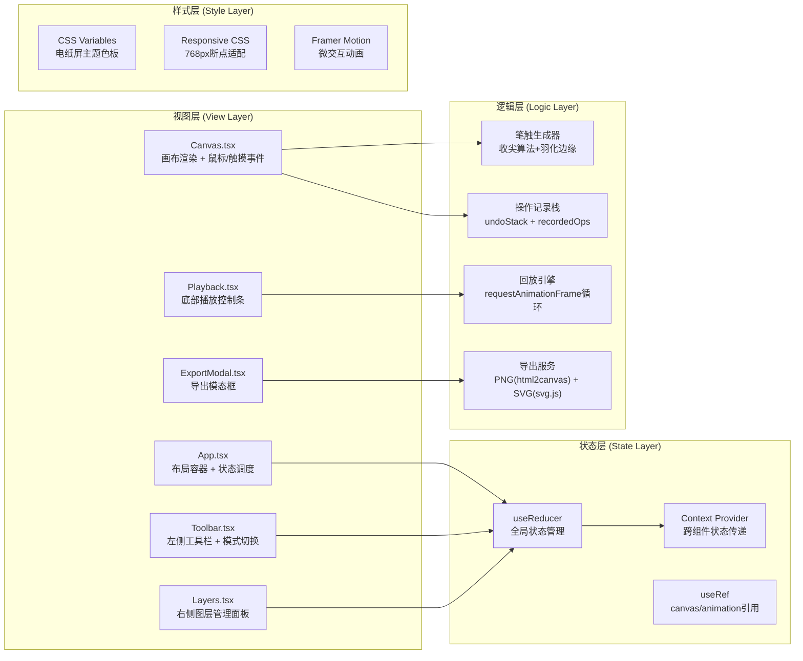

## 1. 架构设计



## 2. 技术栈说明

- **前端框架**：React 18 + TypeScript（严格模式strict: true）
- **构建工具**：Vite 5 + @vitejs/plugin-react（base: './'，@别名指向src）
- **动画库**：framer-motion（按钮交互、文字出现动画）
- **导出服务**：
  - PNG导出：html2canvas（捕获DOM画布元素生成图片）
  - SVG导出：svg.js@3（遍历操作记录生成矢量路径和文本节点）
  - 文件下载：file-saver
- **工具库**：uuid（生成图层ID、笔触ID、文本块ID）
- **Canvas渲染**：原生HTML5 Canvas API（2D上下文）

## 3. 目录结构与文件定义

| 文件路径 | 职责 |
|---------|-----|
| `package.json` | 依赖声明（react、react-dom、typescript、vite@5、@vitejs/plugin-react、uuid、framer-motion、file-saver、html2canvas、@svgdotjs/svg.js@3、@types/file-saver、@types/uuid），脚本dev/build/preview |
| `index.html` | 入口HTML，`<div id="root">`，viewport meta标签，Google Fonts加载衬线字体 |
| `vite.config.js` | React插件启用，base: './'，resolve.alias { '@': '/src' }，开发服务器端口配置 |
| `tsconfig.json` | strict: true，target: ES2020，module: ESNext，jsx: react-jsx，moduleResolution: bundler，include: ["src"] |
| `src/App.tsx` | 主组件，Flex布局（左中右+底部），useReducer初始化全局状态，管理画布尺寸，组合各子组件 |
| `src/Canvas.tsx` | 画布核心组件：背景渐变+点阵纹理渲染，笔触绘制（贝塞尔曲线+线宽收尖+shadowBlur羽化），文字块绝对定位，鼠标/触摸事件绑定，undoStack操作记录 |
| `src/Toolbar.tsx` | 左侧工具栏：笔触模式按钮、文字模式按钮、清空按钮，framer-motion whileHover/whileTap，回调函数修改App状态的currentMode |
| `src/Layers.tsx` | 右侧图层面板：3个图层缩略卡片（每60px高度），点击切换activeLayerId，拖拽HTML5 DnD API重排序，自动隐藏opacity过渡 |
| `src/Playback.tsx` | 底部播放控制：播放/暂停切换，速度滑块（0.5x/1x/2x映射），进度条（操作时间点渲染），useRef + requestAnimationFrame驱动回放循环 |
| `src/ExportModal.tsx` | 导出模态框：磨砂玻璃效果，PNG导出按钮（调用html2canvas → saveAs），SVG导出按钮（调用@svgdotjs/svg.js构建SVG树 → saveAs），ESC/点击遮罩关闭 |
| `src/store/reducer.ts` | useReducer的reducer函数：state类型定义（AppState），action类型联合，处理ADD_STROKE、ADD_TEXT、SET_ACTIVE_LAYER、REORDER_LAYERS、START_PLAYBACK等action |
| `src/store/types.ts` | 全局类型定义：Stroke（笔触点数组+颜色+线宽）、TextBlock（文字内容+位置+旋转角度）、Layer（ID+名称+可见性+操作记录）、RecordedOp（回放操作单元） |
| `src/utils/stroke.ts` | 笔触工具函数：计算两点间距→线宽插值收尖算法，quadraticCurveTo贝塞尔平滑，shadowBlur羽化参数设置 |
| `src/utils/export.ts` | 导出工具函数：strokesToSvgPath（笔触点数组转SVG `<path>` d属性）、textBlocksToSvgText（文字块转SVG `<text>` + transform旋转） |
| `src/styles/index.css` | 全局样式：CSS变量主题，面板自动隐藏transition，响应式媒体查询@768px，按钮悬停/点击样式 |

## 4. 核心数据模型

```mermaid
classDiagram
    class AppState {
        +currentMode: 'draw' | 'text'
        +activeLayerId: string
        +layers: Layer[]
        +undoStack: Operation[]
        +recordedOps: RecordedOp[]
        +isPlaying: boolean
        +playbackSpeed: 0.5 | 1 | 2
        +playbackProgress: number
        +showExportModal: boolean
        +canvasSize: {width: number, height: number}
    }

    class Layer {
        +id: string
        +name: string
        +order: number
        +strokes: Stroke[]
        +textBlocks: TextBlock[]
        +visible: boolean
    }

    class Stroke {
        +id: string
        +points: Point[]
        +color: string
        +baseWidth: number
        +layerId: string
        +timestamp: number
    }

    class TextBlock {
        +id: string
        +content: string
        +x: number
        +y: number
        +rotation: number
        +layerId: string
        +timestamp: number
    }

    class Point {
        +x: number
        +y: number
        +pressure: number
    }

    class RecordedOp {
        +type: 'stroke' | 'text' | 'layer-switch'
        +layerId: string
        +payload: Stroke | TextBlock | string
        +timestamp: number
        +duration: number
    }

    AppState "1" -- "*" Layer
    Layer "1" -- "*" Stroke
    Layer "1" -- "*" TextBlock
    Stroke "1" -- "*" Point
    AppState "1" -- "*" RecordedOp
```

## 5. 状态管理Action定义

| Action Type | Payload | 说明 |
|-------------|---------|-----|
| `SET_MODE` | `{ mode: 'draw' \| 'text' }` | 切换笔触/文字模式 |
| `SET_ACTIVE_LAYER` | `{ layerId: string }` | 切换当前活动图层，记录到recordedOps |
| `REORDER_LAYERS` | `{ layerIds: string[] }` | 按数组顺序重排图层 |
| `ADD_STROKE` | `{ stroke: Stroke }` | 添加笔触到当前图层，记录undoStack和recordedOps |
| `ADD_TEXT` | `{ textBlock: TextBlock }` | 添加文字块到当前图层，记录undoStack和recordedOps |
| `UPDATE_TEXT_POSITION` | `{ id: string, x: number, y: number }` | 拖拽移动文字块位置 |
| `CLEAR_CANVAS` | - | 清空所有图层内容和操作记录 |
| `SET_CANVAS_SIZE` | `{ width: number, height: number }` | 响应式更新画布尺寸 |
| `START_PLAYBACK` | - | 重置progress为0，isPlaying=true |
| `PAUSE_PLAYBACK` | - | isPlaying=false |
| `SET_PLAYBACK_SPEED` | `{ speed: 0.5 \| 1 \| 2 }` | 更新回放速度倍率 |
| `SET_PLAYBACK_PROGRESS` | `{ progress: number }` | 进度条手动拖动更新 |
| `TOGGLE_EXPORT_MODAL` | `{ show: boolean }` | 显示/隐藏导出模态框 |
| `APPLY_REPLAY_OP` | `{ opIndex: number }` | 回放时按索引逐步应用操作到临时状态 |

## 6. 关键算法与性能策略

### 6.1 笔触收尖算法（utils/stroke.ts）
- 输入：鼠标移动产生的原始点数组 `Point[]`
- 处理：
  1. 计算总笔触长度L，首尾15%段为收尖过渡区
  2. 每段相邻两点之间用linearInterpolate插值额外生成2~3个中间点
  3. 根据点在笔触中的位置比例p，计算宽度：`w(p) = baseWidth * sin(π*p)`（0→max→0的钟形曲线）
  4. 相邻三点用quadraticCurveTo绘制贝塞尔平滑路径，lineWidth随进度变化
- 输出：Canvas 2D的path + shadowBlur=0.3的羽化效果

### 6.2 回放引擎（Playback.tsx）
- 架构：`useRef<number>`保存requestAnimationFrame句柄 + `useRef<number>`保存startTime
- 循环逻辑：
  1. 计算 `elapsed = (performance.now() - startTime) * speed / totalDuration`
  2. 将elapsed映射到0~1的progress，更新进度条样式
  3. 遍历recordedOps，找到当前progress已超过的时间点，调用dispatch APPLY_REPLAY_OP
  4. 已播放的OP不重复应用（通过lastAppliedOpIndex跟踪）
- 性能：单次渲染≤16ms（60fps），笔触分段增量绘制而非全量重绘

### 6.3 响应式画布适配
- 逻辑像素 vs 物理像素：`canvas.width = cssWidth * devicePixelRatio`，`ctx.scale(dpr, dpr)` 高清屏不模糊
- 断点切换：useEffect监听`window.matchMedia('(max-width: 768px)')`，dispatch SET_CANVAS_SIZE
- 移动端：所有鼠标事件同步兼容touch事件（touchstart→mousedown等）

### 6.4 导出性能（≤500ms目标）
- PNG：html2canvas配置`{ scale: 2, useCORS: true, backgroundColor: null }`，Web Worker友好
- SVG：遍历recordedOps直接拼装SVG字符串而非构建完整DOM树，减少回流开销
- 异步处理：导出前dispatch TOGGLE_LOADING，Promise.then后saveAs

## 7. 初始化脚本

```bash
# 1. 创建项目（手动创建以下结构）
# 2. 安装依赖
npm install
# 3. 启动开发服务器
npm run dev
```
