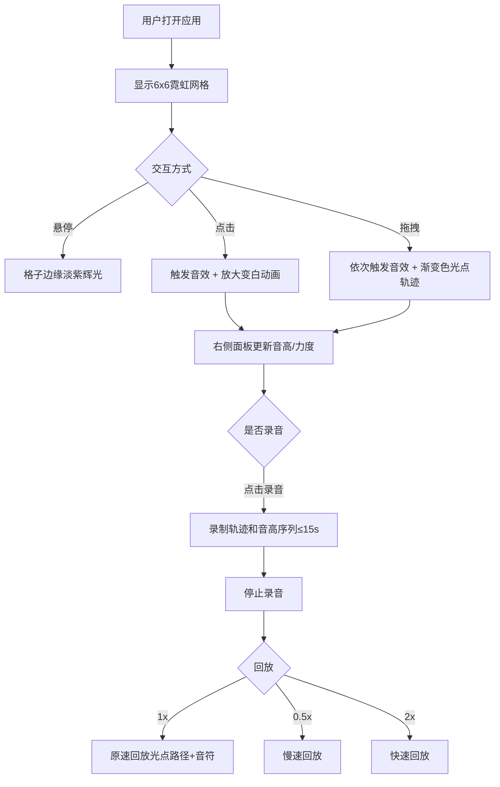

## 1. 产品概述

虚拟光影音疗触控板是一款面向音乐治疗师及需要情绪调节用户的浏览器端交互应用。用户通过点击和拖拽6x6柔光网格触发不同音高与音色的疗愈音效，同时伴随霓虹光效反馈，在轻柔交互中实现心情调节。

- 目标用户：音乐治疗师、压力缓解需求者、冥想爱好者
- 核心价值：将声音疗愈与视觉反馈融合，提供直觉式触控交互体验

## 2. 核心功能

### 2.1 功能模块

1. **触控板页面**：6x6霓虹圆形网格、点击/拖拽交互、音效与光效实时联动
2. **信息面板**：音高名称显示、力度进度条、冷暖色调背景自适应
3. **录音回放**：15秒录制、原速回放、可调速度（1x/0.5x/2x）

### 2.2 页面详情

| 页面名称 | 模块名称 | 功能描述 |
|----------|----------|----------|
| 触控板页面 | 6x6网格 | 半透明霓虹圆形，悬停淡紫辉光，点击放大变白渐变恢复，拖拽渐变色光点轨迹 |
| 触控板页面 | 音效触发 | 点击触发短音效（音高与行列相关），拖拽依次触发音效 |
| 信息面板 | 音高显示 | 显示当前音高名称（C4、D4等）和力度值（0-100进度条） |
| 信息面板 | 冷暖色调 | 面板背景根据最近5次点击平均音高冷暖变化（暖→橙红，冷→蓝紫） |
| 录音控制 | 录音按钮 | 录制最多15秒拖拽轨迹和音高序列 |
| 录音控制 | 回放功能 | 按原速重绘光点路径并播放音符，支持1x/0.5x/2x速度 |

## 3. 核心流程

用户打开页面后，看到深色疗愈主题背景上的6x6霓虹圆形网格。鼠标悬停格子时边缘出现淡紫色辉光，点击格子触发音效并伴随放大变白动画。拖拽划过多个格子时，沿路径留下一串渐变色光点（金黄→暖橙），每个经过的格子依次触发音效。右侧面板实时显示音高和力度，背景色随音高冷暖变化。用户可录制交互过程并回放。

## 4. 用户界面设计

### 4.1 设计风格

- 主色调：深色疗愈主题（极深紫#0f0c29 → 墨蓝#1a1a2e → 黑色#16213e渐变）
- 格子颜色：柔和玫瑰色#b76e79，悬停辉光淡紫#b39eb5，点击白色#ffffff
- 拖拽光点：金黄#f4d03f → 暖橙#e67e22渐变
- 按钮风格：渐变金色圆形按钮（#d4af37→#f5d76e），点击向内挤压动画（scale 0.95）
- 字体：优雅衬线体（Playfair Display）+ 清晰无衬线体（Nunito）
- 布局：触控板居中，信息面板右侧，录音按钮右上角
- 网格效果：磨砂玻璃毛玻璃效果（backdrop-filter: blur(4px)）

### 4.2 页面设计概述

| 页面名称 | 模块名称 | UI元素 |
|----------|----------|--------|
| 触控板页面 | 6x6网格 | 霓虹圆形（40px），间隔10px，毛玻璃背景，深色渐变主背景 |
| 触控板页面 | 拖拽光点 | 渐变色光点（20px→5px递减），0.8s淡出 |
| 信息面板 | 音高显示 | 文字显示音高名称 + 力度进度条 |
| 信息面板 | 冷暖背景 | 暖音高偏橙红，冷音高偏蓝紫 |
| 录音控制 | 按钮组 | 渐变金色圆形按钮，右上角，向内挤压动画 |

### 4.3 响应式适配

- 桌面端：触控板480x480px，格子间隔10px
- 平板端：触控板320x320px
- 移动端：触控板240x240px，格子间距减至6px
