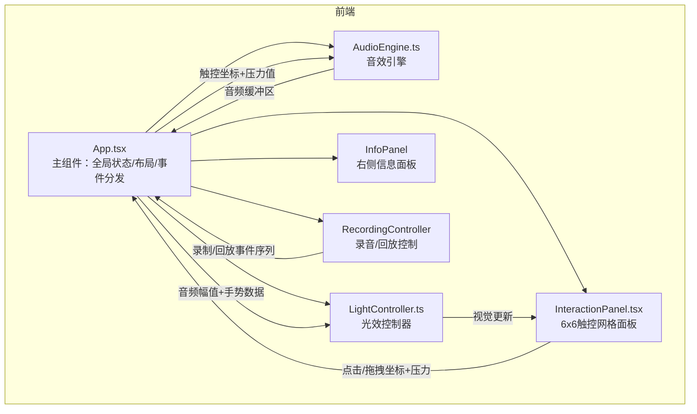

## 1. 架构设计



数据流向：
1. 用户在InteractionPanel上点击/拖拽 → 坐标和压力数据传给App
2. App将触控数据分发给AudioEngine（合成音效）和LightController（更新光效）
3. AudioEngine返回音频缓冲区，App控制播放
4. LightController输出视觉更新，驱动InteractionPanel的渲染
5. RecordingController录制事件序列，回放时注入App

## 2. 技术说明

- 前端：React@18 + TypeScript + Vite@5
- 音效合成：Tone.js（浏览器端Web Audio API封装）
- 动画：framer-motion（React动画库）
- 唯一标识：uuid
- 状态管理：React useState/useRef（组件内状态）+ zustand（全局录音状态）
- 样式：CSS Modules / 内联样式（无需Tailwind，精准控制光效动画）

## 3. 路由定义

| 路由 | 用途 |
|------|------|
| / | 单页应用，包含触控板、信息面板、录音控制 |

## 4. 文件结构

```
├── package.json
├── vite.config.js
├── tsconfig.json
├── index.html
├── src/
│   ├── main.tsx              # 入口，挂载App
│   ├── App.tsx               # 主组件，全局状态/布局/事件分发
│   ├── AudioEngine.ts        # 音效引擎（Tone.js合成）
│   ├── LightController.ts    # 光效控制（亮度/颜色/尺寸计算）
│   ├── InteractionPanel.tsx  # 触控板6x6网格面板
│   ├── InfoPanel.tsx         # 右侧音高/力度/冷暖面板
│   ├── RecordingController.ts # 录音/回放逻辑
│   ├── store.ts              # Zustand全局状态
│   ├── types.ts              # TypeScript类型定义
│   └── index.css             # 全局样式
```

## 5. 核心模块接口

### 5.1 AudioEngine
- `init()`：初始化Tone.js音频上下文
- `playNote(row, col, velocity)`：根据行列播放对应音高和音色的短音效
- `getNoteName(row, col)`：获取音高名称字符串（如C4）

### 5.2 LightController
- `computeCellState(row, col, isActive, amplitude)`：计算格子的亮度/颜色/尺寸
- `computeTrailPoints(path, velocity)`：计算拖拽路径上的渐变色光点

### 5.3 RecordingController
- `startRecording()`：开始录制
- `stopRecording()`：停止录制，返回事件序列
- `playback(events, speed)`：按指定速度回放事件序列

## 6. 性能约束实现策略

- 音效触发延迟≤50ms：使用Tone.js预加载合成器，避免运行时创建
- 拖拽渲染帧率≥30fps：使用requestAnimationFrame批量更新光点，CSS transform代替布局属性
- 回放时间误差≤100ms：使用高精度performance.now()时间戳录制和回放
