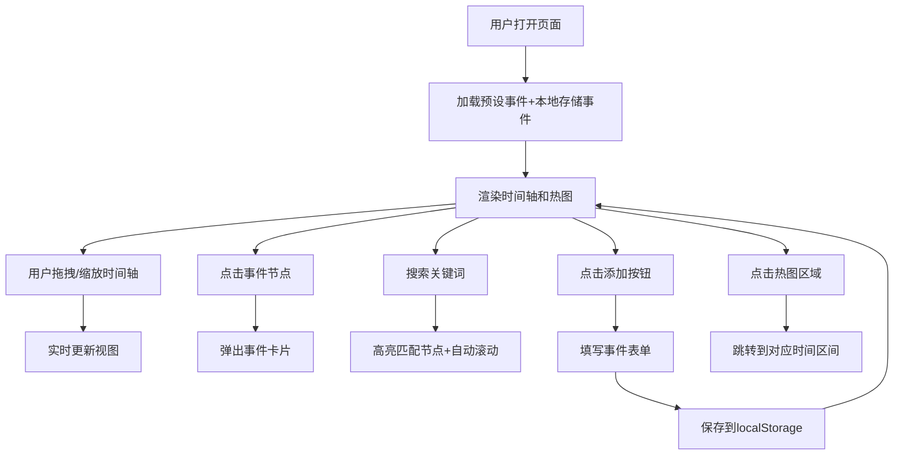

## 1. 产品概述

交互式历史时间线可视化应用，解决传统历史学习方式枯燥、缺乏时间与事件关联感的问题。通过可拖拽缩放的时间轴、事件节点、热图等可视化方式，帮助用户直观理解历史事件的时间脉络与密度分布。

- 目标用户：历史爱好者、学生、教师
- 核心价值：将抽象的历史时间概念具象化，提供沉浸式的历史探索体验
- 产品定位：轻量级、单页面历史学习工具

## 2. 核心功能

### 2.1 用户角色

| 角色 | 注册方式 | 核心权限 |
|------|----------|----------|
| 普通用户 | 无需注册 | 浏览预设事件、搜索事件、添加/编辑/删除自定义事件 |

### 2.2 功能模块

1. **时间轴模块**：横向可拖拽时间线，滚轮缩放，事件节点展示
2. **事件卡片模块**：点击节点弹出详情卡片，包含名称、日期、描述、图片
3. **自定义事件模块**：添加、编辑、删除用户自定义事件，localStorage 持久化
4. **搜索模块**：关键词搜索事件，高亮匹配结果并自动滚动定位
5. **热图模块**：事件密度热图，渐变色条展示，支持点击跳转

### 2.3 页面详情

| 页面名称 | 模块名称 | 功能描述 |
|----------|----------|----------|
| 主页面 | 顶部标题区 | 应用标题、搜索框、添加事件按钮 |
| 主页面 | 时间轴区域 | 可拖拽缩放的时间轨道、事件节点、年代标签 |
| 主页面 | 热图区域 | 事件密度渐变条、十年区间标识 |
| 主页面 | 事件卡片 | 弹出式详情面板，包含事件完整信息 |
| 主页面 | 编辑弹窗 | 添加/编辑自定义事件的表单 |

## 3. 核心流程

## 4. 用户界面设计

### 4.1 设计风格

- **主色调**：米黄色背景（#f5e6c8）、深棕色文字（#3d2914）
- **辅助色**：不同时代/文明用不同颜色区分（古埃及-金色、古希腊-蓝色、古罗马-红色、中世纪-紫色、文艺复兴-绿色、近代-橙色、现代-蓝绿色）
- **时间轴轨道**：深色木质纹理背景
- **卡片样式**：圆角设计、柔和阴影、从底部向上滑入动画（0.3s cubic-bezier）
- **节点交互**：悬停放大 1.1 倍 + 轻微旋转
- **字体**：Playfair Display（标题）、系统 serif 字体（正文）
- **整体风格**：羊皮纸复古风格

### 4.2 页面设计概述

| 页面名称 | 模块名称 | UI 元素 |
|----------|----------|----------|
| 主页面 | 标题区 | 居中手写体标题、右侧搜索图标/搜索框、添加按钮 |
| 主页面 | 时间轴 | 木质纹理轨道、年份刻度、彩色事件节点、上下排列避免重叠 |
| 主页面 | 热图 | 底部渐变色条、冷色到暖色表示密度、十年间隔 |
| 主页面 | 事件卡片 | 圆角卡片、图片预览、标题、日期、描述、关闭按钮 |

### 4.3 响应式设计

- **桌面端**：完整布局，搜索框展开显示，时间轴高度较大
- **平板/手机**：时间轴自动缩小高度，搜索框收起为图标，点击展开
- **触摸优化**：支持触摸拖拽和双指缩放

### 4.4 动效设计

- 时间轴拖拽和缩放：60fps 流畅度，响应时间小于 16ms
- 事件卡片弹出：从底部向上滑入，0.3s cubic-bezier
- 节点悬停：放大 1.1 倍 + 轻微旋转，平滑过渡
- 热图更新：平滑的颜色渐变动画
- 搜索滚动：平滑滚动到匹配位置

## 5. 性能要求

- 时间轴拖拽和缩放响应时间：< 16ms（60fps）
- 热图渲染时间：< 50ms
- 首次加载时间：< 2s
- 页面刷新后自定义事件自动恢复
