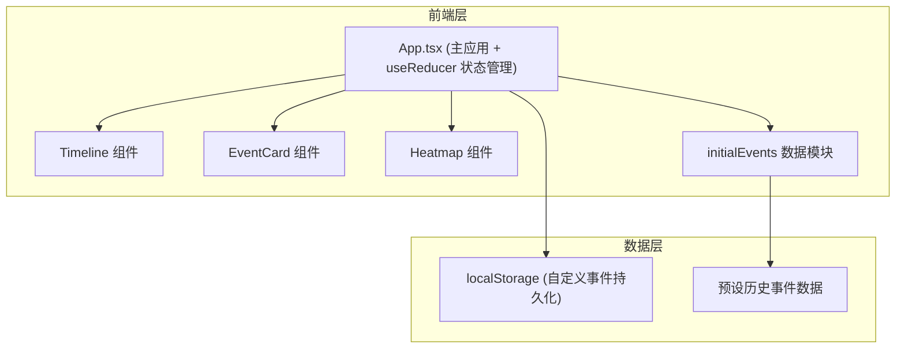

## 1. 架构设计



## 2. 技术栈说明

- **前端框架**：React 18 + TypeScript
- **构建工具**：Vite 5 + @vitejs/plugin-react
- **状态管理**：React useReducer（复杂状态逻辑）
- **样式方案**：原生 CSS（CSS 变量、动画关键帧）
- **数据持久化**：localStorage
- **字体**：Google Fonts - Playfair Display
- **包管理器**：npm

## 3. 目录结构

```
├── package.json
├── index.html
├── vite.config.ts
├── tsconfig.json
└── src/
    ├── components/
    │   ├── Timeline.tsx      # 时间轴组件
    │   ├── EventCard.tsx     # 事件卡片组件
    │   └── Heatmap.tsx       # 热图组件
    ├── data/
    │   └── initialEvents.ts  # 预设历史事件数据
    ├── App.tsx               # 主应用组件
    └── App.css               # 全局样式
```

## 4. 数据模型

### 4.1 事件数据结构

```typescript
interface HistoricalEvent {
  id: string;
  date: number;           // 年份，负数表示公元前
  title: string;
  description: string;
  imageUrl: string;
  era: string;            // 时代/文明分类
  isCustom?: boolean;     // 是否为用户自定义事件
}
```

### 4.2 时代/文明分类

- ancient-egypt（古埃及）
- ancient-greece（古希腊）
- ancient-rome（古罗马）
- medieval（中世纪）
- renaissance（文艺复兴）
- early-modern（近代）
- modern（现代）

### 4.3 应用状态

```typescript
interface AppState {
  events: HistoricalEvent[];
  selectedEvent: HistoricalEvent | null;
  zoomLevel: number;      // 缩放级别（1-10，1=百年视野，10=十年视野）
  viewStart: number;      // 当前视窗起始年份
  viewEnd: number;        // 当前视窗结束年份
  searchQuery: string;
  isSearchExpanded: boolean;
  isEditing: boolean;     // 是否正在编辑/添加事件
  editingEvent: HistoricalEvent | null;
}
```

## 5. 核心组件设计

### 5.1 Timeline 组件

**职责**：渲染可拖拽、可缩放的时间线轨道和事件节点，管理缩放与滚动状态

**Props**：
- events: HistoricalEvent[]
- selectedEvent: HistoricalEvent | null
- zoomLevel: number
- viewStart: number
- viewEnd: number
- searchQuery: string
- onEventClick: (event: HistoricalEvent) => void
- onViewChange: (start: number, end: number) => void
- onZoomChange: (zoom: number) => void

**核心功能**：
- 横向拖拽滚动（鼠标/触摸）
- 滚轮缩放
- 事件节点定位与渲染
- 年份刻度计算与渲染
- 搜索结果高亮

### 5.2 EventCard 组件

**职责**：接收事件数据，渲染弹出卡片，包含关闭按钮

**Props**：
- event: HistoricalEvent
- onClose: () => void
- onEdit?: (event: HistoricalEvent) => void
- onDelete?: (id: string) => void

**核心功能**：
- 事件详情展示
- 滑入动画
- 关闭按钮
- 编辑/删除操作（自定义事件）

### 5.3 Heatmap 组件

**职责**：接收事件数组，计算并渲染密度渐变条，支持点击跳转

**Props**：
- events: HistoricalEvent[]
- viewStart: number
- viewEnd: number
- onJump: (year: number) => void

**核心功能**：
- 按十年区间计算事件密度
- 渐变色条渲染
- 点击跳转到对应时间区域
- 平滑颜色过渡动画

## 6. 性能优化策略

- **时间轴虚拟化**：只渲染视窗内可见的事件节点和刻度
- **requestAnimationFrame**：拖拽和缩放使用 RAF 保证 60fps
- **CSS transforms**：使用 transform 而非 top/left 实现动画
- **will-change**：对频繁变化的元素使用 will-change 提示
- **事件委托**：使用事件委托减少事件监听器数量
- **防抖/节流**：搜索输入防抖，resize 事件节流
- **localStorage 缓存**：自定义事件读写优化

## 7. 状态管理

使用 `useReducer` 管理复杂状态逻辑，action 类型包括：
- `SET_VIEW` - 设置视窗范围
- `SET_ZOOM` - 设置缩放级别
- `SELECT_EVENT` - 选中事件
- `DESELECT_EVENT` - 取消选中
- `SET_SEARCH_QUERY` - 设置搜索词
- `TOGGLE_SEARCH` - 切换搜索框展开
- `ADD_CUSTOM_EVENT` - 添加自定义事件
- `UPDATE_CUSTOM_EVENT` - 更新自定义事件
- `DELETE_CUSTOM_EVENT` - 删除自定义事件
- `START_EDITING` - 开始编辑
- `STOP_EDITING` - 停止编辑
