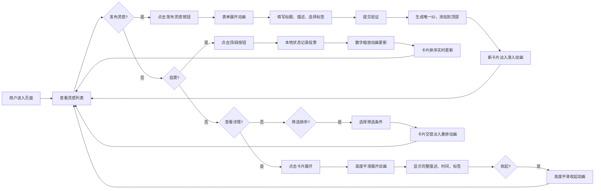

## 1. 产品概述

团队灵感墙是一个轻量级的创意收集与投票工具，帮助小团队快速筛选最值得落地的创意。用户可以发布灵感、参与投票、实时排序筛选，通过协作式投票机制让优秀创意脱颖而出。

- 主要用途：团队头脑风暴、创意收集、投票决策
- 目标用户：小型团队（产品、技术、设计、运营等跨职能团队）
- 核心价值：快速、高效、可视化地进行创意筛选

## 2. 核心功能

### 2.1 用户角色

| 角色 | 注册方式 | 核心权限 |
|------|---------------------|------------------|
| 普通用户 | 无需注册，本地状态管理 | 发布灵感、投票、筛选排序、查看详情 |

### 2.2 功能模块

1. **灵感发布模块**：折叠式表单，包含标题、描述、标签选择
2. **灵感卡片展示**：瀑布流布局，支持展开/收起详情
3. **投票系统**：顶/踩按钮，单次投票限制，数字动画
4. **排序筛选**：多种排序方式，实时切换，动画过渡
5. **统计面板**：Top 5 展示，吸顶效果，点击跳转

### 2.3 页面详情

| 页面名称 | 模块名称 | 功能描述 |
|-----------|-------------|---------------------|
| 主页 | 顶部导航区 | 发布灵感按钮、筛选下拉菜单 |
| 主页 | 发布表单区 | 折叠式表单，标题(50字)、描述(200字)、标签选择(3个) |
| 主页 | 灵感瀑布流 | 两列布局，卡片悬停效果，交错淡入动画 |
| 主页 | 投票统计面板 | 右侧吸顶，Top 5 灵感，票数排序 |
| 主页 | 空状态展示 | 灯泡插画 + 提示文字 |

## 3. 核心流程

## 4. 用户界面设计

### 4.1 设计风格

- **主色调**：#5B8DEF（清爽蓝色）
- **背景色**：#F5F3EE（米白浅灰）
- **卡片色**：#FFFFFF（纯白）
- **边框色**：#E0DEDC（浅灰边框）
- **激活色**：顶(#4CAF50 绿色)、踩(#F44336 红色)
- **圆角**：12px 轻微圆角
- **阴影**：悬停时上浮4px，柔和阴影过渡
- **字体**：采用现代无衬线字体，标题清晰醒目，正文易读性强

### 4.2 页面设计概述

| 页面名称 | 模块名称 | UI 元素 |
|-----------|-------------|-------------|
| 主页 | 顶部导航 | 发布灵感按钮(蓝色背景、白色文字、圆角)、筛选下拉(右对齐) |
| 主页 | 发布表单 | 折叠式展开(0.3s动画)、输入框(细边框、焦点蓝色高亮)、标签多选(预设5种) |
| 主页 | 灵感卡片 | 白色卡片、1px边框、12px圆角、悬停上浮(0.2s ease)、投票按钮(带ripple效果) |
| 主页 | 投票面板 | 吸顶定位、浅色背景、Top 5 排名(序号徽章)、点击高亮 |
| 主页 | 空状态 | 居中布局、灯泡图标、柔和提示文字 |

### 4.3 响应式设计

- **桌面端**：两列瀑布流布局，右侧吸顶投票面板
- **平板端**：自动切换为单列布局，投票面板改为顶部或底部
- **触摸优化**：按钮最小点击区域48x48px，触摸反馈清晰

### 4.4 动画与交互

- **新卡片入场**：从左到右淡入滑入，0.4秒
- **排序重排**：交错淡入动画，每张延迟0.1秒
- **卡片展开**：高度平滑过渡，0.3秒
- **数字更新**：缩放动画，0.2秒
- **按钮点击**：ripple水波纹效果，0.15秒
- **悬停效果**：卡片上浮4px，阴影过渡，0.2秒 ease
