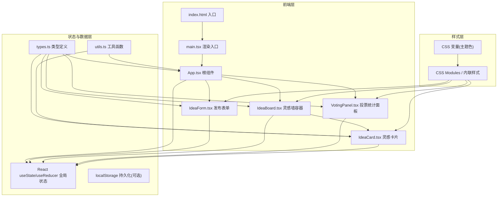
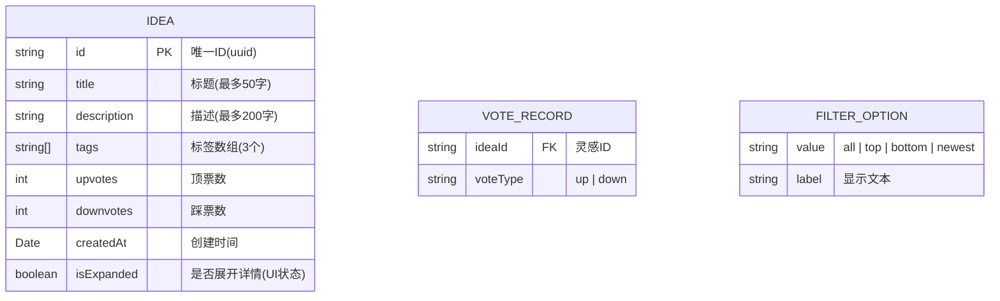

## 1. 架构设计



## 2. 技术描述

- **前端框架**：React 18 + TypeScript 5
- **构建工具**：Vite 5 + @vitejs/plugin-react
- **唯一ID生成**：uuid v9
- **状态管理**：React Hooks (useState, useEffect, useCallback, useMemo)
- **样式方案**：CSS Modules + CSS 变量 + CSS Animations
- **性能优化**：React.memo, useMemo, useCallback, 列表虚拟化(按需)
- **初始化方式**：手动配置 Vite + React + TypeScript

## 3. 文件结构与调用关系

```
project-root/
├── index.html                 # 入口HTML，适配桌面和平板
├── package.json               # 依赖管理，启动脚本
├── vite.config.js             # Vite构建配置
├── tsconfig.json              # TypeScript配置(严格模式)
└── src/
    ├── main.tsx               # React应用入口 → 渲染App.tsx
    ├── App.tsx                # 根组件
    │   ├── 管理全局状态(ideas, filter, votedIds)
    │   ├── 协调IdeaForm、IdeaBoard、VotingPanel
    │   └── 提供onVote、onAddIdea等回调
    ├── types.ts               # TypeScript类型定义 → 被所有组件引用
    ├── utils.ts               # 工具函数(时间格式化、排序逻辑)
    ├── IdeaForm.tsx           # 发布表单组件
    │   ├── 接收App传递的onAddIdea回调
    │   ├── 表单验证(字数限制、标签数量)
    │   └── 提交后触发App状态更新
    ├── IdeaBoard.tsx          # 灵感墙容器
    │   ├── 接收App传递的ideas和filter
    │   ├── 瀑布流布局(两列/单列响应式)
    │   └── 渲染多个IdeaCard组件
    ├── IdeaCard.tsx           # 单张灵感卡片
    │   ├── 接收App传递的onVote回调
    │   ├── 点击卡片触发展开/收起
    │   ├── 投票按钮弹性缩放动画
    │   └── 数字变化平滑动画
    ├── VotingPanel.tsx        # 投票统计面板
    │   ├── 接收App传递的ideas列表
    │   ├── 按票数排序展示Top 5
    │   ├── 吸顶效果(position: sticky)
    │   └── 点击卡片调用App的scrollToCard
    └── styles/
        ├── variables.css      # CSS变量(主题色、尺寸)
        ├── animations.css     # 关键帧动画定义
        ├── App.module.css     # 根组件样式
        ├── IdeaForm.module.css
        ├── IdeaBoard.module.css
        ├── IdeaCard.module.css
        └── VotingPanel.module.css
```

### 数据流向

```
用户操作 → 组件事件 → App状态更新 → 子组件props更新 → UI重渲染
    ↑                                                        ↓
    └────────────────── 回调函数(onVote, onAddIdea) ─────────┘
```

## 4. 数据模型

### 4.1 数据模型定义



### 4.2 TypeScript 类型定义

```typescript
// types.ts
export type TagType = '技术' | '设计' | '运营' | '管理' | '产品';

export type FilterType = 'all' | 'top' | 'bottom' | 'newest';

export type VoteType = 'up' | 'down';

export interface Idea {
  id: string;
  title: string;
  description: string;
  tags: TagType[];
  upvotes: number;
  downvotes: number;
  createdAt: Date;
  isExpanded: boolean;
}

export interface VoteRecord {
  ideaId: string;
  voteType: VoteType;
}

export interface AppState {
  ideas: Idea[];
  filter: FilterType;
  votedIds: Record<string, VoteType>;
  isFormExpanded: boolean;
}
```

## 5. 性能优化策略

| 优化点 | 实现方案 | 预期效果 |
|--------|----------|----------|
| 大量卡片渲染 | React.memo 包裹 IdeaCard，useMemo 计算排序后列表 | 100张卡片滚动≥55fps |
| 动画性能 | 优先使用 transform 和 opacity 属性，避免 layout thrashing | 动画耗时≤0.5秒 |
| 状态更新 | 使用函数式 setState，批量更新投票状态 | 减少不必要重渲染 |
| 事件处理 | useCallback 缓存回调函数，避免子组件重复渲染 | 提升交互响应速度 |
| 列表重排 | 使用 CSS transform 实现平滑过渡，而非 DOM 重排 | 排序动画流畅 |

## 6. 核心模块说明

### 6.1 排序算法 (utils.ts)

```typescript
// 按顶踩差排序(默认)
export const sortByVoteDiff = (ideas: Idea[]): Idea[] => {
  return [...ideas].sort((a, b) => {
    const diffA = a.upvotes - a.downvotes;
    const diffB = b.upvotes - b.downvotes;
    return diffB - diffA;
  });
};

// 按顶票最多
export const sortByUpvotes = (ideas: Idea[]): Idea[] => {
  return [...ideas].sort((a, b) => b.upvotes - a.upvotes);
};

// 按踩票最多
export const sortByDownvotes = (ideas: Idea[]): Idea[] => {
  return [...ideas].sort((a, b) => b.downvotes - a.downvotes);
};

// 按最新发布
export const sortByNewest = (ideas: Idea[]): Idea[] => {
  return [...ideas].sort((a, b) => 
    b.createdAt.getTime() - a.createdAt.getTime()
  );
};
```

### 6.2 时间格式化 (utils.ts)

```typescript
// 转换为"X分钟前"格式
export const formatRelativeTime = (date: Date): string => {
  const now = new Date();
  const diffMs = now.getTime() - date.getTime();
  const diffMins = Math.floor(diffMs / 60000);
  
  if (diffMins < 1) return '刚刚';
  if (diffMins < 60) return `${diffMins}分钟前`;
  
  const diffHours = Math.floor(diffMins / 60);
  if (diffHours < 24) return `${diffHours}小时前`;
  
  const diffDays = Math.floor(diffHours / 24);
  return `${diffDays}天前`;
};
```
