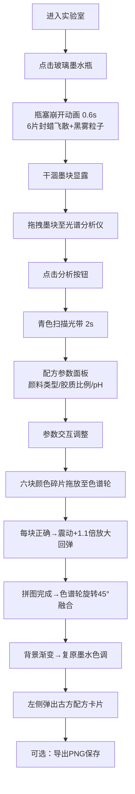

## 1. 产品概述

虚拟墨水瓶拆解与墨水配方复原实验室——一款沉浸式的历史墨水调配体验应用，让用户化身调墨师，通过拆解古董墨水瓶、光谱分析、色谱拼图三步流程，复原普鲁士蓝、中国墨、赛别尔紫等失传墨水颜色。

- 核心价值：将枯燥的化学配方转化为富有叙事感和仪式感的交互式探索体验
- 目标用户：历史爱好者、设计从业者、教育场景师生、追求独特体验的普通用户

## 2. 核心功能

### 2.1 用户角色

| 角色 | 注册方式 | 核心权限 |
|------|----------|----------|
| 调墨师（用户） | 无需注册 | 完整的拆解、分析、拼图与配方导出体验 |

### 2.2 功能模块

1. **工作台区域**：古董玻璃墨水瓶SVG渲染、瓶塞崩开动画、封蜡碎片飞散、黑雾粒子特效、干涸墨块生成与拖拽
2. **光谱分析仪**：黄铜设备渲染、墨块拖拽放置、青色扫描光带动画、配方参数（颜料类型/胶质比例/pH值）显示与交互
3. **配色拼图区域**：四分之一色谱轮渲染、六块颜色碎片拖放拼接、咔嗒震动反馈、色谱轮旋转融合、最终颜色生成
4. **古方配方卡片**：淡黄色底花体字标签、墨迹拖尾装饰、墨水信息展示、PNG格式一键导出

### 2.3 页面详情

| 页面名称 | 模块名称 | 功能描述 |
|----------|----------|----------|
| 主实验室页 | 背景渐变系统 | 暗墨绿(#1b2a1a)→旧木棕(#5a3e2b)渐变，拼图成功后平滑过渡至复原墨水色调 |
| 主实验室页 | 工作台与墨水瓶 | SVG半透明玻璃墨水瓶+封蜡，点击触发0.6秒瓶塞崩开动画（6片封蜡缓出飞散），30个黑色粒子黑雾扩散，露出干涸墨块 |
| 主实验室页 | 光谱分析仪 | 黄铜管状设备，墨块拖拽放置后点击"分析"触发2秒青色扫描光带，显示三参数滑块交互 |
| 主实验室页 | 色谱拼图 | 四分之一圆色谱轮+六块碎片拖放，正确放置震动+1.1倍放大回弹，拼完旋转45度融合出最终色 |
| 主实验室页 | 古方标签卡片 | 弹出式淡黄底棕色花体字卡，展示墨水名称/年代/配方参数，html2canvas导出PNG |

## 3. 核心流程

用户进入实验室 → 视觉焦点落在布满灰尘的木质工作台中央的古董墨水瓶上 → 点击墨水瓶触发瓶塞崩开与黑雾粒子 → 干涸墨块显露 → 将墨块拖拽至右侧光谱分析仪 → 点击"分析"按钮观看青色扫描光带 → 三参数面板浮现（颜料类型/胶质比例/pH）→ 调整参数查看颜色预览 → 拖拽六块颜色碎片至色谱轮正确位置 → 每块正确放置触发咔嗒震动 → 拼图完成后色谱轮旋转45度融合最终颜色 → 背景渐变过渡至复原墨水色调 → 左侧弹出古方配方卡片 → 可导出PNG保存

## 4. 用户界面设计

### 4.1 设计风格

**复古维多利亚炼金实验室美学**

- **主色系统**：
  - 主背景渐变：暗墨绿 `#1b2a1a` → 旧木棕 `#5a3e2b`
  - 铜锈绿 `#5b7a5b`：按钮悬停轮廓、交互高光
  - 金棕描边 `#c9a96e`：所有容器边框、分隔线
  - 淡黄色 `#f5e8c8`：卡片底色、点缀文字
  - 普鲁士蓝 `#1d3557`、中国墨黑 `#1a1a1a`、赛别尔紫 `#4a1942`：最终墨水色

- **按钮样式**：旧金属纹理，使用多层CSS线性渐变模拟黄铜氧化质感；1px金棕描边，2px圆角（非完全圆角，复古感）；悬停时浮现铜锈绿1px外发光轮廓（box-shadow）

- **字体方案**：
  - 展示字体（墨水名称、花体标签）：使用 Google Fonts 的 "Dancing Script" 或 "Great Vibes" 手写花体字
  - 正文字体："Cormorant Garamond" 衬线字体，营造古籍感
  - 参数数值："Courier Prime" 等宽字体，仪器精密感

- **布局风格**：非对称工作台式布局，中央为视觉核心区域（墨水瓶→分析仪横向流），左侧预留卡片弹出位，下方为拼图区域，使用阴影和不透明度模拟多层纸张叠放感

- **纹理与装饰**：全站添加微弱颗粒噪点（SVG noise filter + CSS backdrop-filter），容器边角添加细微磨损感，古方卡片增加墨迹拖尾装饰（SVG path实现）

### 4.2 页面设计概述

| 页面名称 | 模块名称 | UI元素 |
|----------|----------|----------|
| 主实验室页 | 背景系统 | 径向+线性双层渐变，全屏噪点纹理覆盖，四角微弱暗角vignette |
| 主实验室页 | 工作台 | 深木纹SVG纹理矩形，圆角12px，多层box-shadow模拟立体桌面，投影延伸至下方 |
| 主实验室页 | 玻璃墨水瓶SVG | 半透明linearGradient瓶身（带高光与厚度），软木塞纹理，瓶口蜡封（不规则多边形），瓶内阴影层 |
| 主实验室页 | 光谱分析仪 | 黄铜管状主体（径向渐变+高光条），三足支架，圆形扫描舱，青色玻璃观察窗 |
| 主实验室页 | 配方滑块 | 铜色轨道+琥珀色填充条，滑块为圆形黄铜旋钮带高光，左侧图标（颜料滴管/烧杯/pH试纸） |
| 主实验室页 | 色谱拼图 | 深色圆弧底座，四分之一扇形靶区，碎片为不规则多边形带木质纹理+金棕描边 |
| 主实验室页 | 古方卡片 | 米黄色羊皮纸纹理底，四角棕色装饰花纹，左侧墨迹拖尾（SVG path动态），手写体墨水名 |

### 4.3 响应式

- 桌面端优先设计（1440px+最佳体验），核心交互区最小宽度1024px
- 小于1024px时缩放适配，不做移动端重构（拖拽类交互桌面优先）
- 拖放操作同时支持HTML5 DnD API与鼠标事件模拟，确保响应流畅（<50ms）

### 4.4 动画与性能

- 瓶塞崩开：framer-motion spring动画 stiffness=200 damping=15，封蜡6片不同角度+旋转，0.6s缓出
- 黑雾粒子：30个div绝对定位，从瓶口坐标随机方向扩散，opacity 1→0，scale 0.5→2，使用 transform3d 开启硬件加速，目标25fps+
- 扫描光带：线性gradient移动translateX，0.2s淡入→1.6s持续→0.2s淡出，总2s
- 碎片咔嗒反馈：scale 1→1.1→1 配合 rotate ±2deg，0.3s cubic-bezier(0.34, 1.56, 0.64, 1)
- 色谱轮旋转：45度 rotate，配合 conic-gradient 颜色融合动画，1.2s ease-in-out
- 背景渐变切换：CSS background 属性 transition 2s ease，不阻塞主线程
