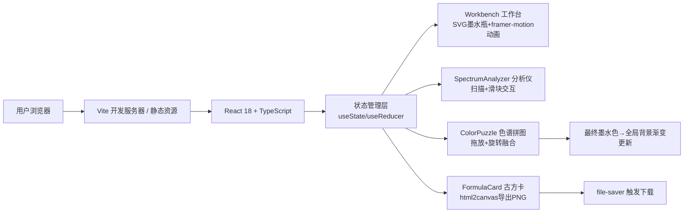

## 1. 架构设计

纯前端单页应用，无后端依赖，所有逻辑、动画与数据在客户端完成。



## 2. 技术说明

- **前端框架**：React 18 + TypeScript（严格模式 strict: true，target ES2020）
- **构建工具**：Vite 5 + @vitejs/plugin-react，base 路径 `'./'`
- **动画库**：framer-motion 11（spring物理动画、variants批量动画、AnimatePresence）
- **ID生成**：uuid 9
- **导出功能**：html2canvas 1.4 + file-saver 2.0
- **CSS方案**：内联样式 + CSS变量（主题色）+ framer-motion transition，不引入额外CSS框架
- **字体资源**：Google Fonts CDN加载（Dancing Script / Great Vibes + Cormorant Garamond + Courier Prime）

## 3. 路由定义

| 路由 | 用途 |
|------|------|
| / | 主实验室页面（唯一页面，单页应用） |

## 4. 状态模型与数据定义

### 4.1 全局状态（App.tsx）

```typescript
type InkColor = {
  name: '普鲁士蓝' | '中国墨' | '赛别尔紫';
  year: string;
  hex: string;
  pigment: 'carbon' | 'indigo' | 'ochre' | 'alizarin';
  binderRatio: number; // 0-100
  ph: number; // 0-14
};

type GameStage = 
  | 'idle'           // 初始，未点击墨水瓶
  | 'bottle_opened'  // 瓶塞崩开，墨块显露
  | 'ink_in_analyzer' // 墨块放入分析仪
  | 'analyzed'       // 分析完成，参数显示
  | 'puzzle_done'    // 拼图完成，最终色生成
  | 'card_shown';    // 古方卡弹出

interface AppState {
  stage: GameStage;
  currentParams: {
    pigment: InkColor['pigment'];
    binderRatio: number;
    ph: number;
  };
  puzzleSolved: boolean;
  finalInk: InkColor | null;
  backgroundTone: string; // CSS渐变字符串
}
```

### 4.2 组件Props定义

- **Workbench**：`onInkBlockReady()` → 通知墨块可拖拽；`inkBlockDraggable` 布尔
- **SpectrumAnalyzer**：`canAcceptInk` 布尔；`onAnalyze(params)` → 分析完成回调；`analyzedParams` 对象或null
- **ColorPuzzle**：`params` 注入参数用于生成碎片颜色；`onComplete(inkColor)` → 拼图完成回调
- **FormulaCard**：`ink: InkColor`；`visible: boolean`；`onExport()` → 导出PNG

## 5. 文件结构

```
auto202/
├── package.json
├── vite.config.js
├── tsconfig.json
├── index.html
└── src/
    ├── App.tsx              # 主组件，状态管理与布局
    └── components/
        ├── Workbench.tsx         # 工作台+墨水瓶SVG+动画+墨块拖拽
        ├── SpectrumAnalyzer.tsx  # 分析仪+扫描光带+参数滑块
        ├── ColorPuzzle.tsx       # 色谱轮+碎片拖放+旋转融合
        └── FormulaCard.tsx       # 古风卡+墨迹拖尾+PNG导出
```

## 6. 关键实现决策

### 6.1 拖放策略
- 墨块拖放：原生 HTML5 Drag & Drop API（`draggable` + `onDragStart/onDragOver/onDrop`），轻量无依赖
- 拼图碎片拖放：framer-motion 的 drag 属性 + `useDragControls`，支持弹簧回弹与碰撞检测逻辑（自定义命中测试）

### 6.2 粒子动画性能
- 30个黑雾粒子：使用 framer-motion `motion.div` + `AnimatePresence`，初始挂载在墨水瓶位置
- 每个粒子随机生成 `x/y` 偏移（-80~80px）、`rotate`（0-360）、`scale`（0.5-2）、`opacity` 1→0
- 使用 `transform` 而非 `left/top`，确保 GPU 合成层，25fps+ 稳定

### 6.3 拼图正确判定
- 色谱轮分为6个扇形槽位，每个槽位有 `targetAngle` 角度范围
- 碎片有 `correctSlotId`，拖放结束时计算质心坐标到各槽位的距离，最近槽位且距离 < 阈值则视为命中
- 命中且 ID 匹配→触发咔嗒反馈动画（scale 1→1.1→1 + rotate ±2°）并吸附；否则回弹原位

### 6.4 最终颜色融合算法
- 6块碎片对应颜料三原色+调墨三要素，使用简单加权平均 HSL 混合
- 算法：收集6块 HSL，`hue` 取平均，`saturation/lightness` 按参数加权，最后转回 HEX
- 色谱轮旋转45°同时，中心圆形颜色使用 framer-motion animate 过渡到最终值

### 6.5 背景渐变平滑过渡
- 全局 CSS 变量 `--bg-from`、`--bg-to`，初始 `#1b2a1a` → `#5a3e2b`
- 拼图完成后，App.tsx 根据 finalInk.hex 计算深浅两色（`finalInk.hex` + `mix(#000, 40%)`），setState 更新背景
- 背景 `transition: background 2s ease` 实现平滑切换

### 6.6 PNG 导出
- 使用 `html2canvas` 捕获 FormulaCard 组件 DOM 节点（useRef 挂载）
- 设置 `backgroundColor: '#f5e8c8'`、`scale: 2` 保证清晰度
- 回调中 `canvas.toBlob` → `file-saver.saveAs(blob, 'ink-formula.png')`

## 7. 性能保障措施

- 所有动画仅作用于 `transform`（translate/scale/rotate）和 `opacity`，避免触发 layout/paint
- 粒子与碎片使用 `will-change: transform` 提前提示浏览器创建合成层
- 拼图拖放命中测试使用 getBoundingClientRect() 缓存，避免每帧重排（<50ms响应目标）
- framer-motion 动画使用 `layout` 属性仅在必要时测量，减少 Reflow
- 分析扫描光带：单 div 背景渐变位移，非逐帧 DOM 操作
